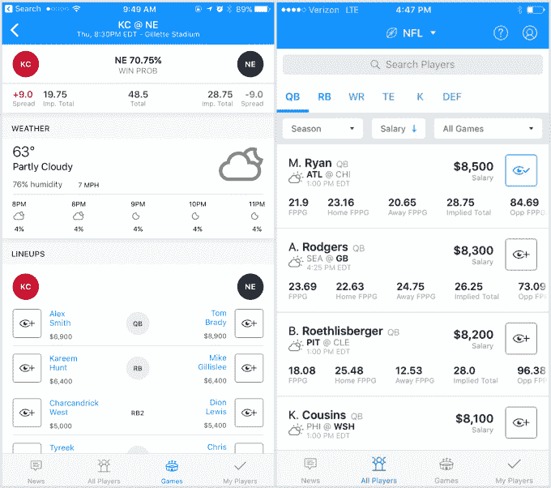

# FanDuel 的新配套应用让玩家研究变得简单

> 原文：<https://web.archive.org/web/https://techcrunch.com/2017/09/07/fanduels-new-companion-app-makes-player-research-easy/>

# FanDuel 的新配套应用程序使玩家研究变得容易

如果你曾经玩过 daily fantasy sports，你会熟悉标准的工作流程——你浏览 5 或 6 个网站来研究球员，切换到 FanDuel 或 DraftKings 应用程序来挑选你的阵容，然后回到这些网站之间切换，以确保开球前没有任何变化。

FanDuel 希望将这项研究集中到一个地方，因此它推出了一个名为 Scout 的新伙伴应用程序，支持你的 NFL 和 MLB 阵容，NBA 和 NHL 即将推出。

该应用程序连接到你的 FanDuel 帐户，这样你就可以导入阵容，然后跟踪队中的每个球员。这意味着你将在应用程序的主要提要中看到与这些球员相关的新闻故事，这使得跟踪像最后一分钟受伤或补充这样的事情变得容易。你也可以将球员添加到观察名单中，以防你想在将他们添加到阵容中之前跟踪和研究他们。

Scout 类似于 [DK Live](https://web.archive.org/web/20230228031752/https://techcrunch.com/2016/09/12/draftkings-live-is-a-news-aggregator-that-tailors-itself-to-your-fantasy-football-team/) ，DraftKings 的同伴研究应用，他们[去年](https://web.archive.org/web/20230228031752/https://techcrunch.com/2016/09/12/draftkings-live-is-a-news-aggregator-that-tailors-itself-to-your-fantasy-football-team/)在 TC Disrupt SF 2017 推出。

为玩家提供一个集中的玩家研究中心为 FanDuel 实现了两件事:首先，它有助于为新手玩家提供公平的竞争环境，这些新手可能不知道在哪里可以获得他们阵容的最新信息。第二，它将玩家留在 FanDuel 生态系统中，这比让他们把时间花在其他幻想体育新闻网站上要好得多(这些网站最终可能会提供每日幻想体育，并成为 FanDuel 的竞争对手)。

应用程序中的数据来自 [numberFire，](https://web.archive.org/web/20230228031752/http://www.numberfire.com/)一家体育分析公司，每天创造 30-40 条原创内容，专注于幻想球员。他们还在应用程序中填充游戏时间表和传播。

目前，这基本上是 Scout 的范围，但最终 FanDuel 希望增加一些功能，让这款应用在你观看比赛时更加有用，比如对你选中的球队的球员进行实时评分和统计跟踪，以及从 numberFire 以外的渠道收集原始新闻。

点击这里查看 iOS 应用商店上的 [Scout。](https://web.archive.org/web/20230228031752/https://itunes.apple.com/us/app/fanduel-scout-dfs-daily-fantasy-football-news/id1275873422?mt=8)