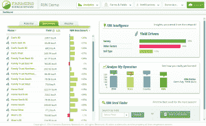
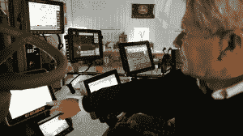

# 农民商业网络从谷歌风投 TechCrunch 获得 1500 万美元

> 原文：<https://web.archive.org/web/https://techcrunch.com/2015/05/19/farmers-business-network-raises-15m-from-google-ventures/>

为了维持预计到 2050 年达到 100 亿的世界人口，我们需要在未来 35 年将全球农作物产量翻一番。对于[农民商业网络](https://web.archive.org/web/20221018012451/https://www.farmersbusinessnetwork.com/) (FBN)，解决方案是一个全球性的、大数据驱动的农民对农民网络——他们刚刚筹集了 1500 万美元的新资金来建设它。

谷歌风投在过去的投资者凯鹏华盈(Kleiner Perkins Caufield & Byers)和影响力投资公司 [DBL](https://web.archive.org/web/20221018012451/http://www.dblinvestors.com/) 的帮助下领投了这轮投资。FBN 现在已经筹集了近 2800 万美元的风险资金。

农民每年在种子和肥料上花费数十亿美元，但目前，在决定购买哪些种子、种植多少种子以及哪些肥料或养分将在不同地区产生最佳效果时，他们缺乏可靠的信息。

“到目前为止，农民不得不依赖来自高度受控实验的大学试验数据，或者来自种子公司的关于使用哪些种子和种植哪些人群的信息，”FBN 的联合创始人查尔斯·巴伦(Charles Baron)表示。

然而，这两种来源都不能准确反映作物的真实表现。

“接受种子公司的建议有点像如果埃克森想卖给你一辆车，埃克森总是会卖给你一辆 suburban，”巴伦开玩笑说。

自去年 11 月推出以来，FBN 已经收集了 17 个州 700 万英亩农场的数据，并且每月增长 30%。该平台目前能够评估 500 种种子和 16 种不同作物的性能。

创新不在于简单地获取所有这些数据。现代农业设备技术先进得令人难以置信，设计用来记录从种子种植到土壤化学变化的一切。

FBN 将从全国农场收集的所有数据进行汇总和标准化，以创建一个分析仪表板，其中还集成了天气或区域土壤条件等外部信息。通过利用 FBN 网络中所有农场报告的结果，农民可以就哪些农产品和做法将产生最高产量做出明智的决定。

对于我们这些不熟悉现代农场内部运作的人来说，无论这听起来多么令人惊讶，农民们正遭受着数据过载的困扰。

“如果你看看现代拖拉机的驾驶室，你会看到六个不同的屏幕，每个屏幕都在生产不同格式的软件，”巴伦说，他告诉我，FBN 正在整合来自 35 种不同类型的农业软件的数据。

“使用这种精密设备的大型农场有软件来分析他们自己农场的数据，因此他们可以发现去年的灌溉问题或肥料问题，并加以纠正，”加入 FBN 董事会的谷歌风险投资公司的安迪·惠勒说。

惠勒说:“但最大的缺失是一直在分析许多农场的数据，这是你可以开始获得真正效率提升的地方——当农民开始相互分享数据，以了解哪些种子在他们的土壤上表现最好，或者哪些耕作方法使他们获得更高的产量。”

这可以为农民省下一大笔钱。巴伦告诉我，例如，普通的 FBN 农民每年购买价值几十万美元的种子。如果他们能确定 5-10%的种子没有产出，他们就能显著降低成本。

“农民的利润微薄，在当前商品价格非常低、投入价格高的环境下，农民几乎无法盈利，”巴伦说。

除了利润，提高效率和最大化每英亩的产量可能是我们延缓全球粮食危机的最好办法。