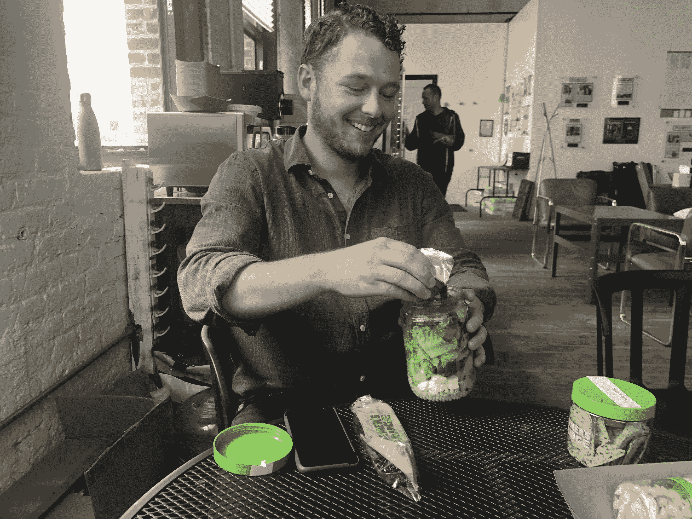
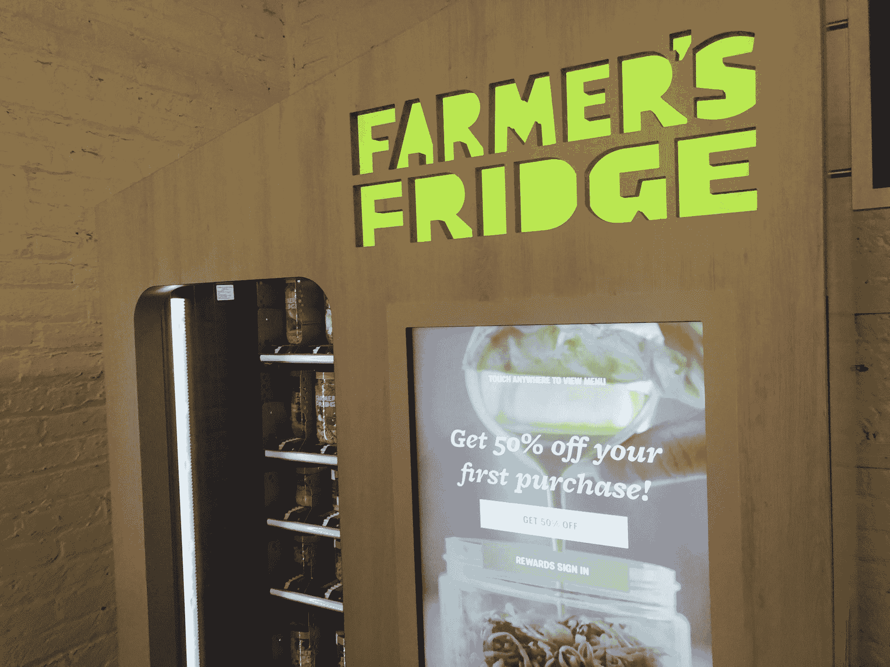

# 农民的冰箱想让吃健康食品像从 ATM 机取钱一样简单

> 原文：<https://web.archive.org/web/https://techcrunch.com/2018/09/26/farmers-fridge-wants-to-make-eating-healthy-food-as-easy-as-getting-money-from-an-atm/>

快速、健康的食物是那些看起来好得难以置信的概念之一。但总部位于芝加哥的初创公司 Farmer's 冰箱最近完成了由前谷歌首席执行官埃里克·施密特(Eric Schmidt)的创新努力领导的 3000 万美元 C 轮融资，旨在使这一目标成为现实。

农夫的冰箱改造了自动售货机，供应健康食品，如沙拉、三明治、格兰诺拉麦片等。—适合忙碌的人，价格从 5 美元到 8 美元不等。为了确保餐厅质量的食物，Farmer's 冰箱有一名厨师，他接受顾客的反馈，不断调整菜单和食物。每天早上，还有大量的劳动力在农民的冰箱厨房里准备食物。我在芝加哥的时候尝过那里的食物，我必须承认它很好吃。这是来自一个通常不喜欢沙拉的人。

虽然浪费的数量很少(剩余约 5%)，但由于其分配算法可以确定每种食物在每个自动售货机位置的库存数量，Farmer's 冰箱有一个系统可以将剩余的食物送到[大芝加哥食物仓库](https://web.archive.org/web/20230225043034/https://www.chicagosfoodbank.org/)，这是一个与 700 家机构合作的食物银行，包括施粥所、避难所和茶水间。

“这个行业的假设是，自动取款机已经这样做了，电影也已经这样做了，这些事情彼此没有关系。因此，唯一的联系就是，消费者通常想要更快、更便宜、更方便的东西，只要他们不必牺牲体验的任何质量，”Farmer's 冰箱创始人兼首席执行官卢克·桑德斯(Luke Saunders)在芝加哥的初创公司总部告诉我。

法默冰箱创始人兼首席执行官卢克·桑德斯在这家初创公司位于芝加哥的总部

“所以，从售货亭租一部电影——没什么区别，”他补充道。“回到家还是那部电影。不过，对于食物来说，这很有趣，因为在很多行业中，体验被认为是最重要的部分，所以“如果你在餐馆提供了非常好的服务，科技真的能取代这种体验吗”是这个行业的核心问题。或者，相对于我们的商业模式，这是一家餐厅重要的持续优势吗？”

到目前为止，它一直在工作。自 2013 年推出以来， [Farmer's 冰箱已经在芝加哥和密尔沃基部署了 200 台自动售货机](https://web.archive.org/web/20230225043034/https://www.farmersfridge.com/locations)。机场、医院和传统零售商，如药店、便利店甚至芝加哥的 Amazon Go 商店都可以找到农民冰箱自动售货机。每个地点每周至少备货五天，而机场每周备货七天。根据业务合作伙伴的不同，Farmer's 冰箱的收入模式从补贴账户到收入分成不等。

桑德斯说:“每个垂直市场的表现都非常不同。”。“在医院里，比起盈利能力，他们更关心为那些无法使用自助餐厅的员工提供过夜便利。在奥黑尔国际机场，由于产生的流量，这是一个收入份额。对于一些零售商来说，这是农民的冰箱给这些地方带来的流量。”

这款应用程序可能是 Farmer's 冰箱在技术上最不有趣的部分，但它提供了一种简单的方式来查看哪里可以找到冰箱、冰箱的库存以及提前预订冰箱中食物的能力。冰箱本身是真正的技术成就。这是一款联网设备，运行固件，具有图形用户界面和云基础设施。

下一年，该计划是扩大区域，并在更多的地区推出。近期来看，Farmer's 冰箱预计将从目前的 130 名员工增加到明年年底的 200 名左右。