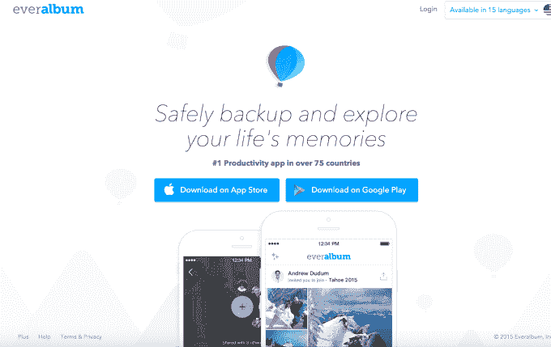

# 快速增长的图片应用 Everalbum，iOS 上的排行榜冠军，来到 Android 

> 原文：<https://web.archive.org/web/https://techcrunch.com/2016/02/16/fast-growing-photo-app-everalbum-a-chart-topper-on-ios-comes-to-android/>

有些应用承诺通过备份然后删除你的照片来帮助你在你的[智能手机](https://web.archive.org/web/20230306012145/https://techcrunch.com/2015/11/17/google-photos-will-now-help-you-free-up-space-on-your-phone/)上[释放空间](https://web.archive.org/web/20230306012145/https://techcrunch.com/2015/10/13/two-new-apps-tackle-the-problem-of-running-out-of-space-on-your-phone/)。有一些应用程序可以帮助你[将照片](https://web.archive.org/web/20230306012145/https://techcrunch.com/2014/05/22/mobile-photo-sharing-app-cluster-now-focused-on-private-groups-adds-support-for-video-notes-and-tablets/)整理成相册，并与朋友分享。还有一些应用程序旨在简单地将照片从手机转移到云端进行安全保存。然而，一家名为 [Everalbum](https://web.archive.org/web/20230306012145/https://www.everalbum.com/) 的成长中的初创公司想要做到这一切。

该公司现在在超过 85 个国家拥有收入排名第一的 iOS 生产力应用程序，正在雄心勃勃地挑战谷歌、苹果、脸书和 Dropbox 等巨头，超越照片备份。现在这款应用已经可以在安卓系统上使用了。

据视频通话平台 TokBox 的联合创始人 Andrew Dudum 表示，更大的服务更能代表你放在衣柜里的照片。他说，另一方面，Everalbum 正试图重新想象实体相册。

“这是关于组织、聚集和理解[你的照片]——关于找到你生活中那些重要的时刻，并让你很容易地组织它们，”杜杜姆说。“这是一种与云存储产品非常不同的产品，我认为这就是为什么它在大众市场上引起了如此大的共鸣。”

这项服务与市场上的其他服务截然不同，因为它不仅仅是上传你手机上的照片。相反，它还可以聚合你现在使用的许多服务中的照片，如脸书、Instagram、Dropbox 和谷歌照片。

当然，一些初创公司试图解决照片组织和存储方面的问题，但大多数公司最终都倒闭或退出了更大的公司。

与此同时，甚至云存储领域的一些大牌也在努力开发自己的照片应用。例如，Flickr 在收购雅虎后多年来一直处于下滑趋势，Dropbox 的专用照片上传器 [Carousel 就在几个月前被关闭。](https://web.archive.org/web/20230306012145/https://techcrunch.com/2015/12/07/failing-to-find-users-dropbox-will-shut-down-mailbox-in-february-2016-and-carousel-in-march/)

如果你信任像 Everalbum 这样的小公司，并希望它能无限期地保护你的记忆，这可能会令人担忧。

然而，有一点对它有利的是，这款应用有一个允许它产生收入的商业模式。Everalbum 促使人们升级到其高级层 Everalbum Plus，其中包括额外的功能，如全分辨率照片的无限存储(免费层提供无限的“高质量”照片存储)，以及无限的高清视频上传和优先客户支持。

在免费试用后，Plus 用户每月为额外功能支付 9.99 美元——这足以将该应用推上 iOS 生产力应用的总收入排行榜。

当然，升级的提示在应用程序中随处可见——在某些时候，进入免费试用几乎是不可避免的。你真的必须阅读细则，以避免选择加入。

也就是说，如果人们觉得它没用，他们会去 iTunes 取消订阅。(高级层从 2015 年初就已经上线，所以他们有充足的时间。)

Everalbum 还声称，在过去 90 天里，其用户在其服务上备份的照片数量超过了 iOS 上的其他服务，包括谷歌照片。当然，它无法访问谷歌的数据，所以把这个作为它的估计。

但 Everalbum 可以从其数百万用户中衡量的事情包括，它已经在人们的智能手机上释放了 5300 的存储空间，迄今为止已经分享了 1.2 亿张专辑，在近 4000 条评论中获得了 4.5 星评级。事实上，最新的版本已经达到了 5 星级。

除了备份、组织和共享之外，Everalbum 还有其他一些功能，包括收藏夹、名为“动画书”的短动画和“回放”——这是一种重新展示旧照片的功能，类似于谷歌和脸书的做法。用户还可以加入 Everalbum Club，作为他们每月 9.99 美元的订阅的一部分，以接收他们在服务上喜欢的照片的物理打印。

Everalbum 的有趣之处在于，到目前为止，它在照片管理方面没有做出任何重大突破，而是以一种聪明的方式结合了其他产品的功能，并将其转化为一种付费实用工具。

然而，该公司的长期愿景包括更好地理解我们的海量照片收藏，方法是将不同来源的碎片结合在一起——包括消息应用程序，甚至是祖母相册中的旧家庭照片——以便获得背景，并帮助我们找到那些真正重要的记忆。

Everalbum 获得了 800 万美元的资金支持，由 Khosla Ventures 领投，Felicis Ventures 和 Cherubic Ventures 也参与其中。基思·拉布瓦和艾登·森库特是董事会成员。该公司是一个由 26 人组成的团队，包括联合创始人唐·霍利、T2、杰克·亚伯拉罕、T4、查理·梅尔拜和乔恩·穆姆，分别位于旧金山和滑铁卢。(后者得益于[对时尚应用 Pout 的收购。](https://web.archive.org/web/20230306012145/http://velocity.uwaterloo.ca/2016/02/velocity-startup-pout-acquired-by-everalbum/))

今天，[这款应用将登陆 Android](https://web.archive.org/web/20230306012145/https://play.google.com/store/apps/details?id=com.everalbum.everalbumapp) ，此前它只在 iOS 上可用。未来，该公司将涉足其他平台——包括苹果电视甚至虚拟现实——但目前还没有这些扩张的细节。