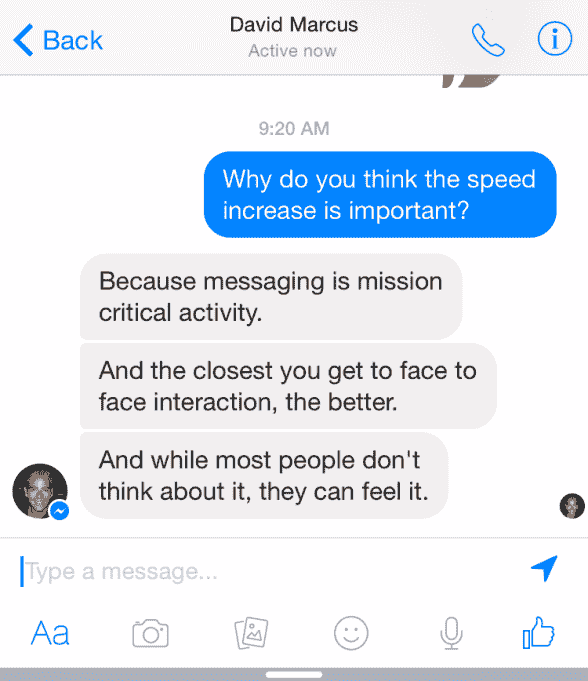
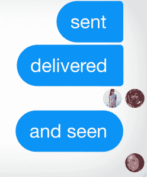

# Facebook Messenger 通过 FacePile 阅读回执展示其新速度 

> 原文：<https://web.archive.org/web/https://techcrunch.com/2014/12/19/fastbook-messenger/>

在聊天时，毫秒会产生影响。滞后越少，越有共处一室的感觉。但是有了短信，我们失去了点头和“嗯嗯”这样的暗示，这些暗示告诉你有人听到了你说的话。

今天, [Facebook Messenger](https://web.archive.org/web/20221207103226/https://www.facebook.com/mobile/messenger) 在这两个方面都有了飞跃,[所有版本的速度都有了很大的提高](https://web.archive.org/web/20221207103226/https://www.facebook.com/Davemarcus/posts/10154997133580195),还有一个新的动画显示你的信息是否正在发送、发送、传递或阅读。该公司告诉我，Messenger 使用你朋友的面部照片，而不是一些微小的灰色文本，来准确显示会议中谁看到了什么。

脸书最初是在大约五年前为一个显示你的哪些朋友喜欢某个网站的[插件](https://web.archive.org/web/20221207103226/https://developers.facebook.com/docs/plugins/facepile)提出 FacePile 设计的。现在，它发现重新利用设计，让你一眼就知道谁看到了你的消息。

新的 Messenger 设计现在正在欧洲和美国的 iOS 和 Android 上推出，并将很快在全球推广。在这个快速演示视频中，您可以看到阅读回执是如何工作的:

【YouTube = https://www . YouTube . com/watch？v=byRmBN2QUxc]

“我们真正想要的是让 Messenger 成为最快、最可靠的移动通讯产品，”产品经理 Lexy Franklin 告诉我。“我们在后端性能方面做了大量工作，减少了端到端延迟，从而提高了所有设备类型的效率。”

脸书新任 Messenger 主管、前 PayPal 总裁大卫·马库斯(David Marcus)解释说，速度至关重要，他说“虽然大多数人不会去想，但他们能感觉到”。

脸书希望在聊天的核心体验上加倍努力，这将使其在全球信息战争中获得优势。微信、KakaoTalk、Kik 等等都在竞相成为最快捷、最流畅的聊天应用。与此同时，脸书必须抵御更丰富的通信工具，如 Snapchat 的视觉信息，Line 的贴纸，谷歌的视频聊天，以及 Twitter 的全球城镇广场。

它的一些竞争对手可能会试图直接从消息服务中赚钱，但在与 Marcus 交谈后，脸书目前的策略似乎是专注于推动锁定整个社交平台的实用性。脸书从其新闻订阅中的广告中赚了很多钱，它只需要让人们点击它的蓝色和白色应用程序。

这也是脸书今天推出[“粘贴信使”](https://web.archive.org/web/20221207103226/https://beta.techcrunch.com/2014/12/19/facebook-stickers-for-messenger/)的原因，这是一个配套应用程序，可以在照片上粘贴贴纸并发送给朋友。它不会直接赚钱，至少目前不会，但如果它能让人们更多地使用 Messenger，他们可能会更多地使用脸书，看到更多的广告。

FacePile 已读回执有助于群组聊天，因为它们显示了对话中谁看到了什么信息。在这里，两个朋友已经“发送”了，而一个朋友已经查看了最近的消息“并且看到了”。

10 月，我们获得了显示[脸书正在开发点对点支付功能](https://web.archive.org/web/20221207103226/https://beta.techcrunch.com/2014/10/05/pay-with-facebook-messenger/)的截图。我从一个消息来源得知，该功能仍在开发中，在 Messenger 的撰写屏幕上有一个“$”按钮，可以让您向朋友汇款。

起初，我想象脸书会对这些汇款征税以获得收入，甚至可能会挑战向农民工汇款回家收取高额费用的汇款行业。越来越多的迹象表明，脸书将试图提供免费支付，以提高 Messenger 的使用率和忠诚度。它最大的竞争对手仍然是短信，所以除了短信以外，它能增加的任何价值都将有助于 Messenger 的发展。

富兰克林承认“我们正在考虑很多事情，所以我们可以创造很酷的体验。”不过，最重要的是。让 messenger 成为最快捷、最清晰的聊天方式。脸书可能希望你尽可能多花时间在新闻提要上。但富兰克林说，Messenger 及其新的已读回执的目标是让你发送信息，并尽快知道它已被送达，这样你就可以把手机放回口袋。这样你就可以回去生活了。