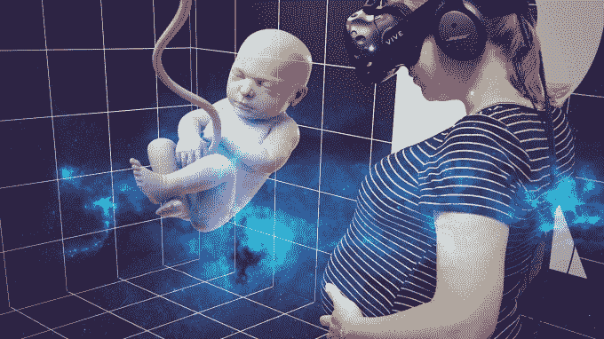

# 准爸爸在女儿出生前用虚拟现实“见”她 

> 原文：<https://web.archive.org/web/https://techcrunch.com/2017/01/05/father-to-be-uses-vr-to-meet-his-daughter-before-shes-born/>

在虚拟现实的所有潜在用例中，萨穆利·坎特尔可以说是最不寻常的，他说服了怀孕的女友对他们未出生的孩子进行 4D 超声扫描，以生成一个可以在虚拟现实中观看的 3D 模型。

他为什么要做这样的事？坎特尔说，主要是因为他认为还没有人想到要这样做。但他也觉得，与仅仅看超声波扫描相比，这将是一种更私人、更身临其境的方式来一瞥他未出生的孩子。

他告诉 TechCrunch:“4D 扫描以前曾被用于制作(未出生婴儿的)3D 模型以供打印，但我想创造一些更具沉浸感的东西，同时尝试在虚拟现实中创造一些个性化的东西。”

“这个想法从一开始就感觉很奇怪，所以我知道我在做一些有趣的事情。我们也一直在试验如何将虚拟现实用于医疗保健，因此这个项目进展顺利。”

虽然他承认在现实生活中，也就是当她真正出生的时候，没有什么可以代替见到婴儿弗雷娅，但他说他发现在虚拟现实中观看她的 3D 模型的经历“非常激动人心，令人平静，但又不真实”。

坎特尔对技术新奇的推广力量并不陌生，他有数字广告的背景，还有自己的[数字产品工作室](https://web.archive.org/web/20221007135801/http://adventure-club.fi/)，他还参与了 2015 年的一个众筹项目，为[的盲人创造无障碍的 3D 打印艺术品](https://web.archive.org/web/20221007135801/https://beta.techcrunch.com/2015/11/12/unseen-art/)。

“我们公司一直在试验新技术，因为我们有创意背景，所以我们时不时会冒出一些非常奇怪的想法，”他补充道。

将 baby Freja 的 4K 超声转化为虚拟现实体验包括将 DICOM 文件导入 osiriX lite，以制作初始 3D 模型，他说“结果相当混乱，但在一位朋友的帮助下，我们雕刻了一个不错的 3D 模型”。

在 3D 模型被手动调整后，它被放在一个 Unity 项目中——并且 VR 体验已经可以观看了。

整个项目花了大约一周时间完成，超声波扫描过程需要大约一个小时。

坎特尔说，他拉了朋友来帮忙，所以不必花钱创建虚拟现实体验，尽管他认为花钱做同样事情的人要花“几千欧元”。

他建议任何想要将胎儿放入虚拟现实的人在怀孕 32 周之前做 4K 超声波检查，以便获得更清晰的 3D 模型。

“与见到她的 IRL 相比，虚拟现实算不了什么，”他补充道。“这种‘低预算’制作没有动画、专业纹理和灯光等。感觉还是有点像电脑游戏。”