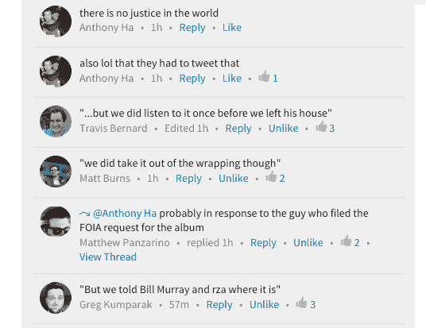

# FBI:我们没有没收 Shkreli 的吴唐专辑 

> 原文：<https://web.archive.org/web/http://techcrunch.com/2015/12/17/fbi-we-did-not-seize-shkrelis-wu-tang-album/>

# 联邦调查局:我们没有没收 Shkreli 的武堂专辑

在最新一集“我靠，这家伙怎么没进监狱……哦，他……真酷”中，联邦调查局被迫就今天因证券欺诈而逮捕马丁·什克里里一事发表声明。

如果你不知道， [Shkreli 以$2M 的价格收购了流行说唱组合 Wu-Tang Clan 的一张未发行的专辑](https://web.archive.org/web/20230128091423/http://www.theatlantic.com/entertainment/archive/2015/12/martin-shkreli-wu-tang-clan-businessweek-once-upon-a-time-in-shaolin-bad/419598/)。《少林寺往事》只有一本，Shkreli 有。

还是在他被捕时缴获的？

联邦调查局说不:

这个绝对天才的人试图以一种非常直接的方式复制这张专辑，这可能会导致联邦调查局说出来:

我们在 TechCrunch 有什么想法？很高兴你问了:

给比利·穆雷打电话的时间到了:

**奖励:**以下是[亚历克斯](https://web.archive.org/web/20230128091423/http://www.twitter.com/alex)为这篇报道建议的标题:

联邦调查局未能没收 Shkreli 的吴唐家族专辑，使他们成为多日来最不受欢迎的联邦机构。

“粉丝承诺在 FBI 未能没收吴唐专辑后对其采取液体剑报复”

“联邦调查局未能从诈骗犯手中没收吴唐专辑后，这个老混蛋进了坟墓”