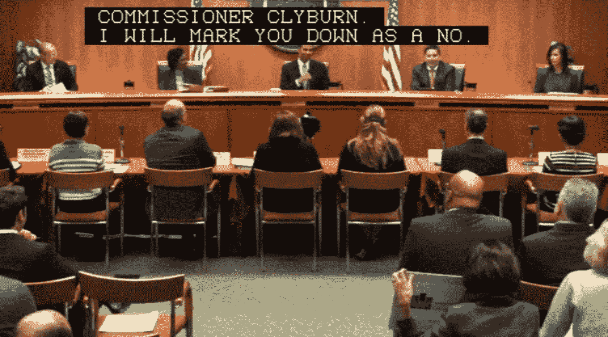

# FCC 专员 Clyburn guts 在延长异议中的反网络中立命令

> 原文：<https://web.archive.org/web/https://techcrunch.com/2018/01/05/fcc-commissioner-clyburns-extended-dissent-guts-anti-net-neutrality-order/>

FCC 专员 Clyburn 在上个月的会议上发表了激烈的异议，这使得她对委员会消除网络中立的计划的立场没有任何猜测的余地。但这不是她要说的全部。昨天，[与“恢复互联网自由”令](https://web.archive.org/web/20230313051919/https://www.fcc.gov/document/fcc-releases-restoring-internet-freedom-order)的最终文本一起发布，这是一份延伸声明，进一步细化并抨击了新规定的诸多不足之处。

整篇声明长达 6000 字，非常值得一读——尤其是如果你错过了她当天的演讲。或许有一半的篇幅致力于对该规则的缺陷进行新的、更具技术性的阐述。

Pai 主席欣然接受了 Clyburn 专员对其工作的猛烈抨击。

以下是我在通读中发现的几个亮点。

关于缺乏证据支持网络中立阻碍了创新的观点:

> 我们已经看到来自宽带提供商的自私声明，我们的网络中立规则在某种程度上阻碍了他们将“创新的”新产品推向市场。他们从来没有告诉我们这些产品在任何真正的细节层面上会是什么样的。
> 
> 我的观点是，如果确实有创新产品能够引起消费者的兴趣，更好的做法是将这些想法公之于众，让消费者迫使持相反意见的联邦通信委员会屈服。但是，由于没有公开这些被我们的规则取消抵押品赎回权的其他幽灵产品的详细计划，我的感觉是，这些产品就像彩虹鬃毛独角兽一样真实。

我曾专门就这些“幽灵产品”询问过几家宽带提供商，但没有得到任何答复。

关于网络中立导致投资下降的说法:

> 这篇文章中没有任何东西让我相信，我们的网络中立政策导致了投资下降……网络中立规则转移了数十亿美元的资本，这令人难以想象，记录也没有提供投资趋势与监管格局相匹配的证据。
> 
> 如果你相信记录中宽带提供商提交的信息，这些信息会跟踪美联储对更广泛经济中投资的评估。这表明，宽带提供商投资的任何所谓减少都可能是由于影响整体经济的宏观经济因素，而不是 2015 年开放互联网规则。

这种说法充其量只能说没有定论，公司自己也公开声明，网络中立规则不是他们投资计划中的一个因素。(我也问过这些说法，无济于事。)

关于标题一和标题二的历史:

> 联邦通信委员会的多数人在重述监管历史时是不诚实的，特别是当它涉及到互联网和分组交换服务时。大多数人并没有“回到”分组交换网络，特别是互联网接入变体被监管为标题 I 服务的时代…将 FCC 过去的互联网接入方法描绘成解除监管的天堂，这没有抓住我们过去监管的真相。
> 
> 没有一种现代服务被大多数人称为电信[即第二篇]服务，这实际上是从法规中读出了这一定义。数百名在记录中备案的计算机科学家同意，这种重新分类是无意义的，也不符合基本的互联网技术。这很容易在我将让律师处理的监管官样文章中丢失，但我认为就此提出几点是有启发性的。
> 
> 我认为这暴露了这是一个以结果为导向的决定，缺乏任何合理的技术或消费者预期。

第一点你可以在我的[网络中立史](https://web.archive.org/web/20230313051919/https://techcrunch.com/2017/05/30/commission-impossible-how-and-why-the-fcc-created-net-neutrality/)中了解，第二点在[的](https://web.archive.org/web/20230313051919/https://techcrunch.com/2017/11/25/fcc-doubles-down-on-its-dead-wrong-definition-of-how-the-internet-works/)[许多解释](https://web.archive.org/web/20230313051919/https://techcrunch.com/2017/12/11/internet-pioneers-plead-with-congress-to-preserve-net-neutrality/)中了解，为什么当前的秩序在技术上是不正确的关于互联网如何工作的定义。

关于 FCC 拒绝为移动宽带制定网络中立规则:

> 虽然大多数人承认委员会有权对移动宽带服务许可证持有人实施开放的互联网行为规则，但委员会拒绝这样做，因为它认为这将导致对没有固定宽带服务的移动许可证持有人施加监管负担。我看不出大多数人如何能恰当地得出这一结论，除非他们审查了全国拉美裔媒体联盟(NHMC) FOIA 请求所披露的 47，000 多份投诉。这是委员会推迟就这一项目进行表决的另一个原因。

事实上，这一最新披露的成千上万的投诉没有得到解决是诉讼过程中的几个污点之一，很可能会出现在法律挑战中。

关于联邦贸易委员会将继续联邦通信委员会的工作的想法:

> 回想一下，联邦贸易委员会必须在损害已经发生后采取行动，而且必须通过诉讼来这样做。这意味着宽带没有明确的规则，而且在它的投诉被裁决之前，一个初创公司或独资经营者可能早就离开了。
> 
> 法院可能会否认联邦贸易委员会对宽带提供商实施反垄断补救措施的努力，因为该行业表面上是由联邦通信委员会监管的。事实上,“威瑞森诉特林科”一案的措辞表明，在《通信法》规定了表面上的损害补救措施的情况下，法院不会特意去发现违反了反垄断法。因此，联邦通信委员会否认权威的事实也可能削弱联邦贸易委员会的权威。

这里的法律先例很复杂，但本质上，联邦贸易委员会可能被禁止适用反垄断法——这是新法令经常提到的补救措施——因为一个专家机构已经在巡逻了。如果联邦通信委员会不愿意，联邦贸易委员会也不愿意，谁愿意呢？谁也不是，就是谁。

最后，作为专员扩展声明的最后一个亮点:

> 简而言之，我们正在用明确的保护来换取不确定的保护，用坚如磐石的法律权威来换取不稳定的保护，用强有力的执法权威来换取较弱的保护……我担心这是又一个为宽带提供商铺上红地毯的策略，同时让消费者排起长队等待侧门。欢迎来到无监管区。

好奇网络中立之战接下来会发生什么？[你继续战斗。](https://web.archive.org/web/20230313051919/https://techcrunch.com/2017/12/14/the-fcc-just-repealed-net-neutrality-what-happens-next/)

