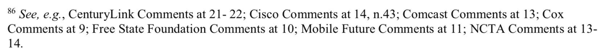

# 美国联邦通信委员会对互联网如何工作的定义大错特错

> 原文：<https://web.archive.org/web/https://techcrunch.com/2017/11/25/fcc-doubles-down-on-its-dead-wrong-definition-of-how-the-internet-works/>

今年 5 月，当联邦通信委员会发布了一份取消 2015 年强有力的网络中立规则的计划的早期草案时，我指出其案例[几乎完全基于对互联网如何工作](https://web.archive.org/web/20230314004225/https://techcrunch.com/2017/05/23/the-fccs-case-against-net-neutrality-rests-on-a-fundamental-deliberate-misunderstanding-of-how-the-internet-works/)的一个非常不正确的定义。现在不可能有错误，这种歪曲是故意的；该机构在提案的最终草案中以更加强硬的措辞[重申了这一点。](https://web.archive.org/web/20230314004225/https://techcrunch.com/2017/11/22/fcc-releases-final-draft-of-restoring-internet-freedom-which-would-not-do-that/)

我不打算详细讨论这个问题(我的[早先的帖子](https://web.archive.org/web/20230314004225/https://techcrunch.com/2017/05/23/the-fccs-case-against-net-neutrality-rests-on-a-fundamental-deliberate-misunderstanding-of-how-the-internet-works/)已经阐明了)，但基本问题是:宽带必须被定义为信息服务或电信服务。第一个是“提供生成、获取、存储、转换、处理、检索、利用或提供信息的能力”，而第二个是“在用户指定的点之间传输用户选择的信息，而不改变发送和接收的信息的形式或内容。”

这一点很重要，因为这两件事受到非常不同的监管——在互联网服务提供商非常害怕的“第二条”授权下，FCC 对电信服务拥有更大的权力。

虽然 ISP 确实以某种方式代表用户存储数据，通常作为管理网络的一部分，但同样可以肯定的是，他们的主要目的是在用户和他或她选择的点之间传输数据。因此，宽带应被归类为电信服务。

但是不要相信我的话。联邦通信委员会在其 2015 年的命令中为我提出了论点，引用了许多自己的来源来支持这一事实。由 EFF 和近 200 名专家制作的这本优秀的初级读本基本上从基本原理上解释了互联网是如何工作的，以及为什么它应该被定义为电信。名单上有很多名人，但似乎很明显，即使是园艺品种专家也比 FCC(或假装)更清楚地了解这一点。

联邦通信委员会在脚注中驳斥了这些学者和互联网的创始人，称自己“不相信”互联网是按照他们坚持的方式工作的。与此同时，该提案反复且毫无疑问地引用了互联网服务提供商的评论，声称像缓存数据这样简单的事情就神奇地使他们免于电信服务:

相信他们就好——毕竟，这场比赛中他们又没有马。

由此产生的将宽带定义为使用户能够生成、存储、转换和处理他们的数据是荒谬的。正如互联网工程师评论指出的，这就像说你的手机是一个比萨饼店，因为你可以用它来订购比萨饼。这就好比说，因为你建造了一条路，你也在建造这条路上的所有企业。

是像维基百科、Dropbox 这样的边缘提供商，甚至是像 TechCrunch 这样的简单网站提供用户请求的服务；在用户和这些边缘提供商之间，是 ISP 承载这些数据，没有形式上的变化。联邦通信委员会拒绝了这个基本的想法，并代之以一个方便的虚构，坚持其目前的野心，重新分类宽带。所有这一切似乎都有道理，但这只是因为互联网看起来非常不同的时代的先例。

这可能是他们垮台的原因。因为整个提案是建立在这个虚假和过时的定义之上的，所以删除它会导致其余部分崩溃。没有重新分类，就没有网络中立性的逆转。这里有希望:联邦通信委员会的论点(也就是说，宽带行业的论点)[已经在法庭上失败](https://web.archive.org/web/20230314004225/https://techcrunch.com/2017/05/01/judge-argues-net-neutrality-violates-the-free-speech-rights-of-internet-providers/)，并且可能再次失败。希望如此。