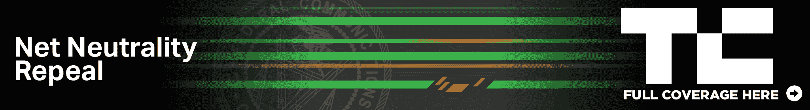

# FCC 将于 12 月 14 日投票决定是否删除网络中立性 

> 原文：<https://web.archive.org/web/https://techcrunch.com/2017/11/21/fcc-officially-moves-to-unwind-net-neutrality-rules/>

联邦通信委员会主席 Ajit Pai [今天兑现了他的长期承诺，解决上届政府制定的旨在保护互联网内容分发的法规。](https://web.archive.org/web/20221210062051/https://www.fcc.gov/document/chairman-pai-proposes-restore-internet-freedom)

周二，在“*重建互联网自由秩序”的支持下，Pai 向 FCC 的其他委员分发了一份他建议的规则修改草案。*

此举将于 12 月 14 日在 FCC 进行投票，这可能会对整个互联网产生广泛的影响。[根据奥巴马政府制定的规则](https://web.archive.org/web/20221210062051/https://beta.techcrunch.com/2017/05/30/commission-impossible-how-and-why-the-fcc-created-net-neutrality/)，互联网提供商被要求为所有数字内容提供开放的网络接入。

新规则将赋予康卡斯特、美国电话电报公司和威瑞森(拥有 Oath，拥有 TechCrunch)等网络提供商新的权力来限制某些内容的分发……相反，对更好的访问收取更多费用。在新的命令中，Pai [认为这样的提供商不“传输”数据](https://web.archive.org/web/20221210062051/https://beta.techcrunch.com/2017/05/23/the-fccs-case-against-net-neutrality-rests-on-a-fundamental-deliberate-misunderstanding-of-how-the-internet-works/)，因此不在 FCC 的权限之内——很少有专家同意这种互联网基础设施的观点。

派认为，奥巴马政府实施的监管“抑制了建设和扩大宽带网络的投资，阻碍了创新。”这一断言的真实性受到了专家和立法者的全面质疑，他们还指出，这是一个极其狭隘的衡量现有规则成功与否的标准。

新规则只会要求互联网提供商“对他们的做法保持透明，以便消费者可以购买最适合他们的服务计划，企业家和其他小企业可以获得创新所需的技术信息。”

根据 Pai 的新规则制定，额外的监管监督将移交给美国联邦贸易委员会，该机构在 2015 年的命令之前有权监管其中的一些事项。

“值得注意的是，我的建议将使联邦政府最有经验的隐私警察，联邦贸易委员会，重新回到保护消费者在线隐私的轨道上来，”Pai 写道。然而，联邦贸易委员会[无法制定](https://web.archive.org/web/20221210062051/https://beta.techcrunch.com/2017/05/19/these-are-the-arguments-against-net-neutrality-and-why-theyre-wrong/)像 2015 年法令中那样的强有力的、先发制人的网络中立规则。

没有提到对新秩序的评论数量，其中绝大多数支持现有的网络中立规则。

网络中立性阻止互联网服务提供商优先考虑他们喜欢或支付更多费用的企业和其他组织的数据。这些规则保持了互联网的开放、自由和不受限制，防止互联网服务提供商成为控制和操纵人们上网内容的看门人。

“互联网权利是公民权利，”美国公民自由联盟高级政策分析师杰伊·斯坦利说。“破坏网络中立将对网络言论自由产生毁灭性的影响。没有它，像康卡斯特、威瑞森和美国电话电报公司这样的门户公司将有太大的权力来干扰信息的自由流动。”

美国公民自由联盟战略倡议主任罗纳德·纽曼说:“在一个没有网络中立的世界里，活动分子可能会失去一个组织和争取变革的重要平台，小组织可能永远不会得到公平的机会来发展壮大。国会必须阻止 Pai 主席的计划，并确保网络中立仍然是法律。”

“今天，联邦通信委员会威胁要终结我们所知道的互联网，”参议员迈克尔·沙茨(D-HI)说。“如果被采纳，FCC 的计划将改变每个美国人获取信息、看电影、听音乐、做生意以及与家人通话的方式。通过废除基本的网络中立保护，联邦通信委员会将互联网的完全控制权交给了提供商，让美国人民的选择和访问更少了。”

以下是完整的声明:

> 近二十年来，互联网在克林顿总统和共和党国会建立的宽松监管方式下蓬勃发展。这一两党合作的框架引导私营部门投资 1.5 万亿美元在全美建设通信网络。它给了我们一个成为世界羡慕的网络经济。
> 
> 但在 2015 年，之前的 FCC 屈服于奥巴马总统的压力。在一次党派投票中，它对互联网实施了严厉的、实用主义式的监管。那个决定是个错误。这抑制了对建设和扩展宽带网络的投资，也阻碍了创新。
> 
> 今天，我与我的同事们分享了一份草案，该草案将放弃这一失败的方法，回归到几十年来为消费者提供良好服务的长期共识。根据我的提议，联邦政府将停止对互联网的微观管理。相反，FCC 将简单地要求互联网服务提供商对他们的做法保持透明，以便消费者可以购买最适合他们的服务计划，企业家和其他小企业可以获得他们创新所需的技术信息。
> 
> 此外，由于我的提议，美国联邦贸易委员会将再次能够监管互联网服务提供商，保护消费者，促进竞争，就像它在 2015 年之前所做的那样。值得注意的是，我的提议将让联邦政府最有经验的隐私警察——联邦贸易委员会——重回保护消费者网络隐私的正轨。
> 
> 说到透明度，当之前的 FCC 采纳了奥巴马总统严厉的互联网法规时，它拒绝让美国人民看到该计划，直到 FCC 投票数周后。这一次，会有所不同。具体来说，我将在明天公开发布我关于恢复互联网自由的提议——比欧盟委员会 12 月 14 日的投票早三周多。
> 
> 与我的同事们一起工作，我期待着回到轻接触、基于市场的框架，这一框架引发了数字革命，并使这里和世界各地的消费者受益。

为了与 Pai 的吹嘘形成对比，看看约翰·奥利弗的这篇文章:

[https://web.archive.org/web/20221210062051if_/https://www.youtube.com/embed/92vuuZt7wak?feature=oembed](https://web.archive.org/web/20221210062051if_/https://www.youtube.com/embed/92vuuZt7wak?feature=oembed)

视频

