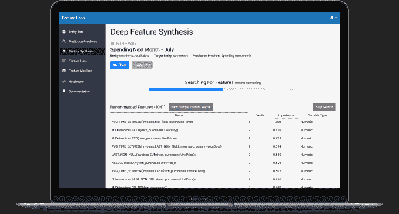

# 麻省理工学院推出特色实验室，加速机器学习算法的开发 

> 原文：<https://web.archive.org/web/https://techcrunch.com/2018/02/22/feature-labs-launches-out-of-mit-to-speed-up-building-machine-learning-algorithms/>

# 麻省理工学院推出特色实验室，加速机器学习算法的开发

[Feature Labs](https://web.archive.org/web/20221209022919/https://www.featurelabs.com/) 是一家初创公司，其研究始于麻省理工学院，今天正式推出一套工具，帮助数据科学家更快地构建机器学习算法。

联合创始人兼首席执行官 Max Kanter 表示，该公司已经开发出一种自动化“特征工程”的方法，对于数据科学家来说，这通常是一个耗时的手动过程。“功能实验室帮助公司识别、实施，最重要的是部署有影响力的机器学习产品，”坎特告诉 TechCrunch。

他补充说，“功能实验室是独一无二的，因为我们自动化了功能工程，这是一个使用领域知识从原始数据中提取新变量的过程，使机器学习算法发挥作用。”

坎特解释说，该公司通过使用一种名为“深度特征合成”的过程来实现这一目标，该过程从原始的关系和交易数据集(如访问网站或废弃的购物车商品)中创建特征，并自动将其转换为预测信号。

他表示，这与当前耗时且容易出错的人工驱动流程有着天壤之别。自动化特征工程使数据科学家能够创建他们自己想出的相同类型的变量，但速度更快，而不必在底层管道上花费太多时间。“通过给数据科学家这个自动化的过程，他们可以花更多的时间来弄清楚他们需要预测什么，”他说。

图片:功能实验室

它通过几种方式实现了这一点。首先，它开发了一个名为 [Featuretools](https://web.archive.org/web/20221209022919/https://www.featuretools.com/) 的开源框架，为开发者提供了一种入门 Feature Labs 工具集的方式。坎特说，他们可以使用这些工具来构建小项目，并轻松使用这些算法。“这项倡议的目标是分享我们的愿景，让开发者有机会在新的机器学习问题上试验自动化特征工程，”他在宣布公司推出的博客文章中写道。

然而，一旦一家公司想要超越实验来扩大项目规模，他们就需要购买该公司的[商业产品](https://web.archive.org/web/20221209022919/https://www.featurelabs.com/product/)，根据客户的要求，他们以云服务或内部解决方案的形式提供该产品。早期客户包括 BBVA 银行、美国柯尔百货公司、美国宇航局和国防部高级研究计划局。

该公司还宣布了一轮 150 万美元的种子资金，实际上已于去年 3 月结束。这轮融资由 Flybridge Capital Partners 牵头，First Star Ventures 和 122 家 West Ventures 参与其中。

功能实验室的产品源于坎特和他的联合创始人 Kalyan Veeramachaneni 和 Ben Schreck 在麻省理工学院计算机科学和人工智能实验室(也称为 CSAIL)的研究。该公司的想法始于 2015 年，在过去的几年里，他们一直在通过与早期客户的合作来完善产品，这导致了今天的发布。