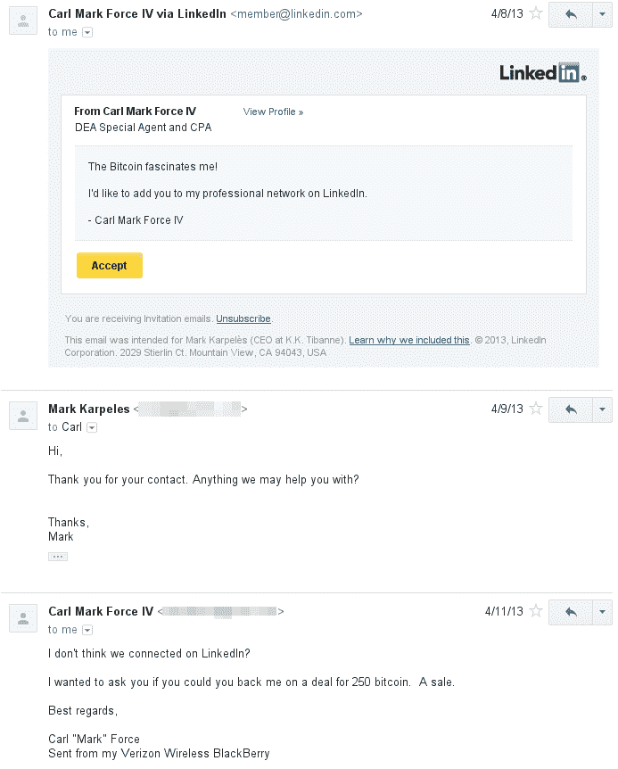
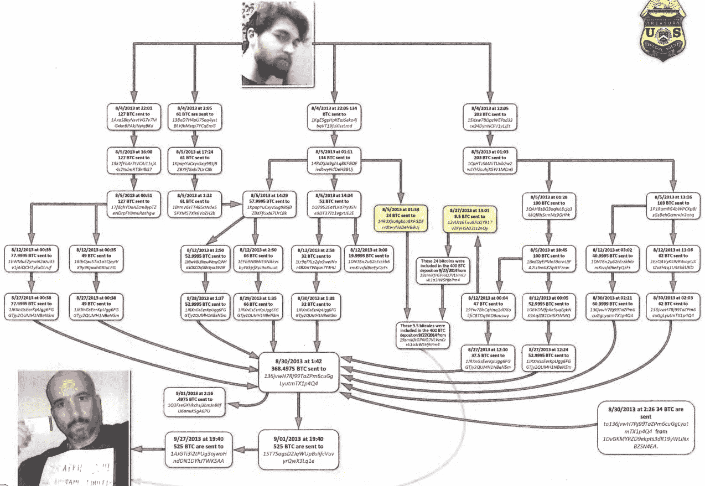

# 联邦调查局逮捕涉及 Gox 和丝绸之路的比特币大劫案 

> 原文：<https://web.archive.org/web/http://techcrunch.com/2015/04/01/feds-nabbed-for-big-bitcoin-heist-involving-gox-and-silk-road/>

More posts by this contributor

丝绸之路案件的新信息在加密货币社区引发了幸灾乐祸的涟漪，因为它对两名美国联邦特工从[丝绸之路](https://web.archive.org/web/20230129063156/https://techcrunch.com/tag/Silk%20Road)和 Mt. Gox 金库中窃取数千枚[比特币](//web.archive.org/web/20230129063156/http://techcrunch.com/tag/bitcoin%E2%80%9D)的失败努力做出了反应。

根据美国司法部周一发布的一份[声明](https://web.archive.org/web/20230129063156/http://www.justice.gov/opa/pr/former-federal-agents-charged-bitcoin-money-laundering-and-wire-fraud)，两名联邦特工因在丝绸之路调查期间窃取比特币而被指控电信欺诈、洗钱和伪造政府文件。

这些特工是位于巴尔的摩的调查丝绸之路市场的特遣部队的一部分。他们的任务包括与罗斯·乌布里希特建立关系(又名“恐惧海盗罗伯茨”，丝绸之路的被告所有者，上个月被判有罪)。这两名特工利用他们作为联邦特工的身份在调查期间误导、施压，并从他们的活动中获取个人利益——所有这些都没有报告或未被雇用他们的部门注意到。

刑事指控中的信息显示巴尔的摩特别工作组在逮捕了一名雇员后获得了丝绸之路的管理员权限。特勤局特工肖恩·布里奇斯当天下午登录了丝绸之路管理账户，亲自从丝绸之路账户进行大规模盗窃。

这起盗窃案是所谓的“雇凶杀人”请求的基石，这些请求是针对乌尔布里切特案的一部分。BTC 号失踪后，乌布里切特曾出钱杀死一名他认为是从丝绸之路偷东西的雇员。他一点也不知道是布里奇斯，作为雇员，做了虹吸。

有趣的是，这些比特币被 Shaun Bridges 从丝绸之路转移到 Mt. Gox，他可以在那里将它们从 BTC 兑换成美元，这让他有时间建立一个有限责任公司并开设一个银行账户，以便他可以将资金汇回美国。

与此同时，另一名被指控的联邦特工卡尔·福斯(Carl Force)通过 Linkedin 联系 Mt. Gox 的马克·卡普莱斯(Mark Karpeles)，问他是否会支持福斯出售 250 枚比特币。福斯说他是一名联邦特工，但正在寻找其他工作。

在此期间，布里奇斯在三个月内从 Mt. Gox 给他的银行账户汇了九笔总计 820，000 美元的款项。完成这些银行转账后，布里奇斯签署了针对 Mt. Gox 的[扣押令](https://web.archive.org/web/20230129063156/http://www.scribd.com/doc/162503556/Mt-Gox-Wells-Fargo-Seizure-Warrants)，没收了 500 万美元，并在此过程中关闭了比特币交易所。affadavit 指控 Mt. Gox 在没有执照的情况下从事货币服务业务，非法允许人们将比特币兑换成法定货币——肖恩·布里奇斯(Shaun Bridges)就在几天前进行了这项活动。

Mt. Gox 被查封后，Carl Force 发来了一封可爱的电子邮件，嘲弄地告诉 Karpeles，他应该与他合作——在关闭前几天，Karpeles 拒绝了这一提议。值得注意的是，卡尔·福斯(Carl Force)是一名 15 年的 DEA 特工，在此期间，他还在一家名为 coinMKT 的比特币交易所担任“合规官”,在那里他个人投资了价值 11 万美元的比特币。

事实上，Carl Force 利用他的 DEA 访问权限非法运行了针对交易所用户的犯罪历史检查，并非法冻结了其中一个个人客户的帐户，其中包含价值 297，000 美元的数字货币和 37，000 美元的现金。问题中的账户属于一名从事个体经营的加州居民——不幸的是，由于 CoinMKT 的系统出现故障，无法提取超过 10，000 美元的资金——该账户被标记为引起 Carl Force 的注意，以控制资金，尽管他缺乏足够的法律依据来这样做。

Carl Force 声称扣押是联邦调查的一部分(这是伪造的)，然后让 coinMKT 将比特币转移到他在 Bitstamp 的个人账户。谢天谢地，Bitstamp 起了疑心，在他们注意到 Carl Force 试图用 TOR(私人)浏览器向一个个人银行账户提取 8 万美元后冻结了账户，因为他不想让“NSA 监视他”

只是在 Bitstamp 与 Bridges 交谈后，Carl Force 的账户才被解冻，他才能够转移被盗的比特币，这些比特币被兑换成美元并转移到他的个人银行账户。卡尔·福斯买了几处房产，把一些现金转到离岸银行账户，还了抵押贷款。

肖恩·布里奇斯和卡尔·福斯窃取了价值数百万美元的比特币和数字货币。联邦特工使用了许多比特币交易所、支付处理器和银行账户，试图在账户和身份之间转移资金。对他们来说不幸的是，他们不熟悉比特币在交易流程中的可追踪性和透明性。谢天谢地，我们可以感谢国税局特工甘巴里安·蒂格兰把这些拼凑在一起。最终，这个奇怪的悲伤故事是加密货币大规模采用之路的又一步，对于那些认为他们可以在自己的游戏中愚弄黑客的人来说，它主要是一个警示故事。

**编者按:** *Lisa Cheng 是加密货币咨询公司 [Vanbex Group](https://web.archive.org/web/20230129063156/http://www.vanbex.com/) 的首席执行官。*