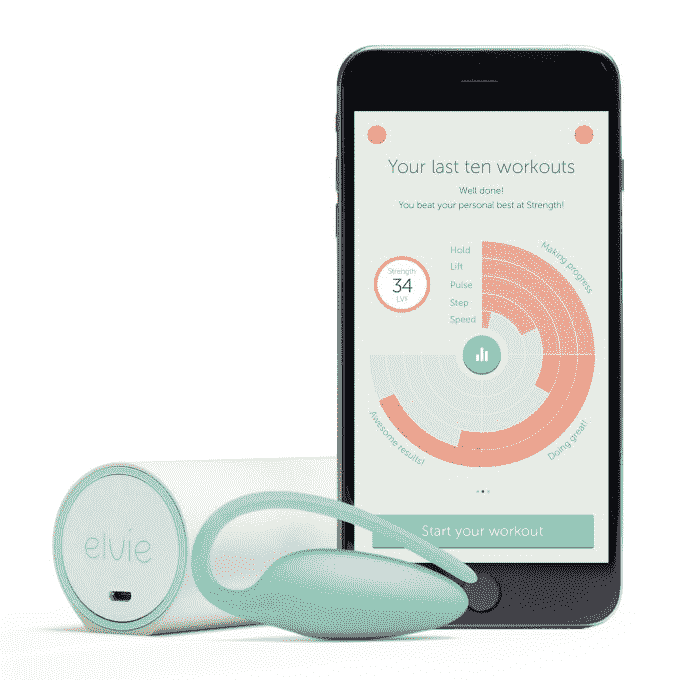

# Femtech 硬件初创公司 Elvie inks 与英国 NHS TechCrunch 建立战略合作伙伴关系

> 原文：<https://web.archive.org/web/https://techcrunch.com/2018/08/10/femtech-hardware-startup-elvie-inks-strategic-partnership-with-uks-nhs/>

女性科技硬件初创公司 Elvie ，其第一款产品是时尚的[智能盆底训练器](https://web.archive.org/web/20230131160503/https://techcrunch.com/2014/11/06/chiaro-elvie/?_ga=2.254342280.1891179592.1533833482-1757155993.1533833482)，已经与英国国家医疗服务系统签署了战略合作伙伴关系，将通过该国的免费医疗服务在全国范围内提供该设备，因此患者无需支付任何直接费用。

这是这家由首席执行官塔尼亚·博勒(Tania Boler)和 Jawbone 创始人亚历山大·阿塞利(Alexander Asseily)在 2013 年共同创立的初创公司的一个重大胜利，其目标是建立专注于女性问题的智能技术——这是电子产品领域中一个被忽视和服务不足的类别。

Boler 在开始 Elvie (née Chiaro)之前的背景包括为联合国全球性教育课程工作。但她对盆底健康的兴趣，以及创办 Elvie 的灵感，始于她自己生了孩子之后，她发现在产后护理身体方面，法国女性比英国女性得到更多的支持。

通过 NHS 合作伙伴关系，这是该创业公司的第一个国家报销合作伙伴关系(因此，正如一位女发言人所说，对于这家仍然年轻的公司来说，它具有“变革的潜力”)，Elvie 正在强调其联网技术有助于减轻尿失禁症状的机会，包括新妈妈或压力相关尿失禁患者的症状。

Elvie kegel 训练器旨在使女性的骨盆底锻炼变得有趣而简单，通过一个应用程序提供实时反馈，该应用程序还可以将活动游戏化，指导用户进行旨在加强骨盆底的锻炼，从而帮助减少尿失禁症状。该设备还可以在用户不正确收缩时提醒用户。

埃尔维引用了一项研究，表明英国国民医疗服务体系每年在尿失禁上花费 2.33 亿英镑，还声称大约三分之一的女性和高达 70%的准妈妈和新妈妈目前患有尿失禁。在 70%的压力性尿失禁病例中，这表明可以通过骨盆底肌肉训练来减轻或消除症状。

虽然并不绝对需要任何设备来执行必要的肌肉收缩以加强骨盆底，但 Elvie 教练打算帮助解决的挑战是，女性很难知道自己是否正确或有效地进行了练习。

埃尔维引用了 2004 年的一项研究，该研究表明，大约三分之一的女性无法仅靠书面或口头指导正确锻炼骨盆底。虽然它说生物反馈设备(一般而言，而不是专门的 Elvie 训练器)已被证明可以将骨盆底训练计划的成功率提高 10%——它说其他研究表明，第一年内可以将手术率降低 50%，并将每位患者的治疗费用减少 424 英镑。

“到目前为止，生物反馈盆底训练设备只能通过 NHS 从患者医院借来在家中使用，患者的分配取决于需求。Elvie Trainer 将是 NHS 上第一款可供患者保留的家用生物反馈设备，这将支持长期激励，”它补充道。

国王学院医院的女性健康理疗师克莱尔·佩希在一份声明中评论说:“我很高兴埃尔维教练现在可以通过英国国民健康服务体系获得。除了它是一款时尚、谨慎和漂亮的产品这一事实之外，这款应用程序使用简单，直接在手机屏幕上的即时视觉反馈会非常有益和激励人。它有助于使盆底康复充满乐趣，这对于维持盆底康复至关重要。”

埃尔维没有透露 NHS 合作的商业细节，但一位女发言人告诉我们，这种战略合作的主要目标是扩大埃尔维教练的使用范围，并补充说:“批发价格反映了这一点。”

在讨论供应安排的结构时，她说 Elvie 正在与 Eurosurgical 合作，作为其交付合作伙伴——她说这是一家经销商，拥有“几十年向 NHS 供应产品的经验”。

该方法将根据信托而变化，关于是否为特定患者订购单元，或者是否将持有少量库存，以便可以在建立需求的会话中向患者提供单元。这一过程将受到监督和审查，以确定最有效和最经济的分配方法的国民保健服务供应链，”她补充说。