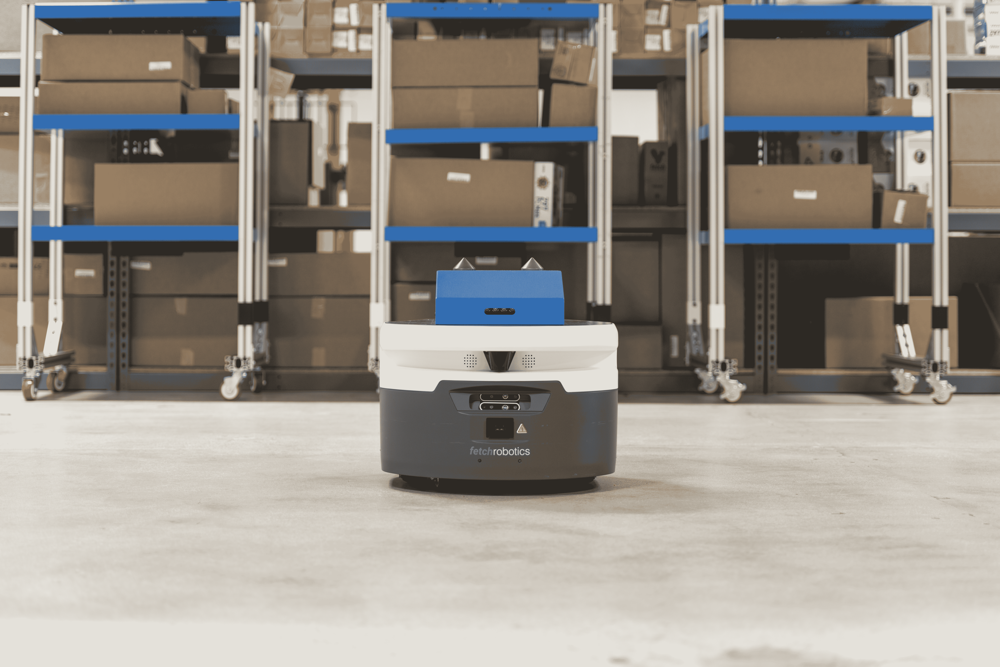

# Fetch 为其仓库自动化大军增加了两个新机器人 

> 原文：<https://web.archive.org/web/https://techcrunch.com/2018/04/05/fetch-adds-two-new-robots-to-its-warehouse-automation-army/>

# Fetch 为其仓库自动化大军增加了两个新机器人

[Fetch Robotics](https://web.archive.org/web/20221025231042/https://techcrunch.com/tag/fetch-robotics/) 以 2500 万美元的 B 轮投资结束了 2017 年，使其总额达到 4800 万美元。很明显，投资者被这家位于圣何塞的自动化公司吸引住了。大多数人认为，自动化程度越来越高的仓库正面临人员短缺，Fetch 提供了人类和机器人协同工作的前景。

今天，该公司宣布了一对新机器人，旨在消除仓库履行中的一些痛点。这两个模块都插在该公司的 VirtualConveyor 机器人(一种大型仓库机器人)的顶部，Roomba 设计了两个在空间中从 A 点到 B 点的自主导航，同时避免与人、过道和掉落的物体发生碰撞。

RollerTop 是在机器人的顶部增加了一系列滚轮，你可能已经猜到了这个名字。滚筒本身是有动力的，所以机器人可以开到传送带前，自己排好队，然后送一个箱子去取货。这里的另一个大功能是 CartConnect，这是一个带有一对金属钉的模块，能够在仓库内拾取和运输手推车。

本周早些时候，TechCrunch 在该公司最近开业的圣何塞总部与首席执行官 Melonee Wise 进行了一次会面。这位高管告诉我们，这些模块代表了 Fetch 模型的一大部分，正在向前发展。该公司可能不会在短期内对实际的机器人硬件基础进行太多迭代，而是专注于这些关键配件以及软件更新。

然而，这些部分确实为该系统指明了前进的方向，通过合适的附加组件，该系统将能够执行广泛的不同任务。由于像亚马逊这样的公司已经完全改变了对仓库物流的期望，许多公司发现他们自己正在努力跟上。例如，很明显，为什么 DHL 已经开始部署 Fetch 的一些机器。

这些机器人当然不是胡说八道，它们能够完成让工厂工人感到紧张的重复性和繁重的任务。