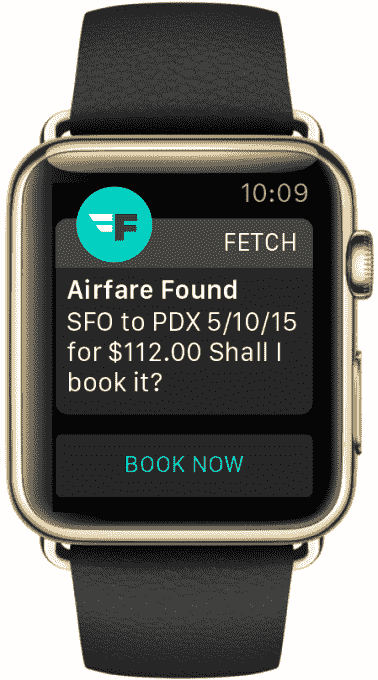

# Fetch 可以让你从 Apple Watch 购买、预订或安排任何东西 

> 原文：<https://web.archive.org/web/http://techcrunch.com/2015/04/28/fetch-lets-you-buy-book-or-schedule-anything-from-your-apple-watch/>

包括 [Magic](https://web.archive.org/web/20230130231622/https://techcrunch.com/2015/02/23/magic-is-a-startup-that-promises-to-bring-you-anything-if-youre-willing-to-pay-for-it/) 、[运营商](https://web.archive.org/web/20230130231622/https://techcrunch.com/2015/04/22/the-request-network/#.o0tzqc:gzLB)和 [GoButler](https://web.archive.org/web/20230130231622/https://techcrunch.com/2015/04/13/gobuttler-nyc/#.o0tzqc:km5n) 在内的许多初创公司，都在专注于满足客户通过手机应用或短信发送的与商务相关的请求。但是今天，它的竞争对手移动购物助手 [Fetch](https://web.archive.org/web/20230130231622/https://www.buywithfetch.com/) 发布了苹果手表应用，着手开发一个新平台。现在，Fetch 更像是一个移动“门房”，手表所有者可以直接从手腕上订购任何产品、按需服务或预订旅行。

例如，客户可以要求 Fetch 应用程序为他们订购披萨，送花给某人，购买电影票，预订最后一分钟的酒店房间，找到机械师，安排医生的预约，预订晚餐，甚至订购另一件当天交付的物品。

Fetch 的首席执行官汤姆·哈德菲尔德解释说，从本质上讲，它是个人购物者、虚拟助理和旅行社代理人的结合，所有这些都集于一身。

使用该应用程序非常简单。将它安装到 Apple Watch 后，您只需点击麦克风图标，说出您的请求。然后，Fetch 的 58 名门房中的一名会接受这一请求，这些门房是在旅游、葡萄酒、鞋子等领域受过训练的专业人员。与此同时，Fetch 使用自然语言处理等技术来处理请求，并通过 API 为商品定价，从而增强了他们的能力。

“我们相信未来是‘人工智能加人类’，”哈德菲尔德指出。

Fetch 的应用程序将请求的结果返回给移动用户，为他们提供一种快速完成手头任务的方法。例如，正如你在下面的照片中看到的，当 Fetch 应用程序找到机票价格时，Apple Watch 用户只需点击“立即预订”按钮即可购买机票。

该应用程序中的支付功能由 Apple Pay 和 Stripe 提供支持，该公司还与其他服务提供商合作，帮助它完成各种请求。像一些按需竞争对手一样，Fetch 与 Postmates 和 Instacart 等服务合作，提供当天送货服务，与 Homejoy 和 Handybook 合作提供房屋清洁服务，与 Washio 和 Rinse 合作提供干洗服务，以及与 DoorDash、Caviar 或 GrubHub 等服务合作提供食品送货服务，等等。

然而，这项服务与一些竞争对手的不同之处在于它的商业模式。Magic 收取额外费用来帮助它创造收入，而运营商则在收入之前首先关注规模。另一方面，Fetch 不会增加额外的费用，但如果可以的话，它会利用联盟计划。此外，该公司目前正在努力与零售商和供应商敲定一些特殊的履约合作伙伴关系，以增加佣金。

此外，尽管这项服务目前是免费使用的，但该公司计划通过下个月推出的高级订阅服务开辟另一条收入途径。哈德菲尔德说，这一级别的定价仍有待确定，但它将包括更快的响应时间和更个性化的服务。

[gallery ids="1150266，1150267，1150268，1150269，1150270，1150271，1150272，1150273"]

Fetch 在美国任何地方都可以通过接入该地区任何可用的本地提供商来工作，因此它不像点播行业的一些公司目前那样仅限于主要的城市市场。

直到今天，Fetch 都是通过 iOS 应用程序、Android 应用程序或者通过发送“Fetch”(33824)请求来提供的。该公司是这一领域的先行者，在 TechCrunch Disrupt NY 2014 上首次发布了[。后来](https://web.archive.org/web/20230130231622/https://techcrunch.com/2014/05/05/fetch-launches-mobile-shopping-app/)[将](https://web.archive.org/web/20230130231622/https://techcrunch.com/2014/09/15/forget-siri-fetch-is-a-real-personal-assistant-contained-in-an-app/)扩展到支持个人购物之外的事情，比如预订机票和酒店、购买机票、订购食物或鲜花等等。

在 2015 年 Q1，该公司的收入为 100 万美元，平均订单规模为 150 美元——高于去年秋季的每份订单 70 美元。在过去的几个月里，有 5 万名新用户注册了这项服务。

Fetch Apple Watch 应用程序现已上线，作为 iTunes 上[Fetch iOS 应用程序的更新。](https://web.archive.org/web/20230130231622/https://itunes.apple.com/us/app/fetch-personal-buying-assistant/id867636554)