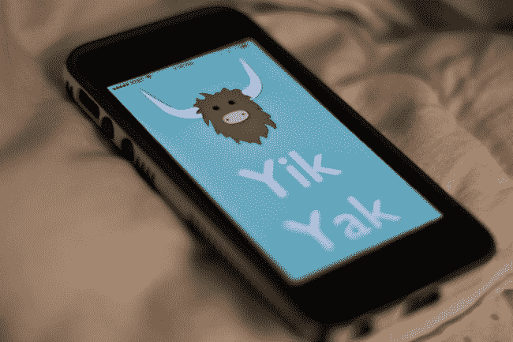
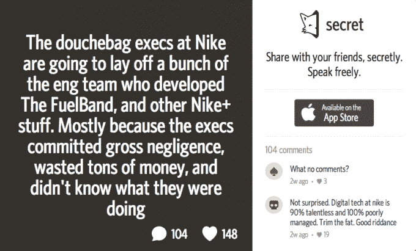
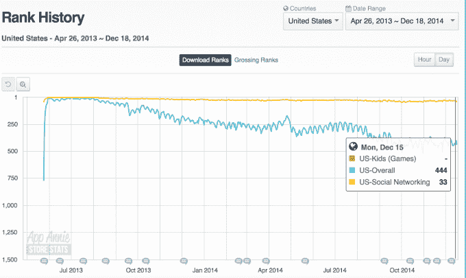
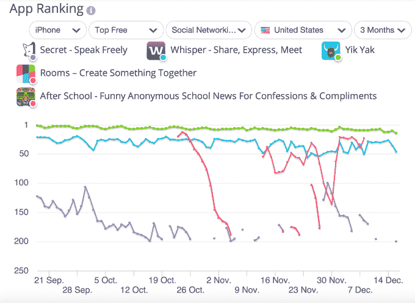
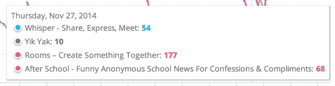
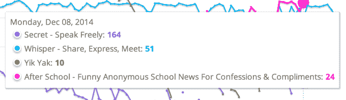
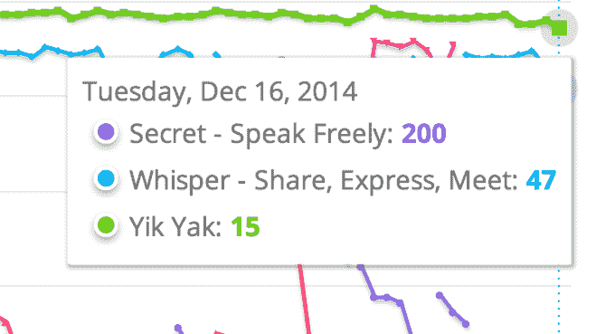
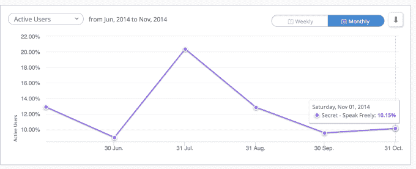
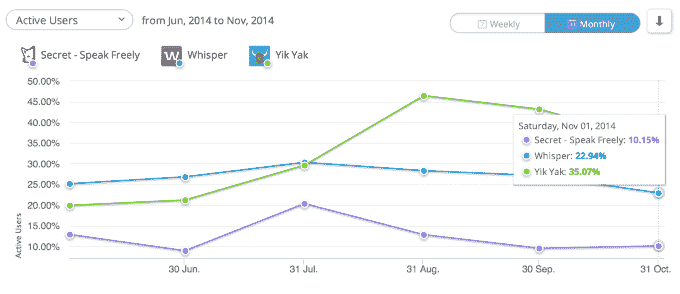

# 匿名社交网络很少有赢家，Secret 不在其中

> 原文：<https://web.archive.org/web/https://techcrunch.com/2014/12/18/few-winners-in-anonymous-social-networking-and-secrets-not-one-of-them/>

匿名社交网络是昙花一现的趋势吗？赢家通吃的类别？如今，哪些匿名社交网络应用仍在蓬勃发展，哪些已经基本消亡？

今天，作为“匿名社交”类别的领先公司之一，Secret[修改了其应用程序](https://web.archive.org/web/20230404202104/http://www.techmeme.com/141218/p21#a141218p21)，借鉴了 Yik Yak 和 Snapchat 等受欢迎的[应用程序的想法，以引入新功能，如基于位置的帖子和消失的私人消息。](https://web.archive.org/web/20230404202104/https://techcrunch.com/2014/12/18/the-anonymous-app-singularity)

Secret 的支点是该应用在匿名社交网络应用整体下降的情况下无法保持增长的代表，Yik Yak、Whisper 和最近的新人 After School 除外。

## 匿名网络及其危险

在开始之前，先介绍一下背景知识:2014 年消费应用中的一个较大趋势是“匿名社交网络”的兴起，即允许用户在不使用真实姓名的情况下公开发帖的应用。这些应用程序上的用户分享秘密、八卦和其他随机想法。

它们与私人消息应用不同，因为它们的内容对任何登录的人或特定地理区域的任何人都是可见的。也就是说，它们是“一对多”的共享应用，而不是“一对一”的移动信使。

投资者和[媒体](https://web.archive.org/web/20230404202104/http://www.slate.com/articles/technology/technology/2014/03/whisper_secret_yik_yak_new_anonymous_social_networks_are_neither_new_nor.html) [同样](https://web.archive.org/web/20230404202104/https://gigaom.com/2014/08/05/anonymous-apps-may-be-troubling-but-are-they-unethical-secret-defends-its-approach/)就这类应用的道德问题展开辩论，因为它们经常允许网络欺凌和羞辱公众人物——在某些情况下，[甚至似乎鼓励这种活动](https://web.archive.org/web/20230404202104/https://techcrunch.com/2014/02/18/whisper-the-sequoia-backed-secret-sharing-app-makes-a-move-into-tmz-territory/)。

然而，“匿名社交”今年似乎为自己开创了一个新的类别。

这种活动出现在后斯诺登时代几乎是合情合理的，在这个时代，用户意识到像脸书这样更公开的“实名”网络上的社交网络已经被他们自己的政府追踪。

或许“匿名社交”会鼓励脸书曾经提供的那种人际关系，而不会有暴露你真实身份的缺点？

事实上，匿名社交网络在很大程度上提供了另一个提醒，当人们不再需要为自己的言论负责时，他们可以说一些非常可怕的事情。自从 Myspace 有幸成为第一个在美国法院做出网络欺凌判决的人以来，社交网络用户就不得不应对网络欺凌问题。

例如，Ask.fm 中的匿名功能被认为是导致大量青少年自杀的直接原因，在它朝着更“安全”的网络政策转变后，新来者 Yik Yak 似乎准备好了作为顶级移动优先匿名网络之一来收拾残局。

在 Yik Yak 上，结合了匿名和基于位置的网络，[网络欺凌今年变得如此糟糕，以至于该公司不得不实施技术，在美国各地的学校理由](https://web.archive.org/web/20230404202104/https://techcrunch.com/2014/03/13/amid-vicious-bullying-threats-of-violence-anonymous-social-app-yik-yak-shuts-off-access-to-u-s-middle-high-school-students/)屏蔽该应用

学校官员警告家长该应用程序的危险，该应用程序已经成为威胁的家园，包括炸弹威胁和枪击，以及恶性欺凌。一篇新闻报道曾经说，Yik Yak 上的一个女孩甚至因为被强奸而被欺负。

Twitter 虽然不是完全匿名的，因为许多用户通过名字来识别自己，[今天在处理欺凌和威胁方面也面临着同样的挑战](https://web.archive.org/web/20230404202104/https://techcrunch.com/2014/12/02/twitter-releases-new-suite-of-anti-harassment-tools-promises-faster-response-times/)。

## 匿名网络的赢家和输家

可悲的是，私下里，人们确实想读一些不光彩的秘密、八卦和其他人们认为但出于礼貌不愿公开说的事情。当任何网络迎合这类活动时，它就会飞速发展。

今年早些时候，Secret 在 App Store 中的地位上升，是因为它成为了科技行业八卦和泄密的首选目的地。当 Secret 从投资者/用户 T10 那里获得了大约 3500 万美元的资金[后，最终不得不取缔这种活动——通过识别和标记用户输入真实姓名的帖子 T12 以及阻止用户发布他们相机胶卷中的照片等方式——它开始衰落。](https://web.archive.org/web/20230404202104/http://www.crunchbase.com/organization/secret)

简而言之:当垃圾言论减少时，这款应用的受欢迎程度也随之下降。

从而证明了匿名应用程序的恶性循环。让人们胡作非为，应用就会活跃起来。净化体验以保护人们的感受(以及潜在用户的生命)，应用程序就会失败。

Ask.fm 是一个很好的“清理”的例子(通过 App Annie)。今年被收购后，谷歌同意与监管机构合作，实施网络欺凌保护措施，谷歌从 App Store 的榜首下滑至第 444 位；

**失败者**

虽然 Secret、Yik Yak、Whisper 和其他人今年占据了主导地位，[和其他一些](https://web.archive.org/web/20230404202104/https://www.producthunt.com/e/anonymous-apps)也在今年进入了“匿名社交”空间。这些很少仍然重要。

例如，来自长尾的代表性样本(数据来自 App Annie):

**获奖者**

那些仍有可能成为竞争者的人呢？

它们包括:Yik Yak，Secret，Whisper，脸书的房间(如果不是通过牵引，而是通过其母公司的力量来推广，如果它选择这样做)，以及[新近流行的](https://web.archive.org/web/20230404202104/https://techcrunch.com/2014/12/03/after-school-is-the-latest-anonymous-app-resulting-in-student-cyberbullying-and-school-threats/)放学后参赛者。公平地说,《放学后》之所以受欢迎，可能只是因为它几乎没有针对内容的保护措施，而且年轻用户被这种“狂野西部”类型的分享体验所吸引。

在上图中，目前截至周二，只有 Yik Yak 和 Whisper 在这个时候有显著的牵引力。(发稿时《放学后》已再次从 App Store 下架。)*(iOS 版本的数据，美国，通过 [SimilarWeb](https://web.archive.org/web/20230404202104/http://www.similarweb.com/) )。*

历史排名:

Yik Yak 在前 10 名和前 20 名之间飞来飞去，小声说前 50 名。在学校短暂飙升之后，还得处理[被从 iTunes](https://web.archive.org/web/20230404202104/https://techcrunch.com/2014/12/04/after-school-is-back-on-the-app-store-but-with-changes-to-curb-cyberbullying/) 撤下的事情。为了网络欺凌！去想想吧。

今天，这些应用在 iTunes 社交网络类别中的美国排名如下:

*   易牦牛:#20
*   耳语:#62
*   秘密:#199
*   放学后:*从 App Store 拉的！又来了！*
*   脸书的房间:#277

有人可能会说 FireChat (#161 社交网络)也应该属于这一类别，但它的目的有点不同——它更多的是在互联网连接或电话覆盖不到的情况下连接人们，而不是仅仅专注于匿名。事实证明，它在户外节日和抗议中很受欢迎。

**什么秘密没落了**

当像 Secret 这样的应用在清理了他们的体验后排名下降，他们往往也会失去他们的活跃用户。

为了深入了解这一点:使用 similar web(beta)服务的数据，你可以看到 Secret 的每月活跃人数随着时间的推移而下降。

Vs Yik Yak 并小声说:

Yik Yak 和 Whisper 是唯一的真正竞争者，因为学校无法在应用商店中保留其应用程序，他们的问题是他们能坚持多久。

可以说，Whisper 今天仍然很受欢迎，因为由于它的“NSFW”类别和其他性内容，它已经转向“成人”领域。与此同时，Yik Yak 可能已经对其应用程序进行了地理隔离，但儿童、青少年和其他年轻人仍在使用它进行网络欺凌(T2 )( T3 )( T4 )( T5)许多最近的新闻(T6 )( T7)报道(T8)表明(T9)。

如果这些应用程序中的任何一个清理了它们的内容或减少了八卦和性，它们的好日子也可能结束了——就像 Secret、Ask.fm、MySpace 和所有其他网络欺凌曾经兴盛然后消亡的应用程序一样。