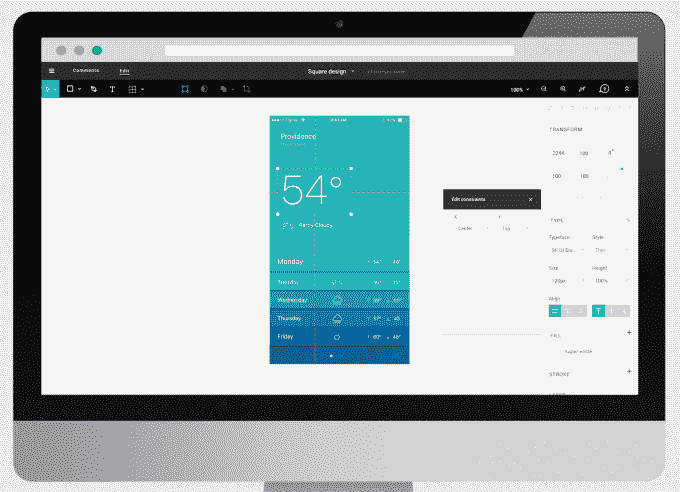
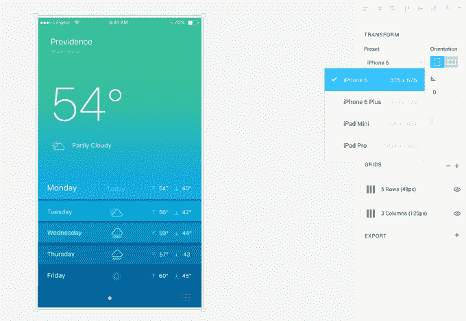

# 23 岁的设计协作工具 Figma 以 1400 万美元启动，对抗 Adobe 

> 原文：<https://web.archive.org/web/https://techcrunch.com/2015/12/03/figma-vs-goliath/>

“我们现在使用的是这个设计的哪个版本？你做了建议的编辑吗？为什么这么久才导出？”今天，界面设计协作工具 fig ma T1 用它基于浏览器的替代 Adobe 桌面软件来消除这些问题。

[Figma](https://web.archive.org/web/20230322160429/https://medium.com/figma-design/design-meet-the-internet-4140774f2872#.slb5qkm5v) 通过版本控制不断地在云中保存项目，这样队友们就可以随时回顾、回去修改或者实时评论设计。它的免费预览程序今天开始接受新的[等待名单](https://web.archive.org/web/20230322160429/https://www.figma.com/)中的队伍。

Figma 联合创始人兼首席执行官迪伦·菲尔德

Figma 的创始人之一是现年 23 岁的 Thiel Fellow Dylan Field。它还宣布了由 Greylock Partners 的 John Lilly 牵头的 1400 万美元的首轮融资，这是对 Index400 万美元种子资金的补充。它需要这些现金来挑战设计工具巨头 Adobe。

Field 告诉我他的大竞争对手“不懂协作”，Adobe Creative Cloud 是“名存实亡的云”。他坚持认为“设计正在经历一场巨大的转变——从设计处于产品周期的最后阶段，人们只是把东西做得更漂亮，到现在设计贯穿整个过程。”Figma 想为界面设计做 Google Docs 为文本编辑做的事情。

目前，协作构建 UI 更多的是工作而不是实际工作。如果一个团队成员想要改变一个图标，他们必须找到并下载最新的设计，检查电子邮件或 Slack 的评论，进行编辑，保存，导出，上传或通过电子邮件发送，然后等待其他人跳过这些环节。进行实际的设计变更只花了那段时间的一小部分。

这是因为尽管在协作网络的其他地方取得了进步，设计行业巨头 Adobe 是作为一个单独的桌面软件体验开发的。菲尔德嘲笑其建立一个创造性的云的大声称，仅仅是从软件销售到每月订阅的商业模式变化。“我认为，如果合作是 Adobe 的基因，Adobe 会在合作方面迈出更大的步伐，”Field 说。

你可能会误认为这是天真的傲慢，但他年轻时的自信正是战胜设计巨人所需要的。

合作的想法是怎么开始的？菲尔德告诉我“我是在网上长大的。大约 10 年前，当谷歌文档问世时，我开始使用生产力工具。”那是在菲尔德还是个少年的时候，“我是他的超级粉丝，在我所有的学校项目中都使用它”。在 Flipboard 和 LinkedIn 实习时，他梦想有一个类似的界面设计工具。后来在布朗大学，菲尔德遇到了能建造它的人，WebGL 神童埃文·华莱士，他曾在皮克斯和微软担任工程师。两个人一起创建了 Figma，就像你想象中的虚构变成了现实。

两人都知道，打造能够对抗 Adobe 产品的东西绝非易事。“这就是为什么花了这么长时间。我们在 3 年前就开始了这项工作，但直到今天才公之于众。到目前为止，Figma 目的的唯一线索是一份暗示照片编辑的财务文件。

Figma 的核心是基于浏览器的 Photoshop，但这牺牲了交互设计的深度。对产品的每一个更改都会自动保存到云中以供协作，版本控制允许用户将项目恢复到以前的状态。它消除了不断发送电子邮件或 Dropbox 文件的需要。

一个特别的功能是评论侧边栏，这样团队可以在产品中交流编辑建议和反馈，尽管 Figma 也加入了 Slack。一个约束工具可以很容易地构建不同的屏幕尺寸，设备预览可以让你立即看到一个界面在 iPhone 6，iPad Pro 或其他小工具上的外观。

现在，你可以共享品牌颜色集，这样团队中的每个人都知道用什么来设计，但 Figma 也在计划共享资源库。最终，它希望建立真正的杀手级功能——用两只鼠标进行实时同步设计编辑。

菲尔德告诉我，该公司对设计师进行了广泛的调查研究。“我们做了一些测试，要求他们在 Figma 中完成一项任务，然后在其他工具中完成。”他承认，当你把你的应用程序与行业标准进行对比时，“你很快就会意识到你的产品在哪里失败了。”

这就是为什么 Figma 只专注于交互设计，而不是其他类型的创意输出。“我们并不试图解决 Adobe 正在做的所有事情”。真聪明。仅仅是努力创建 UI 就非常困难。设计师是一群吹毛求疵的人，他们可能会固执地改变他们的工作流程。

这家拥有 15 名员工的公司将从 Greylock，Index， OATV，亚由美，LinkedIn 首席执行官杰夫·韦纳，白宫首席数据科学家 DJ·帕蒂尔，Wealthfront 首席执行官亚当·纳什和 Dropbox Soleio Cuervo 前设计主管那里大举招聘。

为了偿还这笔费用，它正计划推出一种按月订阅的 SAAS 模式，尽管 Field 尚未决定 Figma 是按座位收费还是按团队统一收费。不过现在，团队可以注册免费的预览程序。

Figma 并不是唯一一家着眼于将设计从事后思考转变为渗透到产品开发各个部分的过程的初创公司。有像 Sketch 这样的硬核桌面设计软件。对于合作，也有像 [Wake 的超级轻量级工具](https://web.archive.org/web/20230322160429/https://techcrunch.com/2015/08/18/wake-launches-its-effortless-designer-feedback-tool-publicly/#.c09dfs:15xO)这样的初创公司，让设计师快速分享设计原型和想法，还有像 [Y Combinator 的 Zeplin](https://web.archive.org/web/20230322160429/https://techcrunch.com/2015/11/24/zeplin-raises-1-2m-to-sync-designers-and-developers-with-less-hassle/) 这样的工具，为设计师和开发人员牵线搭桥。

但 Figma 正在做大，正面对抗 Adobe，而不是紧追不舍。菲尔德总结道，这是一个值得倾注全部精力的探索。他说 Figma 的使命是“消除想象和现实之间的差距。我们可以制造工具，让人们表达自己的想法。我想不出还有什么比这更让我兴奋的了。”