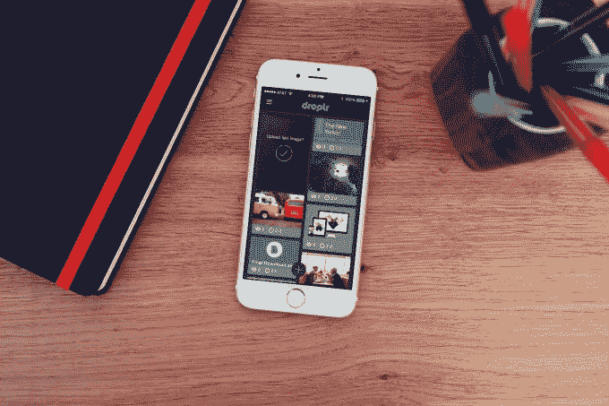
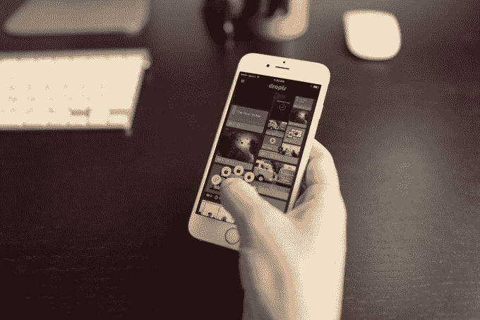

# 文件共享服务 Droplr 走向免费

> 原文：<https://web.archive.org/web/https://techcrunch.com/2015/05/04/file-sharing-service-droplr-is-going-freemium/>

# 文件共享服务 Droplr 正在走向免费增值

文件共享服务 [Droplr](https://web.archive.org/web/20221209173124/https://droplr.com/) 从明天开始采用免费增值商业模式。你不用每月支付 4.99 美元来试用这项服务，你可以在各种平台上下载[客户端，并直接与朋友或在 Twitter 等社交网络上分享你桌面的截图、图像和视频记录。](https://web.archive.org/web/20221209173124/https://droplr.com/apps/)

当然，有一个条件:你在新的免费层下分享的文件链接将在一周后过期。如果你想把这些图片保存更久(或者有密码保护的文件和定制的下载页面之类的漂亮功能)，你必须加入每月 9.99 美元的“Droplr Pro”计划。

与其他模糊消费者、prosumer 和企业软件之间界限的服务一样，向免费增值的转变不仅仅是让个人每月支付 10 美元。真正的目的是扭转颓势——让大型组织中的个人上钩，让他们说服几个朋友和同事采用它，一旦每个人都依赖它工作，让管理层为团队、业务或公司计划买单。

甚至在采用这种新策略之前，Droplr 就已经在一些以创意闻名的公司中取得了成功(所以他们在出去之前会在内部分享大量的视觉效果):这家初创公司的客户包括耐克、Airbnb、Adobe 和皮克斯。

除了新的价格结构，Droplr 还将从明天早上开始推出其 iOS 和 Mac 应用的新版本。为 iOS 8 重建，我最期待的功能是新的 share 扩展。你可以通过共享菜单从任何应用程序中分发文件或图像，而不是将图像保存到相机胶卷或截图，然后再转到应用程序进行共享。

Mac 应用程序也获得了相当不错的更新，增加了一些新功能，比如可以录制你的桌面截屏，并以视频或 GIF 格式分享，设置链接的截止日期，并生成 HTML 代码，以便你可以将上传的文件嵌入网页。