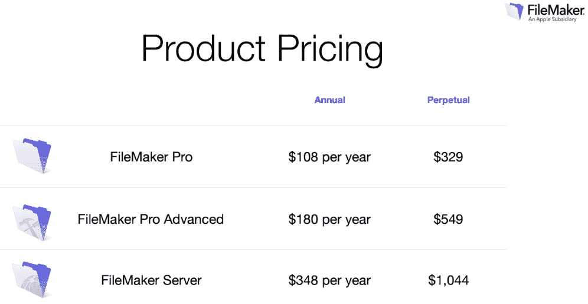
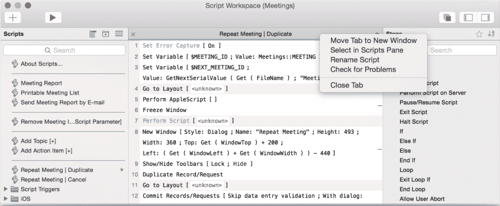

# FileMaker 15 发布，支持苹果最新硬件特性 

> 原文：<https://web.archive.org/web/https://techcrunch.com/2016/05/10/filemaker-15-launches-with-support-for-apples-latest-hardware-features/>

作为苹果公司的全资子公司，FileMaker 让那些没有任何编程知识的人以及有经验的程序员可以轻松地为 iPhone、iPad、Windows PC 和 Mac 开发行业应用程序。该产品自 20 世纪 80 年代(当时它被称为果壳)以来就出现在[了，但从那以后一直在发展。](https://web.archive.org/web/20221207183025/https://en.wikipedia.org/wiki/FileMaker)

随着这一最新版本的发布，FileMaker 现在支持触控 ID 和 3D Touch 等新的 iOS 功能，以及用于构建基于位置的应用程序的 iBeacons 等新技术。在软件方面，FileMaker 现在也支持苹果的[应用扩展](https://web.archive.org/web/20221207183025/https://developer.apple.com/app-extensions/)。

此次更新显然包括大量其他新功能，但一些突出的功能是改进的安全功能(包括改进的对 SSL 认证的支持)、与 PostgresSQL 和 IBM 的 DB2 数据库的集成(在 Pro 和 Server 版本中)以及跨 FileMaker 工具的性能更新。有了 WebDirect，FileMaker 现在还允许用户从 web 浏览器访问他们的 FileMaker 应用程序，虽然该工具的上一版本支持平板电脑大小的设备，但这一新版本也支持手机。

此外，该公司现在也使其工具更容易为团队所用。每年 888 美元，现在有五个用户可以访问 FileMaker 服务器，即 Pro、Go 和 WebDirect，它们需要 FileMaker 服务器才能工作。

正如 FileMaker 的解决方案咨询总监安迪·勒卡茨(Andy LeCates)告诉我的那样，FileMaker 的重点仍然是让它易于使用，并让团队能够为这种不可重复的流程构建定制应用程序，而应用程序商店中的现成应用程序不太适合这种流程。“购买应用程序很容易，但不会给你带来灵活性，”他告诉我。然而，与此同时，传统的编码既困难、昂贵又耗时。

值得注意的是，FileMaker 团队并没有试图帮助您大规模构建企业应用程序。LeCates 表示，用其工具构建的大多数应用程序都是为少于 100 人的团队设计的——其中许多是没有 IT 部门的中型企业，但仍然需要构建定制应用程序才能发展和竞争。例如，许多 SalesForce 用户使用该服务来增强他们的 CRM 系统。

为了更容易上手，FileMaker 15 现在还提供了更新的 onboarding 体验，但此外，该团队还为那些希望深入了解这些应用背后的代码的有经验的开发人员添加了新工具。例如，编辑器现在会突出显示脚本错误，并允许您撤销脚本。

展望未来，LeCates 告诉我，该团队正在调整其发布节奏，以跟上其目标平台的快速变化。它现在转向了年度发布时间表，而以前是 18 到 24 个月一次。

