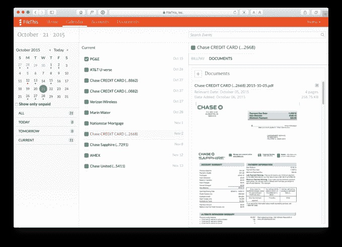
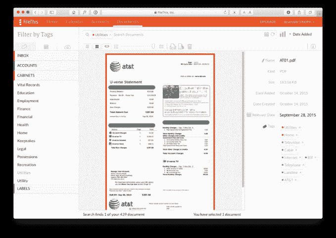

# FileThis 2.0 将整理您的报表和账单，提醒您何时付款 

> 原文：<https://web.archive.org/web/https://techcrunch.com/2015/11/12/filethis-2-0-will-organize-your-statements-and-bills-remind-you-when-to-pay/>

随着越来越多的消费者转向使用在线服务来管理他们的银行业务、账单、支付等，我们一些最重要的个人和财务文件分散在许多网站上，这些网站并不总是保留我们过去报表的完整档案。一个名为 [FileThis](https://web.archive.org/web/20230131005008/https://filethis.com/) 的服务一直致力于解决这个问题，它提供了一个实用程序，可以自动将你的报表、账单和其他文件备份到你选择的云服务中。

现在，随着 FileThis 2.0 的发布，该公司正在推出其应用程序的完全重建版本。更新后的服务不再只是代表你提取和组织你的文件，而是更积极地帮助你跟踪你的账户，管理你的账单日历，甚至提醒你按时付款。

事实上，我使用 FileThis 已经有一年多了，它可以归档各种报表，包括公用事业账单，比如 T-Mobile 和威瑞森的账单，我必须提交这些账单来报销，还有银行对账单。允许 FileThis 工具连接到我的在线帐户并代表我提取项目实际上要容易得多，而不是直接访问每个网站并手动下载 pdf。

使用 FileThis 的过程与使用 Mint.com 这样的服务并没有什么不同，尽管 FileThis 并不仅限于金融账户。它还可以处理来自公用事业、通信公司、保险提供商、零售商等的帐户。总共有 500 多家美国企业和服务提供商可以通过这项服务联系到。

然而，文件服务的早期版本有点粗糙。它很实用，但不漂亮。这证明了它的有用性，我在那里开了这么长时间的账户。然而，它充其量是一种“设置好就忘记”的实用程序——一旦 FileThis 启动并运行，您就不需要返回……除了偶尔重新验证您的连接。

[gallery ids="1237139，1237138"]

随着 FileThis 2.0 的推出，这种情况发生了变化，它引入了一个改进的用户界面和体验，以及一个扩展的功能集，使该服务更像是您经常使用的个人助理。

当 FileThis 用户登录升级后的服务时，他们会看到一个仪表板，让他们概述即将到来的账单、他们在 FileThis 中的帐户以及他们选择存储文档的位置(例如，Google Drive 或 Dropbox 等位置)。)

您可以使用顶部的工具栏进行导航，在“帐户”和“文档”等区域之间移动，以更改您的设置，或者查看显示您的账单及其即将到期日期的“日历”。

这很聪明，因为它代表了大多数人对自己财务状况的看法——除非你的银行账户中有足够的缓冲资金来自动支付所有的账单，否则你可能会以某种专注于时间表的方式来跟踪到期日——比如谷歌日历、带日期的电子表格或一些在线或移动应用程序。那么，FileThis 希望成为那个应用程序。

唯一的缺点是，文件不能让你点击进入并实际支付你的账单。但该公司告诉我，这一功能很可能会在下一个版本中推出，同时在 2016 年推出该应用的 Android 版本。这将使 FileThis 成为你今天使用的任何账单跟踪系统的真正替代品。

除了现在 HTML5 友好的网站(再见 Flash！)，FileThis 2.0 也正在向 iPhone、iPad 和 Apple Watch 推出。这种跨平台支持意味着 FileThis 可以发送账单提醒作为通知。

该服务现在还支持那些想要扫描收据和其他文件的用户，这样他们就可以将 FileThis 作为他们财务的在线文件柜。例如，FileThis 将自动识别与税务相关的报表，如 W-2 和 1099，以帮助您进行税务准备。

“FileThis 1 非常以文档为中心，虽然文档将始终是 FileThis 的重要组成部分，但 FileThis 2 将我们带到了以客户为中心的模式，”首席执行官布莱恩·贝尔松在描述 2.0 更新时解释道。“想想薄荷遇上 Evernote。”

贝尔松表示，自 2014 年 3 月推出以来，这家初创公司的增长率超过了 600%，自那时以来，已经向最终用户交付了超过 900 万份文档。希望随着 2.0 版本的发布，这些数字将大幅增加，这将有助于公司当前的筹资目标。

该产品是一项免费增值服务，根据连接数量、运行频率以及你需要多少存储空间来收费。如果你选择使用这个自己的云存储服务。这个云存储网站的用户界面非常方便，因为它会自动为您组织文件，同时还支持搜索、标记、共享、打印等功能。

该公司的[高级套餐](https://web.archive.org/web/20230131005008/https://filethis.com/plans/)价格低廉，每月 2 美元或 5 美元，这取决于你的喜好，适用于那些想要升级的人。然而，我一直依靠免费计划生存，该计划提供多达 6 个连接。

根据 [CrunchBase](https://web.archive.org/web/20230131005008/https://filethis.com/) 的消息，这个目前得到了 250 万美元的支持。