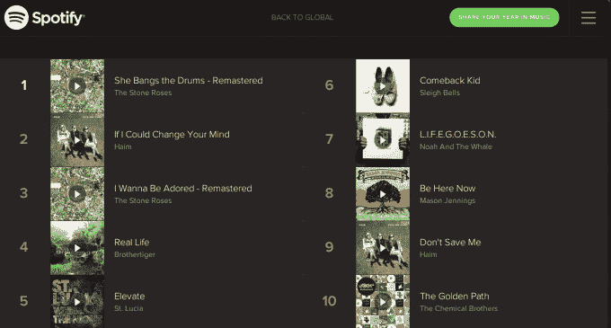
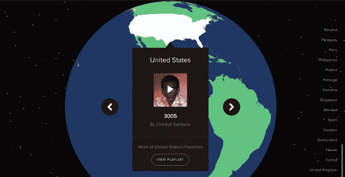
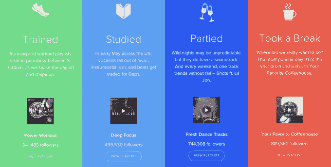
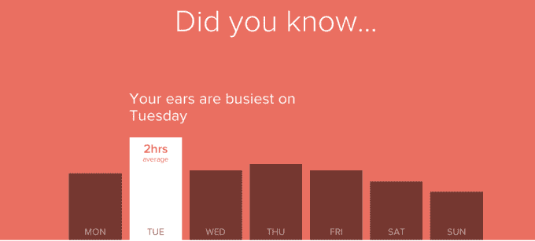

# 找出过去一年你在 Spotify 上听得最多的内容 

> 原文：<https://web.archive.org/web/https://techcrunch.com/2014/12/03/find-out-what-you-listened-to-most-on-spotify-this-past-year/>

当世界其他地方都在为艾德·希兰和他的前 40 位朋友而摇滚时，我主要是在听梦幻般的独立流行音乐，如《纯洁之戒》和《熊掌》。忽略你可能从未听说过熊手的事实(但是相信我，他们很棒)。Spotify 告诉我，在它的个性化[年回顾](https://web.archive.org/web/20221209121557/http://www.spotify-yearinmusic.com/)中，我最喜欢什么。这个漂亮的应用程序会抓取你 2014 年的所有数据，并突出显示你在过去一年中是如何、何时、何地以及听了谁的歌。

今年我在我最喜欢的在线点唱机上花了整整 17，337 分钟，其中 51%是在路上，这是《年度回顾》中的说法。我听了很多 Pandora 和一些 Rdio，所以 2014 年我花了多少时间在流媒体音乐上是个未知数。

我最常听的播放列表，“这是声音。这个！”包括新乐队的组合，如 Chvrches，Paperwhite，1975 和 Great Good Fine Ok。我最喜欢的五个乐队是 BrotherTiger(实际上这只是我反复播放的一首歌。适合跑步。)，海姆，FleetFoxes，石玫瑰和无喜。最重要的是，如果不是 Spotify 这样的流媒体服务指引我走向正确的方向，我可能会被归入其他人在电视上看到的那种无聊的摇滚乐。

但我不是一般的听众。根据 Spotify 的数据，2014 年有更多人喜欢酷玩、魔力红和冰雪奇缘；平均排名前 40 的流行音乐电台的典型素材。去年冬天，Pharrel 的 Happy 在网上疯传，拥有最多的股票。这也是播放次数最多的歌曲。

点击并旋转鼠标，看看哪些国家最喜欢听的音乐，这很有趣。在美国，这是幼稚的甘比诺的“3005”，爱沙尼亚收听卡尔-埃里克·陶卡尔的“Vasupandamatu”，芬兰喜欢 TCT 的“Ranelle”。英国联合了 Take That，加尔文·哈里斯和一些优秀的老大卫·盖塔。你可以在这里看到[所有来自英伦三岛的冠军歌曲](https://web.archive.org/web/20221209121557/https://play.spotify.com/user/spotify_uk_/playlist/68EZYk1zjC2NxFdluPGmMM)。

《一年回顾》显示，我们在 2014 年下午 5-7:30 在全球范围内练习民谣，并在今年秋天享受梅根·特瑞娜的基地。Avicci 的“叫醒我”今年的播放量超过了 2 亿次，仍然是 Spotify 历史上播放量最多的歌曲。

请注意个别的呼喊，某些歌曲变得很大。你可能是在 Spotify 上向播放列表添加了单首歌曲，而不是整张专辑。流媒体服务很容易向艺术家和用户提供一首歌曲被播放了多少次的信息。熊掌乐队的热门歌曲《巨人》已经播放了 560 万次，凯蒂·佩里的《黑马》在 Spotify 上播放了近 2.24 亿次。同一张专辑《生日》中一首不太受欢迎(但仍然非常受欢迎，这是凯蒂·佩里)的歌曲仅被播放了 4800 万次。

偏爱单首歌曲而不是整张专辑改变了唱片公司和公告牌排行榜的局面。这不是关于专辑的销售，而是歌曲的流动。在过去，你可能会跳过 CD 上你不喜欢的歌曲，但在流媒体出现之前，这个行业没有办法知道你在这么做。现在，Billboard 不再只是统计专辑销量，而是统计专辑中的一首歌在 Spotify、Pandora 和谷歌的 All Access 等点播订阅服务中的播放次数。现在，1500 首歌曲相当于一张专辑的销量。

独立唱片公司 Glassnote Records 的负责人丹尼尔·格拉斯(Daniel Glass)告诉最先报道这件事的《纽约时报》(New York Times)，这也有助于那些更有可能获得流媒体播放而不是卖出专辑的新人，“在过去的两三年里，很难将排行榜传达给广播电台，”格拉斯说。“我一直在帮 Shazam 和 Spotify 录制苏格兰音乐，为他们带来所有这些数据。现在有了这个一体化的流图表，它更真实地反映了消耗了多少。”

怎么听？在过去的一年里，你在听什么，你的品味是否符合大多数 Spotify 听众的口味，或者你是否有点像我？我们很想知道。[点击这里回顾你的一年](www.spotify-yearinmusic.com/)，并在下面的评论中告诉我们你的听力习惯。