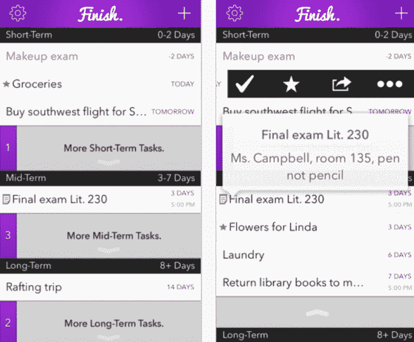

# Finish 3.0 使该应用程序的所有高级功能免费 

> 原文：<https://web.archive.org/web/https://techcrunch.com/2015/01/08/finish-3-0-makes-all-of-the-apps-premium-features-free/>

# Finish 3.0 使该应用程序的所有高级功能免费

苹果设计获奖的懒鬼生产力应用程序 [Finish](https://web.archive.org/web/20221129125549/https://itunes.apple.com/us/app/finish-for-iphone-timeframe/id558559470?ls=1&mt=8) 今天在 App Store 上发布了 3.0 版本，宣布了今年最大的更新。

最大的变化不是引入任何特别的主要特性；相反，成品设计师[瑞安·奥布奇](https://web.archive.org/web/20221129125549/https://twitter.com/orbuch)告诉我，这次更新是为了向整个用户群开放这款应用的高级功能。

在一次电话中，Orbuch 告诉 TechCrunch，他的应用程序的目标市场是拖延症青少年，他们不会为 App Store 上的东西付费。Orbuch 没有将他认为是该应用程序的一些关键功能(添加 10 多个任务，让你设定任务必须完成的具体时间，以及当关键任务过期时，每小时一次可选的“打扰我”通知)锁在付费墙后面，而是决定向所有可能受益的人开放它们。

然而，发布的具体时间部分是基于技术问题。在 iOS 8 下向用户曝光了 Finish 幕后的一些 bug。其中大部分都没有破坏任何重大的东西，但是一个在没有应用内购买的情况下将应用货币化的关键功能，Kiip 的[奖励](https://web.archive.org/web/20221129125549/http://www.kiip.me/)受到了影响。

这些奖励在 2014 年的大部分时间里都在应用程序中，但在更新到 iOS 8 的用户注意到它们的问题后，不得不完全删除。Orbuch 在过去的几个月里一直致力于让他们回到应用程序中，并修复其他暴露的问题。Finish 3.0 的用户在应用程序中完成一项任务后，将获得“三分之一”的“奖励”(基本上是他们不会完全讨厌的广告)。

在我们谈论 Finish 的时候，Orbuch 和我转移了话题，谈到了他正在为初中和高中学生开发的另一个东西:一个点对点的学习应用程序。他已经考虑教育很长时间了，现在有了一个联合创始人和资金(在一个小天使轮中筹集)，这个想法他已经考虑了几年了。他目前无法透露更多细节，只是提到他正在寻找 iOS 和后端开发人员。