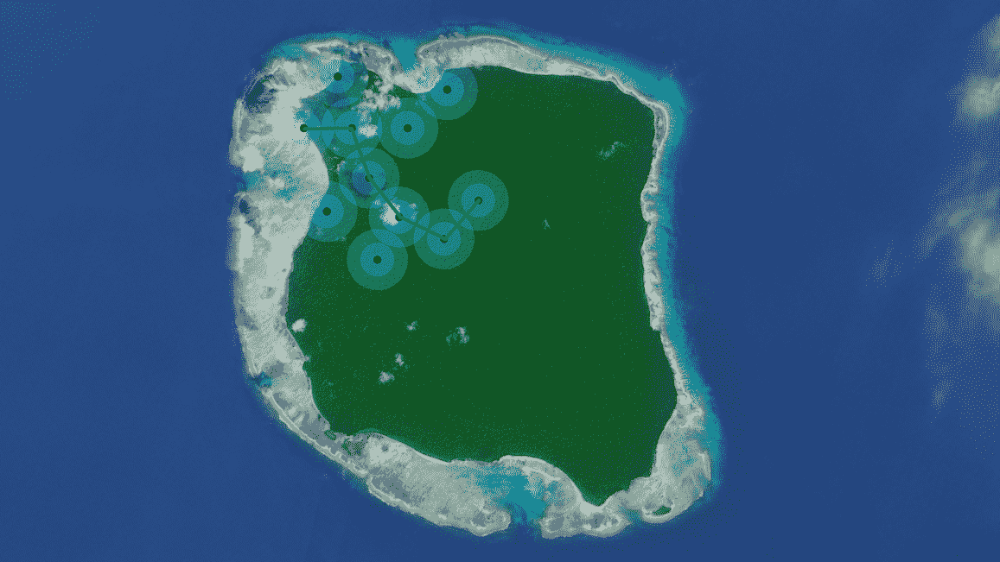

# FireChat 的离网信使获得智能私人信息功能 

> 原文：<https://web.archive.org/web/https://techcrunch.com/2015/07/29/firechats-off-grid-messenger-gets-private-messaging/>

[FireChat](https://web.archive.org/web/20221020103203/http://firech.at/) ，Disrupt alum [Open Garden](https://web.archive.org/web/20221020103203/https://opengarden.com/) 广受欢迎的离线消息应用程序，今天进行了重大更新，引入了甚至可以桥接本地网络的私人消息。

FireChat 的主要创新在于，它允许用户在没有互联网连接的情况下进行群聊。该应用程序将使用可用的 Wi-Fi 网络(无论它们是否连接到更广泛的互联网)、蓝牙和其他连接来建立一个本地网络，人们可以用它来聊天——匿名和实名。

通过这一更新，它还将允许用户发送私人信息，即使他们必须跨越多个本地网络，然后在某个点跳上互联网才能到达他们的最终目的地(它本身可能离互联网入口只有几步之遥)。

那么这在实践中意味着什么呢？比方说，几年后，尽管埃隆·马斯克尽了最大努力，但他的机器人工人意识到，他们也希望能够组建一支管理良好的民兵组织，接管旧金山，并关闭手机网络。假设在机器人大起义期间有足够多的人在使用 FireChat，你仍然可以给你所爱的人发信息。

Open Garden 估计，只要一个城市有 5%的人口使用这项服务，它就可以在用户之间传递信息，平均传递时间为 10 分钟。

为了做到这一点，它使用了一种[存储转发](https://web.archive.org/web/20221020103203/https://en.wikipedia.org/wiki/Store_and_forward)技术，这与 80 年代和 90 年代初基于拨号的老式公告板系统的工作方式没有什么不同。这些信息是加密的，因此其他用户无法阅读它们，即使这些信息存储在其中几个用户上，而该服务正在试图找到一种方法来传递这些信息。

“设备运行一种概率分布式算法来构建一个连通图，”Open Garden 首席技术官 Stanislav Shalunov 向我解释道。“当密度超过某个阈值时，这是可能的。在城市场景和人群中很容易达到这个阈值。一旦网络建立起来，信息就会以一种平衡可靠性和资源利用的方式传递。”

为了到达最终的接收者，信息可能也必须跳到更广阔的互联网上，所以 FireChat 也考虑到了这一点。

Open Garden 的联合创始人兼首席执行官 Micha Benoliel 在今天的公告中表示:“脱离网格的消息允许任何社区创建自己的网络，用于即时公共和私人通信，而不管可用的基础设施和传统的集中式网络。“这一创新为互联网的下一次演变铺平了道路:由人民创造、为人民服务的网络。”