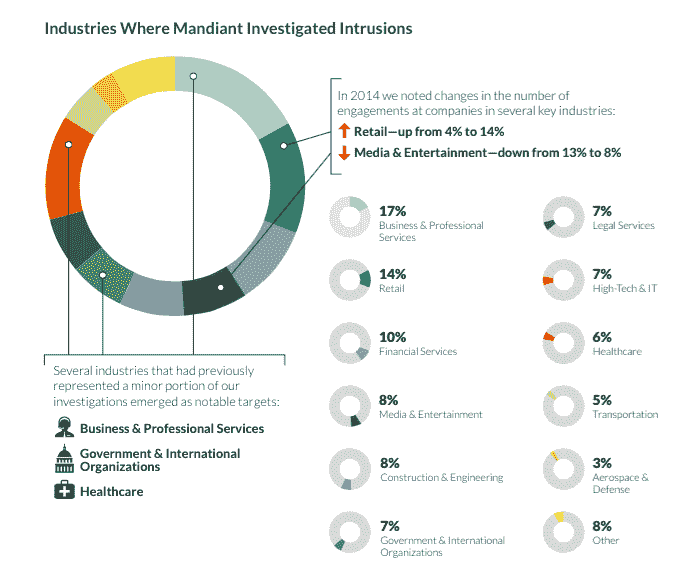

# 商业服务、零售在 2014 年遭遇了最多的在线安全漏洞:FireEye 

> 原文：<https://web.archive.org/web/https://techcrunch.com/2015/02/24/fireeye-security-breaches-2014/>

根据计算机安全公司 FireEye 的一个部门 [Mandiant](https://web.archive.org/web/20230326055549/http://www.mandiant.com/) 的说法，商业服务和零售业务在 2014 年遭遇了最多的恶意黑客在线入侵，其中一个业务在发现自己成为目标之前被渗透和窃听了*整整八年*。最近的新闻追踪了亲阿萨德的叙利亚政府的支持者如何通过看起来无害的聊天传播恶意软件[，今天该公司发布了其关于威胁和黑客破坏在线安全的年度调查。](https://web.archive.org/web/20230326055549/http://www.techmeme.com/150203/p5#a150203p5)

该报告指出，去年零售网站的恶意“参与”增加了 10 个百分点，从 4%上升到 14%，而媒体和娱乐服务——尽管存在索尼黑客攻击等明显的违规行为——从 13%下降到 8%。同样，商业和专业服务，以及政府和医疗保健组织，都见证了安全入侵的增加。

曼迪昂特指出，零售业的一个关键问题是最基本的问题之一。虽然零售商在塔吉特(Target)等公司出现安全丑闻后，已经设法将他们的机器相互分割开来，但他们仍然没有转向双因素身份认证，“允许单一用户凭证向攻击者开放他们的整个网络。”

但是，虽然目标可能在演变，但一些逻辑和方法却没有:“钱到哪里，犯罪分子就会跟到哪里，”Mandiant 写道。“零售商一直是以金钱为动机的网络犯罪分子的目标。我们在 2014 年没有看到这种变化。虽然攻击者使用了一些新技术并获得了更多的头条新闻，但他们的战术在很大程度上与我们在过去几年中观察到的一致。”

该公司还指出，总体而言，攻击者正变得越来越老练，以跟上安全方面的进步，软件只是问题的一部分:基于硬件的攻击仍然是一个目标。

这份报告——全文嵌入下文——概述了黑客用来入侵系统的一些更常见的途径。以下是其他一些值得注意的数据:

**探测时间正在下降，但仍有一些巨大的滞后**。它指出，有一个组织在发现问题之前已经被入侵了八年多。(我想知道那是谁。你不会吗？)平均而言，2014 年检测到违规行为所需的时间高得惊人，为 205 天，尽管这至少比 2013 年的 229 天和 2012 年的 243 天有所下降。

**这在很大程度上仍然取决于局外人来敲响警钟**。是的，公司正在加强安全措施，但显然还不够。Mandiant 指出，31%的组织使用自己的资源发现了自己的漏洞，仅比去年的 33%略有下降。换句话说，69%的违规行为是由外部人员发现的，他们随后会向目标公司发出警报。

**“威胁者”假扮成 IT 员工，并逍遥法外**。Mandiant 说，这是现在最流行的网络钓鱼方案，78%的网络钓鱼是恶意黑客冒充 IT 部门的好人，要求你更新你的证书，从消费者已经使用多年的网络钓鱼手册中取一页。

**芯片加引脚并没有你想象的那么安全**。尽管磁条卡通常被认为是芯片和密码服务的一种不太安全的替代方式，但后者也不是 100%安全的。黑客们现在也想出了攻破 EMV 系统的方法——正好赶上美国采用该标准。这最终可能会推动移动支付和令牌化服务的发展。也就是说，直到犯罪分子将注意力转向破解密码。

[scribd id = 256775495 key = key-perr 1712 u 4 wxm 28 H5 I 94 mode = scroll]