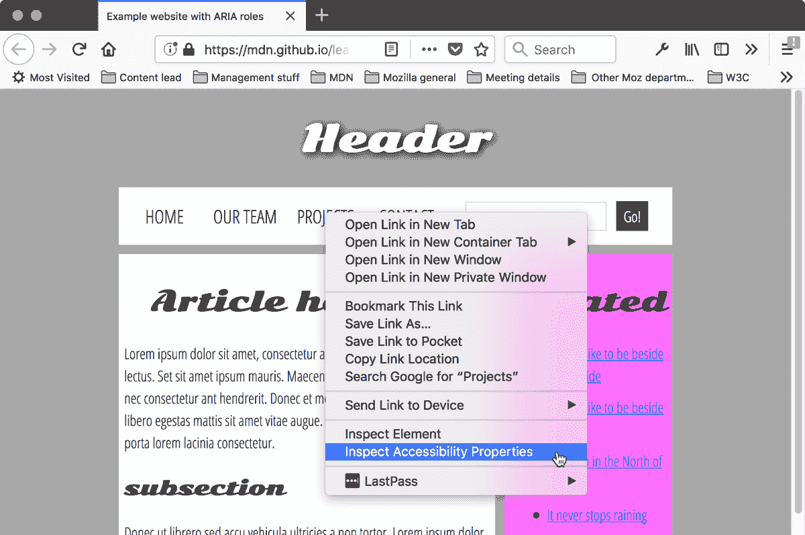

# 火狐获得更快的标签切换，一个新的开发人员辅助工具和更多 

> 原文：<https://web.archive.org/web/https://techcrunch.com/2018/06/26/firefox-gets-speedier-tab-switching-a-new-accessibility-tool-for-developers-and-more/>

# 火狐获得了更快的标签切换，一个新的开发者辅助工具等等

Mozilla 今天发布了其 Firefox 浏览器的第 61 版。到目前为止，众所周知， [Firefox](https://web.archive.org/web/20221207033003/https://www.mozilla.org/en-US/firefox/new/) 作为谷歌 Chrome 浏览器的重要竞争对手重返竞争，虽然新版本没有提供任何突破性的新功能，但 Firefox 61 中所有的新改进和工具都是很好的例子，说明为什么 Firefox 值得再次尝试。

其中两个新功能集中在速度上，这是火狐一度非常缺乏的，但现在提供了很多。

第一个是标签预热，这实质上使标签之间的切换更快，因为当你悬停在它上面时，Firefox 已经先发制人地开始加载标签(在一小段延迟之后)。一旦你点击了那个标签，大部分的渲染已经完成了，所以在标签之间切换感觉更快了。

另一个与性能相关的新功能是“保留显示列表”每当 Firefox 渲染一个页面时，它都会为[构建一个显示列表](https://web.archive.org/web/20221207033003/https://mozillagfx.wordpress.com/2018/01/09/retained-display-lists/)，该列表收集了需要在屏幕上显示的高级项目，如边框、背景和文本，然后根据 CSS 绘制规则对它们进行组织。最初，Firefox 会在每次屏幕改变时建立一个新的列表——例如，可能是因为你向下滚动。对于高分辨率的屏幕和复杂的网站，这个过程可能需要一段时间(尽管这里的“一段时间”指的是 4 或 5 毫秒)。在过去的几个月里，Firefox 团队重新构建了这个系统的部分，以确保这个列表不必每次都重新构建，这导致了绘制时间的显著减少。

Firefox 的另一个主要新特性是辅助工具检查器，它是浏览器内置开发工具的一部分。这里的想法是为开发人员提供一个更清晰的视图，例如，浏览器如何将信息暴露给有视觉障碍的人，这样开发人员可以确保屏幕阅读器在他们的网站上工作。这个工具在默认情况下是关闭的，因为它确实对性能和内存有一点影响，但是在开发人员工具中启用它很容易。你可以在这里阅读更多关于它揭露的所有信息。

像往常一样，在这个版本中有很多其他的调整(包括 WebExtensions 隐藏标签的能力和一个更简化的方法来将搜索引擎添加到地址栏)。你可以在这里找到每一个变化[的完整记录。](https://web.archive.org/web/20221207033003/https://www.mozilla.org/firefox/61.0/releasenotes/)