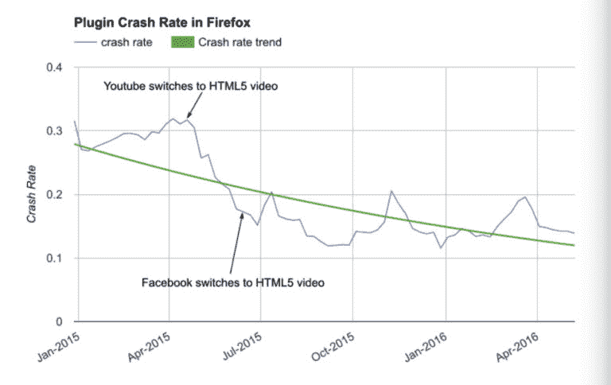

# Firefox 将很快开始屏蔽不可见的 Flash 内容 

> 原文：<https://web.archive.org/web/https://techcrunch.com/2016/07/20/firefox-will-soon-start-blocking-invisible-flash-content/>

# 火狐将很快开始屏蔽不可见的 Flash 内容

该组织今天宣布，从 8 月份开始，Mozilla 的 Firefox 将屏蔽“对用户体验不重要”的 Flash 内容。

随着这一举措，Mozilla 正在跟随谷歌的脚步，谷歌去年做出了类似的决定，现在 T2 计划完全屏蔽 Chrome 浏览器中的 Flash 内容。

不久以前，Flash 是 web 的基础技术之一，因为它使开发人员能够在浏览器中创建丰富的用户体验，这是他们无法通过任何其他方式构建的。现在，现代网络标准基本上实现了与 Flash 相同的功能，然而，这项老化的技术正在成为现代浏览器的拖累。它负责安全问题，减少电池寿命和缓慢的页面加载。

Mozilla 表示，目前它将继续支持 Flash，并将非必要内容定义为用户看不到的 Flash 内容。该组织还在策划一个可以用 HTML 替换的 Flash 内容列表。

到 2017 年，Firefox 将对所有 Flash 内容采用“点击播放”模式，因此用户必须明确允许浏览器激活 Flash 插件。

Mozilla 的火狐质量工程经理本杰明·斯梅德贝里在今天的声明中写道:“这些变化是我们持续努力的一部分，目的是在不牺牲用户喜爱的网络体验的情况下，让浏览更安全、更快捷。”。

有趣的是，Mozilla 没有特别提到阻止基于 Flash 的广告，但谢天谢地，这些广告已经变得越来越少了，部分原因是谷歌的 AdWords 和 DoubleClick networks 已经[逐步淘汰了](https://web.archive.org/web/20230120234823/https://plus.google.com/+GoogleAds/posts/dYSJRrrgNjk) Flash 支持。