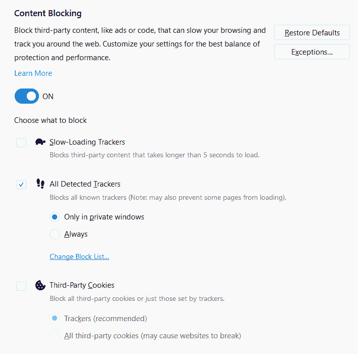

# Firefox 将很快开始默认屏蔽跟踪器 

> 原文：<https://web.archive.org/web/https://techcrunch.com/2018/08/30/firefox-will-soon-start-blocking-trackers-by-default/>

Mozilla 今天[宣布](https://web.archive.org/web/20221207074247/https://blog.mozilla.org/futurereleases/2018/08/30/changing-our-approach-to-anti-tracking/)其 Firefox 浏览器将很快默认自动阻止所有跨站追踪的企图。

这个策略有三个部分。从版本 63 开始，目前正在浏览器的夜间发布频道进行测试，火狐将阻止所有下载缓慢的追踪器(其中广告是最大的罪犯)。这些追踪器需要五秒以上的时间来加载。从 Firefox 65 开始，该浏览器还将删除所有 cookies，并阻止第三方追踪器对所有存储的访问。此外，Mozilla 还在努力阻止密码挖掘脚本和追踪用户指纹的跟踪器。像往常一样，时间表仍然可能改变，这取决于这些首次测试的结果。

Mozilla 的 Nick Nguyen 今天写道:“在现实世界中，用户不会期望成百上千的供应商从一家商店到另一家商店跟踪他们，窥探他们看的或买的产品。”。“用户对网络上的隐私有着同样的期望，然而在现实中，他们无论去哪里都会被跟踪。大多数网络浏览器都无法帮助用户获得他们期望和应得的隐私级别。”

如果你今天想试试这些新功能，你所要做的就是安装不稳定的 [Firefox Nightly release](https://web.archive.org/web/20221207074247/https://www.mozilla.org/en-US/firefox/channel/desktop/) 。在隐私设置中，你会在“内容阻止”标题下找到新的跟踪阻止功能。一旦你打开了它，浏览器还会带你浏览所有这些是如何工作的，并突出显示一些更激进的设置可能会破坏一些网站。

此外，火狐的私人模式已经使用了同样的跟踪保护，就像 iOS 版的[火狐](https://web.archive.org/web/20221207074247/https://support.mozilla.org/en-US/kb/tracking-protection-ios)一样。

Safari 用户在阅读这篇文章时也可能会打哈欠。毕竟，苹果已经在去年宣布了其浏览器[的类似隐私功能。这里的方法是不同的，苹果押注于机器学习，Firefox 使用更传统的阻止列表，但意图是相同的。](https://web.archive.org/web/20221207074247/https://techcrunch.com/2017/06/05/apple-adds-a-tracker-blocker-to-desktop-safari/)

正如 Mozilla 指出的，这里的想法是给用户选择。网站仍然可以要求用户提供数据，但在获得数据之前，他们必须征得用户同意。“在最初的 [Firefox](https://web.archive.org/web/20221207074247/https://blog.mozilla.org/press/2004/11/mozilla-foundation-releases-the-highly-anticipated-mozilla-firefox-1-0-web-browser/) 版本中阻止弹出广告是 2004 年的正确举措，因为它不仅让 Firefox 用户更开心，还给了当时的广告平台一个关心用户体验的理由。Nguyen 写道:“2018 年，我们希望我们为用户赋权的努力能够取得同样的效果。