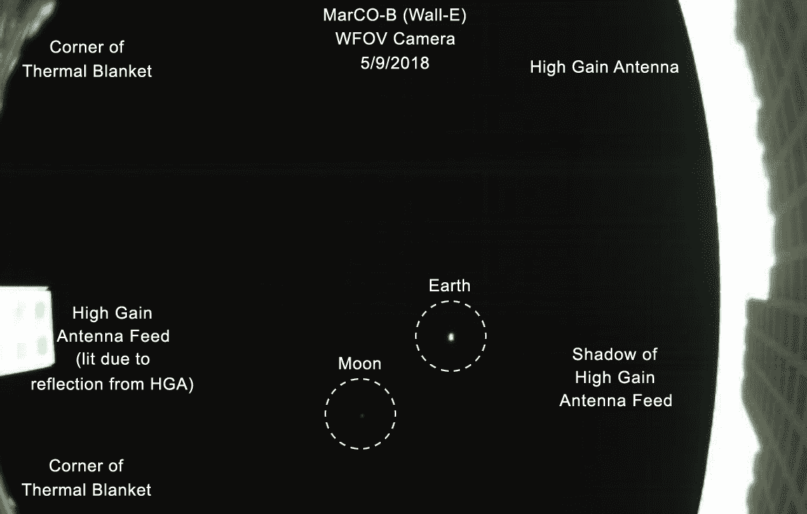

# 首个穿越太阳系的立方体卫星拍摄“浅蓝色点”致敬

> 原文：<https://web.archive.org/web/https://techcrunch.com/2018/05/15/first-cubesats-to-travel-the-solar-system-snap-pale-blue-dot-homage/>

# 第一批穿越太阳系的立方体卫星拍摄了“浅蓝色点”致敬

本月早些时候的 InSight 发射搭载了几名偷渡者:一对小型立方体卫星，这已经是此类小型卫星距离地球最远的一次了——遥遥领先。其中一人有机会拍下他们的母星，以此向[号旅行者任务中著名的“淡蓝色圆点”致敬](https://web.archive.org/web/20230325190759/https://techcrunch.com/gallery/on-voyagers-40th-anniversary-here-are-20-of-the-missions-best-images-and-discoveries/)这张照片几乎没有原作那么惊艳，但还是很酷。

名为 MarCO-A 和 B 的立方体卫星是一项试验，目的是测试小型飞行器是否适合探索太阳系；以前它们只被部署到轨道上。

5 月 5 日，当 InSight 任务起飞时，情况发生了变化，MarCO twins 以类似于地质聚焦火星着陆器的轨迹分离。没过多久，他们就走得比任何立方体卫星都要远。

发射几天后，MarCO-A 和 B 距离地球约 100 万公里(621，371 英里)，是时候打开它的高增益天线了。连接在底盘上的鱼眼镜头监视着这一过程，[拍下一张照片，并将其发送回地球](https://web.archive.org/web/20230325190759/https://photojournal.jpl.nasa.gov/catalog/PIA22323)，通知任务控制中心一切正常。

但意外的是(虽然不是偶然——像这样的任务很少发生意外),当马可-B 用天线自拍时，地球和月球都在视野之内。下面是上面那个的注释版本:

“这是我们对航海家号的敬意，”JPL 的安迪·克莱什在新闻发布会上说。“立方体卫星以前从未在太空中走这么远，所以这是一个重要的里程碑。我们的两个立方体卫星都很健康，功能正常。我们期待看到他们走得更远。”

到目前为止，这只是一个好消息，证明了廉价的立方体卫星有可能以像 InSight 这样的东西的一小部分成本被发射来执行小型科学任务。

不过，不要指望这些家伙会拍更多的快照。一名 JPL 代表告诉我，安装摄像头只是为了确保天线部署正确。事实上，任何火星或其他行星的照片可能都不值得看第二遍——这些是带鱼眼镜头的通用相机，而不是轨道飞行器用来拍摄这些伟大行星的特殊仪器。

马科斯将在洞察号着陆的同时经过火星，根据事情的进展，他们甚至可以在着陆时向任务控制中心传递一些有用的信息。请在 11 月 26 日收听！