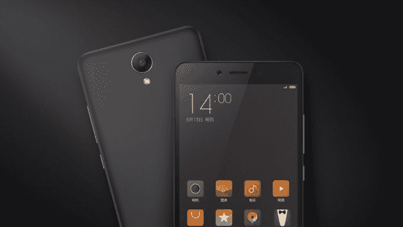

# 小米携手三星发布红米 Note 2 

> 原文：<https://web.archive.org/web/https://techcrunch.com/2015/08/13/first-to-the-august-phablet-launch-punch/>

中国移动制造新贵[小米](https://web.archive.org/web/20221007000638/https://beta.techcrunch.com/topic/company/xiaomi/)正试图抢三星的风头，在同一天推出一对平板智能手机[三星将公布平板尺寸的 Galaxy Note 和 Galaxy S6 Edge 设备更新](https://web.archive.org/web/20221007000638/https://beta.techcrunch.com/2015/07/27/samsung-set-to-unveil-new-galaxy-note-smartphone-on-august-13/)——三星新闻发布会将于今天晚些时候在纽约和伦敦举行。

八月的科技发布会“安静”到此为止…

具体来说，小米今天宣布了 799 元人民币【125 美元】**的红米 Note 2** ，以及 999 元人民币【155 美元】**的红米 Note 2 Prime** 。有了这样的价格标签，三星肯定会对小米将其设备带到美国的前景变得非常悲观——这还没有发生，但小米的国际副总裁(前谷歌员工)雨果·巴拉已经[暗示它将在未来一两年内](https://web.archive.org/web/20221007000638/http://www.patentlyapple.com/patently-apple/2015/08/xiaomi-moving-to-custom-designed-arm-processors-before-entering-the-us-to-take-on-apple.html)这样做。

国际扩张无疑是该公司今年的首要任务，因为它希望达到雄心勃勃的销售目标。目前，三星不得不与统治中国移动市场的小米竞争——这是三星曾经占据的主要地位。分析师 IDC 认为去年秋天小米是世界第三大智能手机制造商，仅次于三星和苹果。

这两款新的小米智能手机有一系列柔和的颜色以及黑色或白色，将于 8 月 16 日开始在中国在线销售。

以下是规格的简要概述:

Redmi Note 2 配备了 2.0GHz 联发科(MTK) Helio X10 处理器，16GB 存储和 2GB 内存。而 Redmi Note 2 Prime 的芯片为 2.2GHz，存储空间为 32GB，内存为 2GB。两者都有 5.5 英寸的全高清显示屏，1300 万像素的后置摄像头和 500 万像素的前置摄像头。

每个都有一个 3060mAh 的可拆卸电池，两者都有一个用于内存扩展的 microSD 卡插槽——这是三星过去在其旗舰机上提供的标准功能，但在 3 月份的 [Galaxy S6 和 S6 Edge 手机](https://web.archive.org/web/20221007000638/https://beta.techcrunch.com/2015/03/01/samsung-galaxy-s6-s6-edge-hands-on/)上被删除，以支持更时尚的设计(以便更好地与 iPhone 竞争)。

小米显然希望利用这一转变，继续为用户提供三星夺走的东西。

同样在今天，小米发布了其 Android 皮肤的更新，展示了即将到来的 MIUI 7 更新，它表示将于 8 月 19 日在全球发布——在印度新德里举行的另一场活动中。

它表示，这次更新带来了更好的性能和节省电池的调整，以及扩大了用户可用的个性化选项“丰富多彩的主题”。

MIUI 7 的图库中还有一个自动组织的新人脸识别功能，它可以识别用户照片中的个人并将图像分组在一起——因此你可以大概获得你拍摄的每张自拍的提要。这听起来一点也不可怕…

虽然小米经常因其极具价格竞争力的硬件而脱颖而出，但公司联合创始人兼首席执行官雷军强调了其对软件的关注，并指出 MIUI R&D 团队现在“有 750 多人”，其界面已在超过 156 个国家和地区拥有 1.5 亿用户。

小米补充说，它的两款新平板电脑将与 MIUI 6 一起发货，但将在“稍后的日期”收到新的 MIUI 7 更新。

在今天的最终设备发布会上，小米推出了一款新的 PCB 智能路由器，名为 Mi Wi-Fi nano，售价 79 元人民币(约 12 美元)。该公司目前销售的硬件种类相当丰富，包括一款空气净化器、各种 T2 可穿戴设备、智能电视、路由器和无线热点，以及一系列智能手机和平板电脑。

它还不能与三星的大规模电子扩张相提并论，但摆脱韩国巨头对消费电子市场的控制的野心是显而易见的。