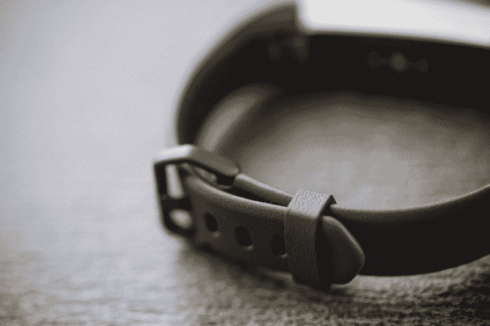
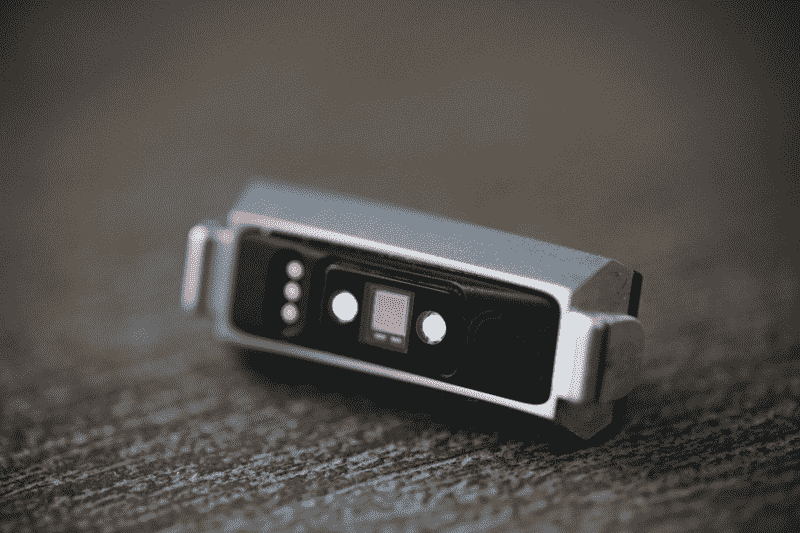

# 第一次使用可穿戴设备的用户查看 Fitbit Alta HR 

> 原文：<https://web.archive.org/web/https://techcrunch.com/2017/04/06/fitbit-alta-hr-review/>

Fitbit 目前在市场上有八种不同的健身追踪器。尽管该公司的财务状况[非常糟糕](https://web.archive.org/web/20230213024156/https://techcrunch.com/2017/01/30/fitbit-layoffs/)，但它的产品出货量仍然超过其他所有可穿戴设备公司。这部分归功于巨大的知名度、扎实的产品设计和主流吸引力。该公司提供八种不同层次的产品，但它们都是为每个人设计的。

而[阿尔塔 HR](https://web.archive.org/web/20230213024156/https://techcrunch.com/2017/03/06/fitbit-alta-2/) 则落在中间某处。150 美元的价格不可忽略，但仍然便宜到足以成为一款平民设备。它不是为长跑运动员或交叉健身狂热分子而设计的，只是为那些寻求帮助来提高自己运动水平的人而设计的。多走路，多站起来，也许睡得好一点，多喝水。

所以我们把这款设备交给了第一次佩戴的人。为了解释她的健身历史，我们的制作人 Veanne 给我讲了一个故事，她和一个朋友曾经站在当地健身房外面，在贫穷、出汗的跑步机跑步者的视野范围内吃墨西哥卷饼。(“我在上大学，”她为自己辩护说)。

“但是因果报应找上了我，”她补充道。“现在我 30 多岁了，一切都是凹凸不平的。我气喘吁吁地走上两层楼梯，感觉糟透了。我在努力更好地照顾自己。”

因此，机会以鲑鱼色 Fitbit Alta HR review 的形式出现，这是一款 150 美元的可穿戴技术，她不会特意为自己购买。但她上周一直戴着它，而且很享受这种体验。确切地说，这不是一个爱情故事，但这是一段蓬勃发展的关系，即使它最终像许多人一样以一方脸朝下漂浮在厕所里而告终。

## 不公平

Fitbit 应该很合适。就在名字里。但总体而言，可穿戴设备一直存在“一刀切”的问题。当然，有些人比其他人更容易犯错。银河 S3 和 LG 手表体育立即春天的脑海。这些笨重的设备充分体现了许多制造商以男性为中心的设计理念。

Fitbit 在产品设计上当然更为民粹。这家公司的过失是主流，而且它产品线中的任何东西都比不上这些智能手表近乎疯狂的庞大。该公司还提供不同尺寸的乐队，但模块本身是相同的两个。我们无畏的制作人身高 5 尺 4 寸，比美国女性的平均身高略低一英寸，但她第一次试穿时仍然觉得有点不舒服。

“对我来说有点太大了，”她解释道。“实际上，我必须把它反着穿才能合身，”这意味着，在过去的一周里，她戴着这款设备，显示屏朝下。当她需要查看通知时，她会翻转手腕。不是世界末日，但也不理想。

此外，在风格上，这是该公司生产的较好的硬件之一。不过，正如 Veanne 乐意建议的那样，不要买鲑鱼色的。我也可以确认这不是一个很好的外观。

## 生活导师

除了可穿戴性，Veanne 告诉我她很喜欢这个东西——或者至少是一般意义上的健身追踪器。当然，Fitbit 在同类产品中提供了更好的体验。驱动因素一直是健身追踪器的主要吸引力之一:动力。

简单地买下和戴上这件东西有内在的激励因素，就像在手指上系一根绳子来提醒你真的不应该整天无所事事。这些年来，Fitbit 还改进了它的运动提醒功能，当你坐得太久，编辑 Veanne 的视频时，它会让你的手腕发出嗡嗡声。

“我喜欢这些小提醒，”她说。“我快截稿了，我正在办公桌前设置，然后有一个小嘟嘟声，提示我要走 200 步。我不知道自己健康了多少。我没瘦，但感觉好多了。”因此，在这方面肯定是积极的，因为她的目标在一周左右的时间里已经从每天 5000 步快速转移到 10000 步。

Fitbit 的大部分产品都改进了睡眠跟踪功能，提供了不同睡眠水平的更详细视图，这在一定程度上要归功于背部的光学心率监测。Veanne 说，跟踪似乎基本准确，尽管有时会错过她的起床时间，因为她早上不会立即起床，

此外，她通常不觉得整个睡眠跟踪的事情像健身方面那样有动力。“这款应用令人尴尬，它不断提醒我睡眠不足。”视频制作人的工作永远不会结束。

## 长期健身

正如承诺的那样，电池非常好。该公司表示，充电一次可以使用一整周。她的经历接近六天——不过，还不错。你真的不想再频繁充电了，尤其是当你应该戴着这个设备睡觉的时候。

同时，触摸屏可能有点“挑剔”，她说。“我一直在寻找最佳点，让它发挥作用。我希望有一个按钮。”与充电不同，Alta 没有任何物理按钮，所以当触摸屏不太好用时，这就有点问题了。

哦，Alta 不是防水的——这是我们惨痛的教训。它真的应该成为 2017 年可穿戴设备的标准功能，这样你就可以游泳、淋浴，或者像这个不幸丢失的设备一样，把它扔进厕所。不推荐，但是你知道，倒楣的事情发生了。我们都有过这种经历，洗洗就能治好。

## 我们可以解决这个问题

总而言之，这是一次积极的经历。我们仍然希望让设备起死回生，但也许你会考虑 40 美元的保修。也值得考虑一个更便宜的设备。例如，Fitbit Flex 具有许多相同的功能，但没有心率监测器或显示器，这两者似乎都不是 Veanne 的交易破坏者。

此外还有那些便宜得离谱的可穿戴设备，比如小米的小米手环(Mi Band)，它们正在迅速侵蚀 Fitbit 在低端市场的份额。尽管 Fitbit 确实提供了市场上最完美的端到端健身带体验之一——前提是你要盖上马桶盖。因果报应真的很糟糕。