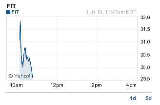

# Fitbit 首次公开募股涨幅超过 50%

> 原文：<https://web.archive.org/web/https://techcrunch.com/2015/06/18/fitbit-spikes-more-than-50-in-ipo-debut/>

# Fitbit 首次公开募股涨幅超过 50%

Fitbit 今天早上上市，股价一度飙升超过 50%。可穿戴设备公司[将其股权定价为每股 20 美元。在早盘交易中，股价突破了 30 美元大关。](https://web.archive.org/web/20230223153832/http://blogs.barrons.com/techtraderdaily/2015/06/18/fitbit-surges-to-30-29-on-debut-52-above-offer/?mod=yahoobarrons&ru=yahoo)

在撰写本文时，Fitibit 目前的交易价格为 29.60 美元，涨幅为 48%。无论如何，该公司正在经历大多数初创公司梦寐以求的首次亮相。值得记住的是，Fitbit 最初提出的上市价格为[14 至 16 美元](https://web.archive.org/web/20230223153832/https://techcrunch.com/2015/06/02/fitbit-ipo-358-million/)。因此，它甚至比一些人预期的还要超前。

这张图表是你要找的色情图片:

最初，Fitbit [申请了 1 亿美元的公开募股](https://web.archive.org/web/20230223153832/https://techcrunch.com/2015/05/07/fitbit-s-1/)。这个数字——通常是一个占位符——上升到 3.58 亿美元，使用其原始股票定价。该公司今天筹集了更多的资金。简而言之，无论 Fitbit 为这笔钱计划了什么，它都能做到，甚至做得更多。

[gallery ids="1173060，1173058，1173056，1173055，1173053，1173052，1173051，1173050，1173048"]

公司的财务状况良好。Fitbit 的收入和利润都在增长。如果这个事实听起来很奇怪，请记住，并不是所有的 IPO 都是为寻找新资金的现金短缺的公司设计的。也就是说，2014 年和 2015 年是基于利润率以外的因素，但那是另一回事了。

我们在收盘时会有更多，但现在可以肯定地说，Fitbit 的份额符合英国俚语的含义。

最后一点:目前，每一笔由风险资本支持的强劲 IPO 都是来自流动性之神的一篮子水果。风险世界在很多情况下都是饥渴的，但当谈到退出时，这种事情就像沙漠中的含羞草。所以，这次首次公开募股并没有做太多，而是加剧了我们目前的泡沫。

万岁！