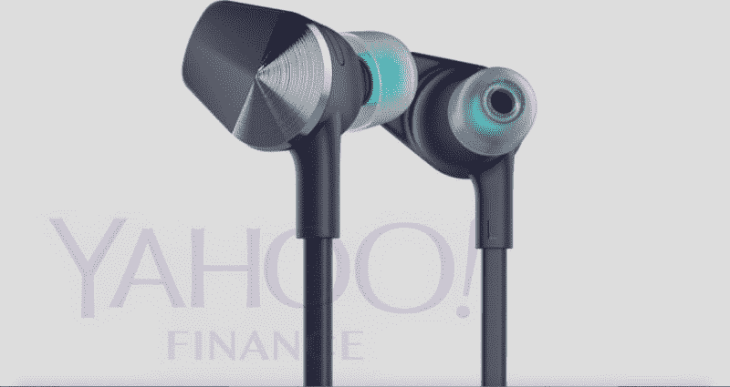

# 据报道，Fitbit 即将推出的智能手表是一个巨大的混乱

> 原文：<https://web.archive.org/web/https://techcrunch.com/2017/05/01/fitbits-upcoming-smartwatch-has-reportedly-been-a-giant-mess/>

雅虎财经[获得了几张显示 Fitbit 即将发布的智能手表的照片](https://web.archive.org/web/20230223153838/https://finance.yahoo.com/news/leaked-photos-fitbits-new-headphones-troubled-smartwatch-140436483.html?soc_src=social-sh&soc_trk=tw),以及一些让整个事情听起来像是一场大惨败的报道。消息来源正在谈论关于设计、生产延迟、天线问题和软件问题的投诉。

该设备看起来与[公司的 Blaze 设备](https://web.archive.org/web/20230223153838/https://techcrunch.com/2016/03/01/fitbit-blaze-is-a-whole-workout-in-a-wearable/)有着共同的设计语言，该设备介于健身追踪器和成熟的智能手表之间。一位消息人士告诉雅虎，这个代号为“希格斯”的设备“绝对不性感”，渲染似乎证实了这一点。

据说它可以运动 GPS，有本地音乐存储和内置心率监测。与此同时，鉴于该公司在过去一年进行的一些收购，非接触式支付和四天电池寿命似乎是显而易见的。它还计划推出一些可选的蓝牙耳机，标志着这家可穿戴制造商的一个新的产品类别。

据报道，该设备原定于春季推出，试图在苹果发布下一款手表之前推出，但许多因素显然将它推迟到了秋季。其中包括由于天线放置造成的 GPS 问题和一些最近报告的软件问题。

由于消费者兴趣下降，许多其他硬件制造商已经放弃了智能手表领域，Fitbit 已经向它跑去，收购了陷入困境的先驱 [Pebble](https://web.archive.org/web/20230223153838/https://techcrunch.com/2017/02/22/fitbit-pebble-acquisition/) ，以及 [Vector](https://web.archive.org/web/20230223153838/https://techcrunch.com/2017/01/10/vector-smart-watch-startup-acquired-by-fitbit-as-wearable-giant-expands-its-team/) 和 [Coin](https://web.archive.org/web/20230223153838/https://techcrunch.com/2016/05/18/fitcoin/) ，希望制造一款将打开整个空间的设备，因为除了苹果和 Garmin 之外，很少有人真正取得成功。

近年来，Fitbit 一直在经历自己的成长烦恼，但首席执行官詹姆斯·帕克认为，一款制作精良的智能手表恰恰可以扭转这家可穿戴制造商的命运。

“我们相信我们有独特的优势来成功满足消费者对智能手表的需求:时尚、设计精良的设备，将正确的通用功能与对健康和健身的关注结合起来，”Park 在一份声明中说，该声明是在该公司宣布裁员 6%时发表的。“随着最近从 Pebble、Vector Watch 和 Coin 收购资产，我们正在采取行动，为公司的长期成功做好准备。”

该公司未来的成功很大程度上取决于一台设备，因此 Fitbit 显然已经将一切投入到该产品中。事实上，也许太多了。三次收购，扰乱了智能手表领域及其自身的长期健康，对一款设备来说是很大的负担。Fitbit 真的需要做好这一点。至少到目前为止，它听起来像是在做任何事情，但是。