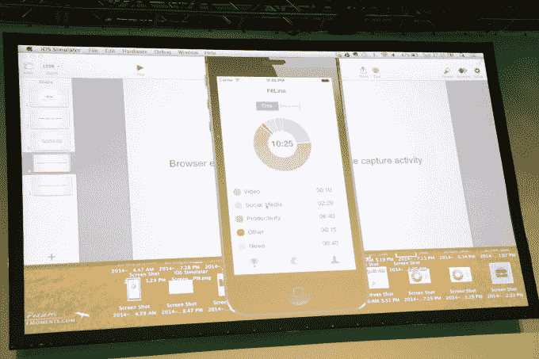

# FitLine 像健身追踪器一样监控你的应用程序使用情况 

> 原文：<https://web.archive.org/web/https://techcrunch.com/2014/09/07/fitline-monitors-your-app-usage-like-a-fitness-tracker/>

# FitLine 像健身追踪器一样监控你的应用程序使用情况

如果你是那种经常参加黑客马拉松的人，你很可能会花一些时间在笔记本电脑或智能手机上，从事事后看来可能并不值得你关注的活动。

广告技术公司 [Rubicon Project](https://web.archive.org/web/20221006172952/http://www.rubiconproject.com/) 的一组黑客了解其受众，带着一个想法来到 TechCrunch Disrupt 黑客马拉松:一个收集你的网络和应用使用情况并展示这些数据的应用，就像来自[耐克](https://web.archive.org/web/20221006172952/https://itunes.apple.com/us/app/nike+-move/id712498492?mt=8)或 [Fitbit](https://web.archive.org/web/20221006172952/http://www.fitbit.com/) 的健身跟踪应用一样。它只收集你在每项活动上花了多少时间，所以它不会知道你在脸书上看的是谁的照片——只知道你已经打开那个标签 20 分钟了。

FitLine 的主持人 Saket Saurabh 告诉我，他的妻子告诉他，他在脸书上花了太多时间，所以他有了这个想法。当他开始反驳时，他意识到他实际上并没有足够的数据来支持他的辩护。

Saurabh 和其他三名构建 FitLine 演示的黑客成功构建了跨平台的数据收集工具。对于今天的演示，他们为 Android 开发了一个应用程序，可以记录你在每个应用程序上花了多长时间，并将其发送给他们的服务，以及 Firefox 网络浏览器的扩展(Saurabh 说可以很容易地移植到 Chrome 上)。他还表示，苹果为 iOS 提供了 API，允许他们建立一个启动器来跟踪平台上的应用程序使用情况，尽管苹果可能不愿意将它用于他们的目的。

我是健身追踪应用和小工具的忠实粉丝，所以通过向人们展示他们当前的习惯来改变他们的行为的想法对我很有吸引力。FitLine 特别酷，因为它更容易融入你的生活，而且没有懒惰与之对抗——它不是为了激励我而可视化我锻炼得有多少，而是显示我总共浪费了多少时间。在我看来，找出如何花更少的时间做一些浪费的事情比腾出时间做一些大多数人并不真正想做的事情更容易。

在他的演讲结束后，我们和绍拉布聊了一会儿: