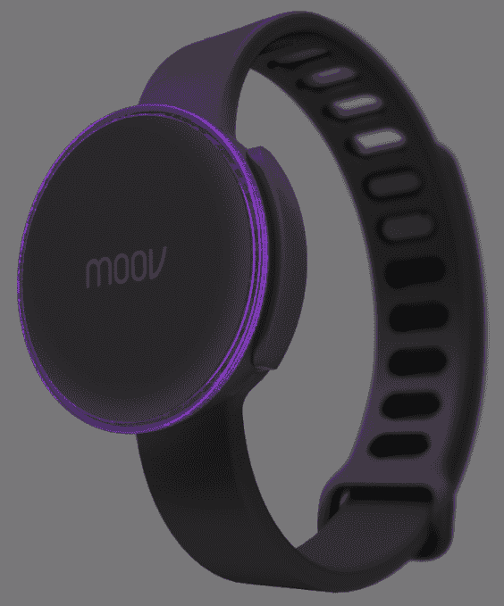

# 健身追踪器 Moov 为其可穿戴人工智能蔻驰 TechCrunch 筹集了 300 万美元

> 原文：<https://web.archive.org/web/https://techcrunch.com/2014/10/22/fitness-tracker-moov-raises-3-million-for-its-wearable-a-i-coach/>

由前苹果工程师和 HALO 游戏设计师 Nikola Hu、微软研究专家(现 Moov 首席执行官)和 Tony Yuan 创建的众筹健身追踪器 Moov 在由 Banyan Capital 牵头的 A 轮融资中筹集了 300 万美元的新资金。此前，Moov 通过其网站上的众筹页面筹集了 100 万美元。

Moov 新的基于硬件的健身追踪器首次亮相后不久就引起了人们的热议——[该团队仅用了 90 分钟就达到了 4 万美元的众筹目标](https://web.archive.org/web/20221205124508/https://beta.techcrunch.com/2014/02/28/moov-fitness-tracker-passes-its-40k-crowdfunding-goal-in-90-minutes/)，随后又大大超过了这一目标。

该公司正在销售的设备旨在超越其他健身追踪器收集的通常的“脚步追踪”数据，而是使用硬件(9 轴传感器)和软件算法的组合，旨在精确定位身体的运动*(明白了吗？“哞哞！”)*不用相机。这意味着该设备可以帮助穿着者参加跑步或步行以外的其他类型的活动，包括拳击、自行车、举重、游泳等。

Moov 的硬件包括一个防水的圆形表面的手表状小工具，可以戴在手腕或脚踝上，取决于你目前正在进行的活动类型，以获得最佳效果。

更重要的是，Moov 的系统不仅仅包括数据跟踪——它还根据你的运动方式提供实时指导和反馈，这可以帮助用户更好地表现，同时保护他们免受伤害。换句话说，它试图通过提供一种服务，对你的运动做出反应，然后通过 Moov 的移动应用程序在锻炼过程中推动和鼓励你，从而将“真正的”健身教练置于小工具形式。

该公司正致力于提供一套专门为被跟踪的活动设计的应用程序，包括跑步和步行、有氧拳击、游泳、骑自行车等应用程序。列表中的前两个已经在 iTunes 应用商店上线，其他的还在建设中。Moov 还致力于在下个月将其软件引入安卓系统，同时推出几款新应用。到今年年底，Moov 的应用清单将增加一倍以上。

Moov 首席执行官李梦不会透露迄今为止售出的确切数量，但会证实该公司在众筹的前两周筹集了 100 万美元的预售款，unites 的售价为 50 美元/台。(这是前几周售出的 20，000 台，给你一个概念。)今天，该公司通过其网站以 79.95 美元的价格出售 Moov，仍然可以预订。这个价格包括一个追踪器，两个带和一个充电器，尽管那些从事拳击等活动的人可能想订购 2 个设备以进行更好的分析。

李指出，由于加薪，这个 11 人的团队现在正在壮大，剩余的资金将用于扩大 Moov 设备支持的活动数量，减少制造时间，以及开发 SDK(软件开发工具包)，以便其他开发者可以开发 Moov 兼容的应用。