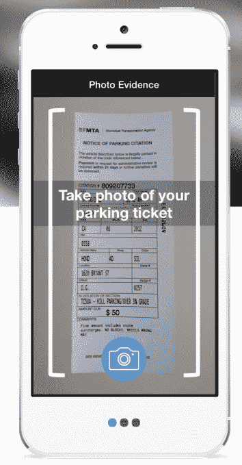
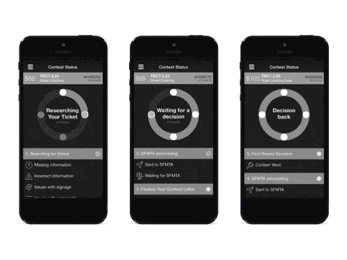

# 已修复，修复停车罚单的应用程序在旧金山、奥克兰和洛杉矶被屏蔽

> 原文：<https://web.archive.org/web/http://techcrunch.com/2015/10/12/fixed-the-app-that-fixes-your-parking-tickets-gets-blocked-in-san-francisco-oakland-l-a/>

[Fixed](https://web.archive.org/web/20221130174759/http://getfixed.me/) ，一款代表用户对抗停车罚单和其他交通罚单的[移动应用，在旧金山、奥克兰和洛杉矶这三个顶级城市加强了阻止 Fixed 访问其停车罚单网站的措施后，其停车罚单业务被屏蔽。](https://web.archive.org/web/20221130174759/https://beta.techcrunch.com/2014/01/15/fight-parking-ticket-fixed/)

该公司证实，截至三周前，它已经暂停了这三个城市的停车罚单业务——此举影响了约 10 万名用户。我们被告知，展望未来，Fixed 将专注于交通罚单业务。

这家初创公司与旧金山市交通局(SFMTA)的问题已经有一段时间了。

该机构从来没有接受过这种服务，以及它自动为当地人提供机票竞争过程的方式。使用其应用程序，Fixed 的客户可以用手机摄像头拍下停车罚单的照片，然后 Fixed 会检查各种常见错误，然后代表用户给城市写一封定制的信。该应用程序还巧妙地接入了谷歌街景，以查看该市在收到罚单的区域是否有适当的标志。

创始人大卫·赫加蒂[曾指出](https://web.archive.org/web/20221130174759/https://beta.techcrunch.com/2015/05/22/fixeds-app-can-now-fix-your-new-york-parking-tickets/)超过一半的门票有问题，会使它们无效，但该市在仲裁纠纷时往往不按自己的规则行事。这使得固定的“赢”率只有 20%-30%，今年早些时候。(当该公司胜诉时，它会收取相当于原罚款 25%的成功费——减少了客户原本要支付的费用。)

然而，即使顾客没有逃票，该应用程序也可以帮助自动支付，而不必使用一个城市通常过时的网站。最近新增的“门票卫士”可以自动为你处理门票，并通过监控政府网站提醒客户有新的门票。

当然，这些城市并不欢迎一个旨在通过自动化跳过法律漏洞的过程来帮助当地人不支付门票的应用程序。当 Fixed】去年开始向 SFMTA 发送传真时，该机构给这家初创公司发了电子邮件，要求他们停止使用传真机。当 Fixed 指出这样做是合法的时，该机构干脆关掉了他们的传真。

根据赫加蒂的说法，这三个城市目前将票务运营的后端外包给施乐，施乐在今年 2 月或 3 月开始试图屏蔽他们票务网站上的 Fixed。据报道，封锁是 SFMTA 的明确指示。最初，屏蔽是微不足道的，赫加蒂说，只是验证码和 IP 地址屏蔽。这很容易解决。

但在 8 月，施乐开始利用第三方组织阻止 Fixed 访问停车罚单网站。虽然 Fixed 的工程师仍然可以在街区周围工作，但现在需要更多的工程时间和资源，这也影响了 Fixed 的客户服务运营。

因此，Fixed 决定在这些地方停止对停车罚单协助的支持。

“9 月，我们决定暂停停车罚单服务。赫加蒂说:“系统中现有的所有机票都将继续处理，但在我们解决这个问题之前，我们不会接受新的机票。”。

“很不幸，SFMTA 决定阻止我们的服务。超过 60，000 张停车罚单被提交给 Fixed。他继续说道:“我们不仅帮助人们战胜了不公平的停车罚单，我们应用程序上的提醒还帮助人们按时缴纳停车罚款，避免了滞纳金。”。

“停车罚单罚款占了 SFMTA 运营预算的 15%，看起来他们反对我们为他们的流程提供一些问责制，”赫加蒂补充道。

虽然该公司仍在研究其选择，但目前没有计划恢复其停车罚单服务。相反，Fixed 的新计划是专注于不断增长的交通罚单业务，该业务目前正在加州以外的地区扩张。

今天 Fixed 的系统中仍然存在的任何停车罚单将被完全处理，但它将不再接受新的客户。任何通过该应用程序提交停车罚单的人现在都将收到一封电子邮件，通知他们关闭。

该邮件内容如下:

> 嗨–很遗憾，我们无法处理您的停车罚单。
> 
> 不幸的是，我们不得不暂停你所在城市的停车罚单业务。市政府一直阻止我们访问他们的停车罚单网站。
> 
> 我们希望解决这个问题，并尽快恢复停车罚单业务。如果您提交了其他停车罚单，请不要担心，他们正在处理中。此外，交通罚单不受城市行动的影响。
> 
> 如果您有任何其他问题，请告诉我们。
> 
> 大卫

记者无法立即联系到 SFMTA 置评。

Fixed 得到了 Y Combinator、Merus Capital、Slow Ventures、Structure VC、Paul Buchheit、说唱歌手 Nas、Scott Banister、John Cobbs、Mark Randolph、Matt Humphries、巫启贤、王冠淇等人 185 万美元的资金支持。

*补充报道:德鲁·奥拉诺夫*

**更新** : SFMTA 周一因假期关闭，但现在提供了一份声明(10/13/15，美国东部时间下午 3 点)

> 施乐公司对他们的系统进行了安全更改，不再允许所有客户进行大规模电子提交和支付。施乐公司称，这是为了增强内部控制和系统完整性。这不是 SFMTA 的要求。事实上，我们已经重新分配了工作人员来帮助支持 Fixed 提交的任何材料，他们仍然可以在线提交抗议或继续提交纸质副本。

**更新 2** : Fixed 向我们提供了它通过 FOIA 程序要求的一封电子邮件，该公司表示，这确实暗示了 SFMTA 和施乐之间就 Fixed 进行了直接对话。(美国东部时间 2015 年 10 月 14 日下午 5 点)–

固定邮件

**更新 3** :施乐公司现在也发布了一份官方声明。(美国东部时间 2014 年 10 月 15 日下午 4 点 45 分)–

> 需要说明的是，Fixed 并没有被奥克兰、旧金山和洛杉矶的机票网站屏蔽。现在的情况是，施乐对所有面向公众的网站实施了行业标准支付卡行业(PCI)最佳实践，以保护我们的系统安全。这些网站不再允许大规模电子自动化系统访问。个人付款、抗议和其他互动仍可在线提交或通过纸质副本提交。这项工作并不针对任何一家公司，而是旨在保护我们所有客户的整体系统安全。安全标准是行业标准应用程序，类似于您在许多交易网站、社交媒体网站和新闻群组中看到的应用程序，旨在确保客户的所有安全措施。