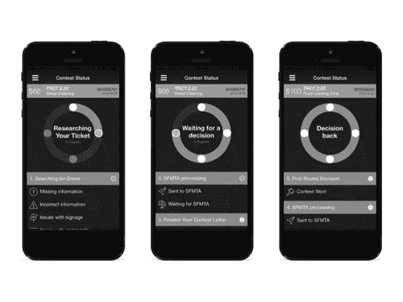

# 已修复，帮助你打票的应用程序被一家律师事务所收购 

> 原文：<https://web.archive.org/web/https://techcrunch.com/2016/06/15/fixed-the-app-that-helps-you-fight-tickets-gets-acquired-by-a-law-firm/>

有时候政府会赢，而不是创业公司。例子: [Fixed](https://web.archive.org/web/20221209171908/https://www.crunchbase.com/organization/fixed-3#/entity) ，这家一开始是通过使用技术帮助司机[对抗停车罚单的工具公司，已经被收购。Fixed 一直在努力让各城市接受其提交的申请，面临着各种各样的问题，从被各城市的机票网站屏蔽到代理商仅仅是](https://web.archive.org/web/20221209171908/https://beta.techcrunch.com/2015/10/12/fixed-the-app-that-fixes-your-parking-tickets-gets-blocked-in-san-francisco-oakland-l-a/)[拔掉传真机](https://web.archive.org/web/20221209171908/https://beta.techcrunch.com/2014/07/24/fixed-raises-1-2-million-for-a-mobile-app-that-fights-your-parking-tickets-for-you/)这样 Fixed 就无法联系到他们。事实上，该公司[去年秋天不得不关闭其停车罚单业务](https://web.archive.org/web/20221209171908/https://beta.techcrunch.com/2015/10/12/fixed-the-app-that-fixes-your-parking-tickets-gets-blocked-in-san-francisco-oakland-l-a/)转而专注于交通传票，原因是当地政府机构的抵制和缺乏反击资源。

固定的想法是巧妙的。它使用户能够自动质疑停车罚单，只需让司机用智能手机摄像头拍下罚单的照片。然后，Fixed 的移动应用程序会检查各种常见错误，并代表用户给这座城市写一封定制的信。它甚至接入谷歌街景，查看该市在收到罚单的地方是否有适当的标志。

如果门票是合法的，Fixed 还可以帮助自动支付，这样用户就可以避免使用该市经常过时的网站的苦差事。

但是依靠停车罚款来充实国库的地方政府，并不关心一个旨在帮助用户逃避支付罚款的应用程序。因此，Fixed 的“赢”率相当低——大约有 20%到 30%的竞争门票按照用户的喜好进行了调整。(修复了一次[声称](https://web.archive.org/web/20221209171908/https://beta.techcrunch.com/2015/02/03/fixed-the-app-that-fights-parking-tickets-raises-650k-more-and-heads-to-oakland/)旧金山市政交通机构不会总是取消门票，即使它发现了应该使门票无效的问题)。

Fixed 最终于 2015 年 10 月在三藩市、奥克兰和洛杉矶被封锁。尽管它知道如何绕过封锁，[但由于所需的工程时间和资源增加，它无法做到这一点](https://web.archive.org/web/20221209171908/https://beta.techcrunch.com/2015/10/12/fixed-the-app-that-fixes-your-parking-tickets-gets-blocked-in-san-francisco-oakland-l-a/)。这时候它开始关注流量引用。

该公司建立了一个系统，可以分析交通罚单，然后帮助向客户解释这在财务上的影响。这很有用，因为大多数客户只考虑罚款金额，而不考虑由于罚单给你的执照增加的分数和随后的保险增加而造成的长期损害。

然后，它可以将客户与能够提供帮助的律师联系起来，而且费用较低，因为 Fixed 使律师事务所的许多入职流程实现了自动化。它与十几个州的大约 20 名律师合作。

这最终引起了 [Lawgix](https://web.archive.org/web/20221209171908/http://www.lawgixlaw.com/) 的注意，这是一家跨国律师事务所，实际上是一家科技公司。(经营技术业务的埃里克·索尼尔也知道 Fixed，因为他和 Y Combinator 是一类人)。

Fixed 每周处理大约 500 张罚单，它向客户推荐的律师可以帮助大约 90%的案件取消积分。他们还帮助减少了一半的罚款。

Lawgix 已经为诉讼过程的后端建立了技术系统，比如那些处理法庭日期和法庭行动结果的系统。现在，它将把 Fixed 的技术添加到前端，装载新客户，并将 Fixed 的应用范围扩大到 17 个州。

然而，这次收购是为了技术，而不是人才。虽然很高兴知道这项技术将继续存在，但这并不是 Fixed 创始人大卫·赫加蒂想要的那种结果。

Fixed 在 9 月份正在筹集资金，但当这些城市屏蔽了该应用程序时，新一轮融资就不再是一个选项了。尽管优步对投资者产生了一些影响，这些投资者此前不太愿意为接受当前监管的服务提供资金，但许多人仍对进入这类业务持谨慎态度。

赫加蒂说，对抗监管给创业公司的成长带来了另一个摩擦。“当一帆风顺的时候，让一个企业运转起来已经够难了，”他指出。

此外，在转向交通罚单后，Fixed 也开始反对律师协会。

“我们开始在那个系统中与现有的律师发生摩擦，他们会向律师协会投诉我们，”赫加蒂说。“我们曾与洛杉矶的一名道德律师合作，以遵守所有这些规章制度，但这变得非常困难。这是对该行业的又一次束缚，”他表示。

Lawgix 不会处理同样的问题，因为它不必担心诸如披露 Fixed 提供的信息不是“法律建议”之类的事情。人们再也不能争辩说，Fixed 的门票帮助就像执业律师，因此是一个问题。Lawgix 是一家律师事务所，这就可以了。作为科技公司的一部分，它可能也非常适合 Fixed。

Fixed 已经筹集了 180 万美元的种子[资金](https://web.archive.org/web/20221209171908/https://beta.techcrunch.com/2015/02/03/fixed-the-app-that-fights-parking-tickets-raises-650k-more-and-heads-to-oakland/)，包括来自[的《鲨鱼池》的马克·库班](https://web.archive.org/web/20221209171908/http://sharktankblog.com/business/fixed/)，戴夫·莫兰的[慢风险投资](https://web.archive.org/web/20221209171908/https://www.crunchbase.com/organization/slow-ventures)，[结构 VC](https://web.archive.org/web/20221209171908/http://structure.vc/) ，[保罗·布赫海特](https://web.archive.org/web/20221209171908/https://www.crunchbase.com/person/paul-buchheit)，说唱歌手[纳斯](https://web.archive.org/web/20221209171908/https://www.crunchbase.com/person/nasir-bin-olu-dara-jones)，以及其他人。

赫加蒂拒绝就交易条款置评。