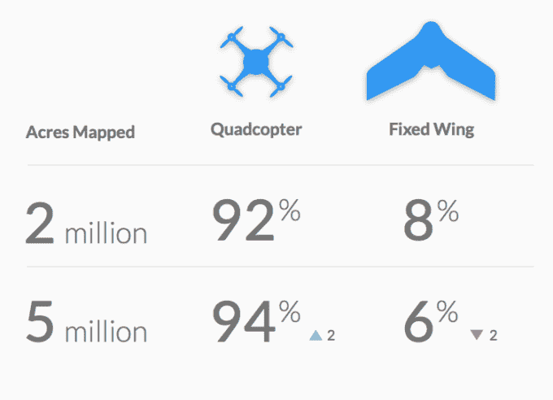

# 一项新的 DroneDeploy 研究发现，固定翼无人机尚未在商业市场上起飞

> 原文：<https://web.archive.org/web/https://techcrunch.com/2016/08/15/fixed-wing-drones-not-quite-taking-off-in-commercial-market-a-new-dronedeploy-study-finds/>

[DroneDeploy 本周发布了一项关于商业和工业无人机市场的新研究](https://web.archive.org/web/20230324024115/http://info.dronedeploy.com/commercial-drone-industry-trends/)，为固定翼无人机制造商透露了一个坏消息——四轴飞行器在每个行业都远远超过了这种无人机。

固定翼无人机，如 [SenseFly](https://web.archive.org/web/20230324024115/https://www.sensefly.com/) eBee Ag、 [3DR](https://web.archive.org/web/20230324024115/https://3dr.com/) Aero-M 和 [PrecisionHawk](https://web.archive.org/web/20230324024115/http://precisionhawk.com/) Lancaster，承诺性能优势，包括续航能力和耐用性。

一般来说，与多旋翼无人机相比，固定翼无人机单次充电可以飞得更远，覆盖更大的区域。但 DroneDeploy 发现，只有 6%的航班将它们用于商业和工业目的。

与此同时，四轴飞行器被广泛使用，这种飞行器有望让无人机操作员在飞行中更容易控制，并允许快速起飞。

DroneDeploy 首席执行官兼联合创始人[迈克·韦恩](https://web.archive.org/web/20230324024115/https://www.dronedeploy.com/team.html)解释说，“人们宁愿在一个大区域内多次驾驶四轴飞行器，或者停下来更换电池，也不愿在飞行前经历组装固定翼无人机的过程。”

值得庆幸的是，大多数商用和工业用固定翼无人机的制造商也开发了四轴飞行器或其他多旋翼模型。

DroneDeploy 的研究还发现，仅在过去四个月中，无人机的商业和工业用户就绘制了 300 万英亩的土地。相比之下，在此之前的一整年，测绘的土地不到 200 万英亩。

到目前为止，农业是使用无人机最多的行业，其次是建筑业。但无人机应用增长最快的领域是采矿、检查以及石油和天然气。

如今，新的行业正在寻找无人机的用途，包括:教育、应急服务和房地产，尽管这些行业的机构仅在一年前还几乎没有测试过无人机。

并且在过去的一年里，这个市场上使用最多的无人机硬件来自 DJI；SenseFly(一家鹦鹉所有的公司)；3DR 分别是 AgEagle 和 Parrot。市场上最受欢迎的无人机相机技术来自 DJI、佳能、索尼、GoPro 和 Mapir。

DroneDeploy 提供软件和系统，帮助组织将无人机用于任何类型的商业和工业目的，从测绘和测量交通，到监控和场地安全，到喷洒作物和从高处监控作物健康。

该公司的研究基于其客户在过去 16 个月中在 130 个国家的无人机相关活动。