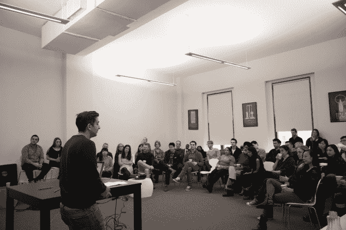

# 熨斗学校通过 Learn Verified TechCrunch 推出完整的在线课程

> 原文：<https://web.archive.org/web/https://techcrunch.com/2015/10/08/flatiron-school-launches-full-online-curriculum-with-learn-verified/>

[熨斗学校](https://web.archive.org/web/20221004141100/http://flatironschool.com/)是一个针对网络和移动开发的加速教育项目，随着 Learn Verified 的推出，该学校正在改变其模式。

传统上，熨斗学校在真实的教室里教授课程，99%的成人毕业生找到了平均工资为 7 万美元的全职开发工作。但除此之外，Flatiron 还通过许可程序本身，以及与学校签约教授课外课程等方式，将其课程扩展到学校(T4)。通过自己的培训人员。

但随着 Learn Verified 的推出，Flatiron 现在首次提供完整的在线课程。通过 Learn Verified，用户可以按照自己的进度完成他们的课程，Flatiron 保证该计划的毕业生将在完成该计划的六个月内获得全职工作，否则他们将获得退款。

该课程是开源的，与 Flatiron 的 IRL 学生所经历的课程相同，并不断更新以反映整个 Flatiron 学校社区的反馈，从教师到学生再到毕业生。

Learn Verified 课程包括 600 到 800 小时的 web 开发内容、200 多个代码实验室以及 100 多个视频、阅读材料和互动测验。要完成该计划，学生必须在教师的指导下进行两次小型评估，以检查整个课程的进度，并在课程结束时由教师进行最终验证。

在整个过程中，Learn Verified 学生可以每天 18 小时访问熨斗学校的教职员工，并可以每周 7 天、每天 24 小时访问他们的研究生社区。

Flatiron 已经与谷歌、Etsy 和 Kickstarter 等公司建立了招聘合作关系，并将寻求将 Learn Verified 毕业生安置在他们居住地附近的合理的网络或 iOS 开发岗位上。

熨斗学校从来都不是为计算机科学爱好者准备的，学习验证定价反映了这一点。该计划每月花费 1000 美元，需要 4 到 6 个月才能完成。

总部位于纽约的熨斗学校迄今为止已经筹集了 1450 万美元的资金。

你可以在这里亲自查看[。](https://web.archive.org/web/20221004141100/https://learn.co/verified)