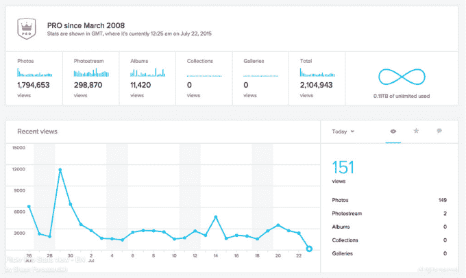

# Flickr 恢复其“专业”订阅计划 

> 原文：<https://web.archive.org/web/https://techcrunch.com/2015/07/23/flickr-brings-back-its-pro-subscription-plan/>

Flickr [宣布](https://web.archive.org/web/20221206154606/http://blog.flickr.net/2015/07/23/hey-there-flickr-pro-nice-to-see-you-again/)今天它将恢复其针对雅虎照片共享服务的高级用户的“Pro”订阅计划，该计划将引入各种新功能，包括获得改进的分析、软件折扣等，并允许无广告体验。专业用户也将再次收到一个“专业”徽章，突出显示在他们的帐户上，这将表明他们的地位。

你可能还记得，雅虎在 2013 年春天对[的定价等级](https://web.archive.org/web/20221206154606/https://beta.techcrunch.com/2013/05/20/yahoo-drops-flickr-pro-to-compete-with-facebook-still-offers-two-paid-tiers-for-ad-haters-and-power-users/)进行了大量重大调整，引入了新的等级，如“无广告”和“doubler”(存储空间翻倍)，同时放弃了旧版本的 Flickr Pro。当时，该公司声称，取消 Pro 不会有太大的影响，因为 Pro 此前的表现并不太好。

话虽如此，[雅虎同时](https://web.archive.org/web/20221206154606/https://beta.techcrunch.com/2013/05/20/yahoo-drops-flickr-pro-to-compete-with-facebook-still-offers-two-paid-tiers-for-ad-haters-and-power-users/)对现有 Pro 会员做出了令人困惑的决定，称即使新用户不能注册 Pro，它也将继续提供可续订的订阅，任何订阅过期的人也将永远失去 Pro 的访问权。此外，它这次取消了 Pro 徽章，并消除了任何人“赠送”Pro 订阅的能力。

然而，鉴于针对专业摄影师的初创公司的竞争日益激烈——如 EyeEm 或 500px，后者刚刚在本周获得了新一轮 1300 万美元的融资——似乎雅虎正在更多地试图吸引专业人士回到其平台上来……或者至少保留其仍然拥有的专业人士。

根据 Flickr 的说法，修改后的专业会员资格将包括访问新的和改进的统计数据，包括在移动设备上查看这些数据的改进导航。这些分析将允许专业人员更好地确定哪些照片最有影响力，哪些照片的访问量最大。用户可以通过照片、照片流、相册、收藏和图库以及收藏夹和评论来跟踪他们的浏览量。

专业会员在查看自己或他人的照片时也不会受到广告的影响，他们将再次在个人资料上获得“专业”徽章。

此外，专业会员将获得一些照片产品的折扣，包括年度订阅者的 Adobe Creative Cloud Photography 计划的 20%折扣，以及 Flickr 商品的免费运输和最低购买 25 美元的国际运输半价。然而，Flickr 指出，这些折扣将只适用于那些按年注册 Pro 的用户。

年度计划是每年 49.99 美元，否则专业版订阅每月 5.99 美元。

那些已经为“专业”层(付费订阅)付费的 Flickr 用户将继续获得他们以前拥有的好处，包括无限的存储空间，同时还可以访问新功能。与此同时，那些已经为“无广告”层付费的用户现在将迁移到 Pro，他们的计划价格没有变化。(无广告也是每年 49.99 美元。)

关于升级过程和变化的更多细节在雅虎的帮助网站上。或者，用户可以访问[他们的账户页面](https://web.archive.org/web/20221206154606/https://www.flickr.com/account/upgrade)升级到不同的层级。

Flickr 告诉 TechCrunch，它根据用户反馈做出了这一改变。

一位发言人解释说:“这些年来，随着会员需求的变化，我们对账户选项进行了调整。“随着 Flickr 4.0 发布的成功，我们的新会员和现有会员要求改进照片统计，以便他们可以了解更多关于他们照片的参与情况以及 Flickr Pro 徽章的复兴。”