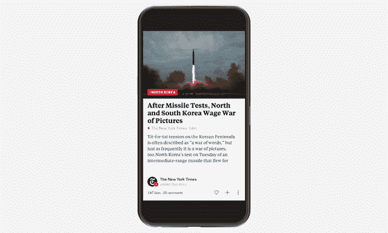

# Flipboard 通过拥抱移动网络向更多出版商开放 

> 原文：<https://web.archive.org/web/https://techcrunch.com/2017/10/10/flipboard-red-bolt/>

Flipboard 正在改变它与在线出版商的合作方式，这要归功于两个相关的公告。

首先，出版商不再需要直接与 Flipboard 合作，以便将他们的故事纳入应用程序。取而代之的是[，一个新的自助注册选项](https://web.archive.org/web/20221213171003/https://about.flipboard.com/publishers/)，允许 Flipboard 自动从出版商的 RSS 订阅源中获取故事。

需要说明的是，首席执行官迈克·麦库埃表示，Flipboard 不会让所有人都使用这款应用。相反，在出版商提交后，会有一个审查过程，以确保他们遵守 Flipboard 的内容规则(除其他外，这些规则禁止仇恨言论)。

其次，Flipboard 不打算将所有这些文章转换成应用程序的原生格式。相反，它将专注于移动网络。

Flipboard 已经包含了一些非原生文章，但现在它正在围绕它们创建一个更正式的系统，符合特定内容和广告准则的出版商将在其文章旁边获得一个“红色闪电”(该符号实际上是一个红色闪电，但该名称也代表读者增强显示)。

麦库埃说，这个想法是为了“庆祝移动网络的最好之处”，给读者一个清晰的信号，告诉他们哪些文章可以快速加载，而不会有任何烦人的广告。此外，红螺栓文章将在 Flipboard 中优先显示。

参与由谷歌领导的加速移动页面项目的出版商可能从一开始就准备好了，他们将被相应地快速跟踪。(该指南要求页面在一秒钟或更短时间内加载，并避免咄咄逼人的弹出广告。)

麦库埃说，原生文章格式并没有完全消失——但听起来重心确实在转移。Flipboard 表示，已经有数百家 RED Bolt 出版商在船上，包括《纽约时报》、《华盛顿邮报》、The Verge 和 Axios。

由于这些是出版商自己的网页，出版商将继续负责广告。然而，麦库埃表示，他有兴趣在未来与出版商合作开发新型移动广告单元。

当我问及脱离原生文章是否会损害 Flipboard 从广告中赚钱的机会时，他回答说，“我不太担心这一部分”——因为如果观众和出版商都满意，“从赚钱的角度来看，Flipboard 会做得很好。”

相反，麦库埃说，“我关心的是移动网络广告的状况。”对比我们经常在移动网页上看到的劣质广告和最好的杂志上可能出现的美丽而相关的广告，他认为他的目标是找出，“我们如何在移动网络上创建一个数字化的环境，复制并现代化这些基本原则？”

至于为什么首先引入更多出版商很重要，麦库埃承认 Flipboard 并没有因为某些主题的内容缺乏而受到影响(比如唐纳德·川普)。然而，他认为这将使 Flipboard 在更窄的主题上更有深度(毕竟，该公司的目标是帮助人们[追随他们的激情](https://web.archive.org/web/20221213171003/https://beta.techcrunch.com/2017/02/08/flipboard-smart-magazines/)，无论这些激情可能是什么)。这也有助于 Flipboard 在没有太多编辑合作伙伴的国家取得进展。

这些出版商将被鼓励通过社交插件推广他们的 Flipboard 账户——这一策略可以帮助出版商通过 Flipboard 获得更多流量，并可以为 Flipboard 本身提供一个良好的推动。