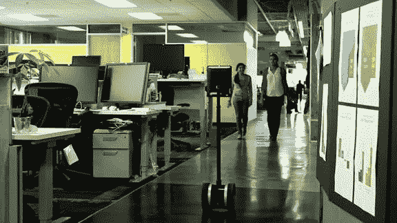
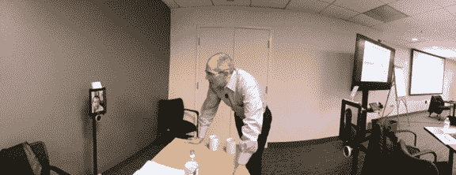

# 翻转办公室网真模式 

> 原文：<https://web.archive.org/web/https://techcrunch.com/2016/06/18/flipping-the-office-telepresence-model/>

More posts by this contributor

如果我告诉你，你可以不离开办公室，在一天之内游览三个大洲，并且真正地感觉到你身临其境，会怎么样？你可以走过走廊或穿过舞台，进行眼神交流，感觉更像一个人，而不仅仅是屏幕上的一张脸？

今年早些时候，保罗·麦克多纳-史密斯——我在伦敦的麻省理工学院斯隆管理教育学院的同事——在“远程呈现机器人”的帮助下做到了这一点上午的第一件事是，他和我们的同事辛迪·陈一起出席了在新加坡举行的一个会议，然后在南非开普敦参加了一个商务会议，下午晚些时候，他在麻省理工学院剑桥校区会见了我和其他团队成员。

如果你以前没有遇到过远程呈现机器人，它们看起来出奇的谦逊。外观上有一些变化，但基本要素是:一个充当“头”的屏幕，一个用于转动“头”的“腿”或“脖子”，以及一套用于旅行的陀螺轮。我们使用的模型是由[双机器人](https://web.archive.org/web/20221207080350/http://www.doublerobotics.com/)制造的，本质上是一个带轮子的腿上的 iPad。虽然这看起来很简单，但这项技术在将人们聚集在一起方面非常出色。

在我们的办公室里，远程呈现机器人不再是一个新奇的事物，而是我们一直用来让我们的远程团队成员更加投入的日常工具。我们大约三分之二的员工每周远程工作一到三天。Double 的机器人装置可定期用于团队会议或一对一访问。保罗的经历可能有点极端，我们并不是每天都像那样使用双打。

我们中的大多数人更像科琳·伯杰(Colleen Berger)，她是一名高管教育项目主任，住在科德角，在天气好的时候，从办公室通勤大约需要三个小时。科琳经常使用远程呈现机器人参加会议，并与校园里的同事交谈。我在旅行时偶尔会使用机器人，甚至曾经在飞机上登录过。然而，我们都喜欢的是在与同事和客户的互动中真实呈现的能力——这种体验比电话或视频会议更自然、更私人。

> 远程呈现似乎是一个有趣的附加功能，并且已经证明对我们的团队非常有效。

麻省理工学院斯隆管理教育团队的日常运作分为三大类:开发和促进教育项目；会见教师、客户和商业团体成员；在世界各地参加专业会议和商务会议。既然我们已经了解了双机器人的最佳内部用途，我们已经逐渐地——战略性地——扩展到办公室之外。我提到了[我们如何在内部使用远程机器人](https://web.archive.org/web/20221207080350/http://stories.doublerobotics.com/?story=true&id=59)，但是将机器人带进教室需要更多的思考，而不仅仅是解决一两个人的后勤问题。

## 高管教育课堂上的机器人

麻省理工学院斯隆管理人员教育项目植根于共享的学习体验——参与者聚集在校园里向我们的教师和其他人学习，建立专业关系，并参与麻省理工学院的生态系统。我们在选定的项目中试验虚拟交付，但基本原理保持不变。我们如何向远程参与者提供在线学习的所有优势，同时又不影响同处一室的学习者的体验？谁将从这项技术中受益最多？

向有距离和行动困难的人提供它似乎是一个好的开始。我们希望向那些可能根本不会考虑注册的人提供我们的一些项目，尽管他们和房间里的每个人都会从他们的参与中受益。为了帮助我们找到合适的试点候选人，我们请来残疾多样性专家 Sean Driscoll。肖恩是 [BBsquared](https://web.archive.org/web/20221207080350/http://bb2consulting.com/) 的创始人，这是一家就多样性、平等和包容倡议向组织提供建议的咨询公司。

我们之前曾与 Sean 合作参与 [Work Without Limits](https://web.archive.org/web/20221207080350/http://www.workwithoutlimits.org/) ，这是一个旨在增加马萨诸塞州残疾人就业的全州网络。Sean 对残疾多样性问题的深入了解和他广泛的专业网络对我们的实验很有帮助。在肖恩的帮助下，我们见到了汤姆·赫尔希，一位在洛杉矶生活和工作的娱乐业高管。汤姆使用电动轮椅，所以穿越这个国家对他来说是一系列独特的挑战。

> 一旦它全部启动并运行，这是一件非常有趣的事情，老实说，我忘记了我是在远处的事实。汤姆·赫尔希

汤姆参加了一个为期两天的高管教育项目，[管理复杂的技术项目](https://web.archive.org/web/20221207080350/http://executive.mit.edu/openenrollment/program/managing-complex-technical-projects/#.VwQJQxIrJE4)，由我们的一位资深教员史蒂文·艾宾格教授领导。在该计划之前，Tom 与我们的员工进行了几次培训和故障排除会议，但除此之外，他应该像房间里的其他人一样参与。他很快就掌握了操作机器人的窍门，并且能够享受程序的各个方面。“一旦它全部启动并运行起来，这是一件非常有趣的事情，老实说，我忘记了我是在远处的事实，”他说。“你有点被教室里发生的活动吸引住了——就像身临其境一样。”

作为一名麻省理工学院的本科生，汤姆认为他对机器人的体验非常接近课堂体验。幸运的是，汤姆在索尼电影公司从事特效技术的长期职业生涯使他成为一个精明的用户，并渴望尝试一种很酷的新技术方法。他指出了一些需要改进的地方，但总体印象非常好。“我没有意识到自己离得那么远，”他说。“它需要更多的工作，但我相信这将是一个很好的途径。”

## 教授机器人学生

史蒂文·艾宾格对教室里有一个机器人参与者有点紧张。"我最关心的是汤姆能从这个项目中得到他应该得到的东西吗？"他说。“尽管我知道通过这种机器人技术与人互动是可能的，但我不知道它在教室环境中如何工作，但它实际上工作得相当顺利。汤姆完全能够参加。在一个大约 50 人的开放注册项目中，如果愿意，每个人都应该有机会在课堂上发言，并与同桌的其他人互动，而他正是这样做的。”

史蒂文·艾宾格在节目间隙采访汤姆和保罗。(摄影:布鲁斯·赫克特)

Steven 认为个人互动是整个项目体验的重要组成部分。尽管他曾在各种技术支持的环境中授课，包括在线和电话会议，但同步交付仍然是他的首选方法。

“我认为你会从同步中获得更丰富的体验，”他说。“为了真正同步，我们需要聚集。我们可以在麻省理工学院进行物理实验，也可以使用各种远程技术。与传统的甚至非常好的视频会议相比，网真有更多的存在感。对于某些事情，同步和协同定位有很大的优势。这使得我们有可能打破共址要求。”

作为奖励，史蒂文不需要改变他的教学方式来适应这项技术。很简单。然而，教一屋子的机器人将是完全不同的事情，因为如果房间里的每个人都以数字形式出现，他们的感知能力将会非常不同，需要截然不同的教学方法。

> 远程呈现机器人的另一个关键方面是远程参与人员所需的注意力水平。

乔安妮·耶茨教授同意这一观点。“一屋子的机器人没有多大意义，因为远程呈现机器人给你的是可以与其他人互动的物理存在。如果没有现场感，为什么不让每个人都出现在屏幕上？”

JoAnne 教授我们的[数字时代的沟通和说服](https://web.archive.org/web/20221207080350/http://executive.mit.edu/openenrollment/program/communication-persuasion-in-the-digital-age/#.VwPhAxIrJE4)项目，并研究分散的团队和使他们有效的沟通方法。在她看来，与更传统的协作工具相比，远程呈现机器人提供了重要的优势，允许远程参与者加入位于同一地点的小组。

“机器人比音频电话连接或视频会议给你更多的灵活性，”她说。“声音其实来自机器人，所以人们对待机器人更像是对待一个人。通常，图像和声音不会来自同一个空间点，而机器人会。这是让机器人在课堂或会议中与人互动的一大优势。”

## 看 iPad 的眼睛

布鲁斯·赫克特和汤姆参加了同一个项目，只不过是以个人身份——或者说是以他的身体。作为总部位于波士顿的 ADI 公司的电气工程师和机器人爱好者，Bruce 非常高兴有一位共同参与者通过远程呈现机器人出席会议。虽然他最初没有坐在同一张桌子上，但他一见到汤姆就直奔过去。“当我听说他在哪里时，我想见见他，因为我想知道这种体验是什么样的，还因为我喜欢和不同桌子上的人坐在一起，尽可能多地认识更多的人。”Bruce 利用一切机会在休息、午餐和小组项目中与 Tom 交谈。他把这种体验描述为与在他们身体里的人一起工作没有太大的不同。

布鲁斯经常参加麻省理工学院斯隆管理教育项目。对他来说，与他的合作学习者建立关系是项目体验的一个重要方面，这不是用传统的音频或视频会议工具可以轻易做到的。“那在电话里是不可能的。这么多人，你甚至不知道该问什么，也不知道该问谁，”他说。“房间里，有很多人。但如果你有这么多人在通话，一次只能有一个人真正进行对话。”

远程呈现机器人使远程人员以更自然的方式引导他们的注意力成为可能。你可能还不能和别人握手(还不行！)，但是你可以在说话的时候保持目光接触，你可以转身看着桌子周围的其他人，你在房间里有一个实际的座位，就像你实际上一样。“当你坐在桌边时，你把它(iPad)放下来，这样你基本上就像坐在同一位置上一样。布鲁斯说:“你可以看到餐桌上的人们看法一致。

## 导航沟通风格

除了机器人的自然感觉之外，远程人员还可以在不同的交流方式之间切换。我们的超级用户保罗是这样描述的。“我们可以进行一对一的对话，但我可以非常自然地转移到另一种交流方式，我可以将机器人移动到一个舞台上，我可以向 10 或 50 或 100 人的小组进行演示。你可以很容易地从这种一对一或一对几的协作方式转变为更广泛的沟通方式，并来回转换。”

机器人适应不同通信模式的灵活性对汤姆来说也是一个重要方面。“在沟通领域之间导航:教师到班级，教师到学生，学生到工作组，学生到学生是这项技术的一个关键优势，”他说，并补充说，作为一个用户，他认为这一领域是“进化改进的最佳时机。”

> 远程呈现技术带给我们的远远超出了我们最初为远程员工提供有意义的技术便利的计划。

这种自然的轻松是音频或视频会议等更传统的协作工具所无法实现的。“有一种轮流发言的趋势，”Paul 解释道。有时你不得不等待主持人发起与远程用户的讨论。如果我通过机器人参与，我实际上可以非常容易地发起讨论，从这个意义上来说，这更加平等。这不是发生在我身上的事。这是我正在积极创造和参与的事情。积极参与是一个关键的区别。”

保罗还指出了替身的设计和面对面交谈之间的相似之处。“iPad 上唯一可见的是人的头部。这大约是房地产的 80%或 90%。这从人类互动的角度来看非常相似，这是我们在身体互动时看到的。”

然而，眼神交流并不是这个替身动作范围内唯一的类人特征。保罗将该装置的轻微摆动比作一个人站着说话时将平衡从一只脚转移到另一只脚。“我认为这给人一种活跃的存在感，就像一个人的化身，”他说。

## 保持专注

远程呈现机器人的另一个关键方面是远程参与人员所需的注意力水平。你不能轻易地同时处理多项任务——这是一件好事。Colleen 解释道，“我认为我们都陷入了一个陷阱，如果我们只是在打电话，我们往往会经常进行多任务处理，而网真则没有这个选项。你真的必须出席。如果你愿意，这可以是重新训练你自己，以不同的方式工作，但最终，会议更有成效，更具协作性。如果你真的在听，你会参与更多，增加更多的价值，并可能从中获得更多的价值。”

在我们的课堂上，高度的关注和专注同样重要。我们的高管教育项目的体验是紧张的，需要在每个项目期间投入全部的时间和精力。

## 实验、探索和进化

远程呈现技术带给我们的远远超出了我们最初为远程员工提供有意义的技术便利的计划。关于需要是发明之母的流行谚语对我们来说当然是正确的。

我们尝试这项技术的动机来自于我们的办公室搬到一个物理上偏远的空间，并且正在进行校园附近的一个大型城市建设项目，这将使臭名昭著的令人沮丧的波士顿通勤更加令人沮丧。我们花了很长时间认真思考为我们的团队成员提供弹性工作的最有效方法。

远程呈现似乎是一个有趣的附加功能，并且已经证明对我们的团队非常有效。我已经[写了](https://web.archive.org/web/20221207080350/https://beta.techcrunch.com/2015/10/08/how-telerobotics-can-reshape-our-workspace/)和[说了](https://web.archive.org/web/20221207080350/http://video.foxbusiness.com/v/4260669571001/send-a-robot-to-the-office-for-you/#sp=show-clips)大量关于我们灵活的工作安排对员工士气、工作满意度和生产力的益处，远程呈现机器人等技术正帮助这一切成为可能。

现在，我们已经向我们团队以外的机器人参与者开放了我们的教室，并从这次经历中吸取了经验，我们将继续寻找在校园内外使用远程呈现机器人的不同方式。