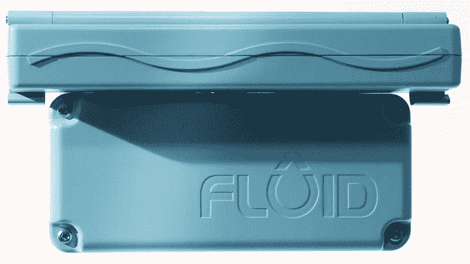
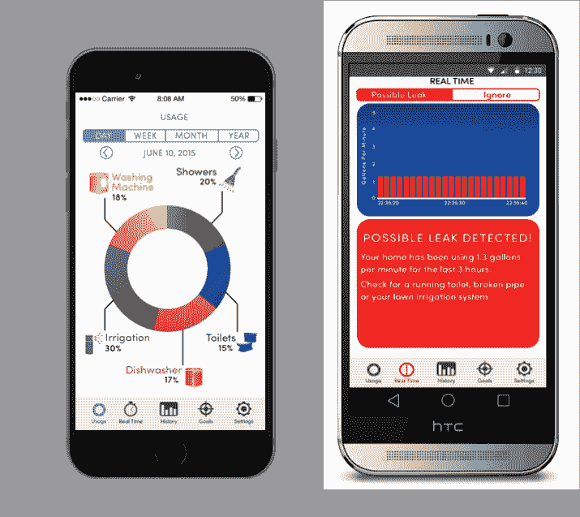

# 流体是你家的智能水表

> 原文：<https://web.archive.org/web/https://techcrunch.com/2015/09/15/fluid-is-a-smart-water-meter-for-your-home/>

你今天早上洗澡了吗？这意味着 30 加仑的水白白浪费了。冲几次厕所？那是另外四五加仑。也用洗碗机吗？再加六加仑，[至少](https://web.archive.org/web/20230227002611/http://water.usgs.gov/edu/qa-home-percapita.html)。

普通美国人每天消耗 [80 到 100 加仑的水](https://web.archive.org/web/20230227002611/http://water.usgs.gov/edu/qa-home-percapita.html)——相当于大约 700 个半升的水瓶。这个数字还不包括洒水器或软管的室外用水量。

在加州，积雪水平[已经跌至 500 年来的最低点](https://web.archive.org/web/20230227002611/http://www.theguardian.com/us-news/2015/sep/14/california-drought-sierra-nevada-snowpack-500-year-record-low)。我们知道干旱的严重性，但是监控和减少个人用水量是一项费力不讨好的任务。

你想让我数一下我洗澡的时间吗？好的。我打赌我的邻居不会这么做。

这正是[流体](https://web.archive.org/web/20230227002611/https://www.kickstarter.com/projects/825947844/fluid-the-learning-water-meter)想要改变的行为。[昨天在 Kickstarter](https://web.archive.org/web/20230227002611/https://www.kickstarter.com/projects/825947844/fluid-the-learning-water-meter) 上发布，FLUID 是一款智能水表，可以帮助你准确了解你每天在家里消耗的水的时间、地点和数量。

“现在消费者每个月都会收到一份水费单，而且是以单位为单位，而不是加仑，所以你必须把单子翻过来，做一些数学计算，才能知道你用了多少加仑，”FLUID 的联合创始人乔希·韦塞拉说。“流体实际上是让消费者能够更好地控制他们的用水。”

液体只是在你家的主水管周围快速流动。你把它插上电源，连接到你的 Wi-Fi，下载 FLUID 应用程序，就可以在你的 iPhone 或 Android 上访问实时报告。

使用超声波技术——本质上是从一个超声波传感器向另一个传感器发送脉冲——该设备能够在不切入管道的情况下测量水流速度。

更酷的是流体如何准确地知道水从哪里来。

你家里的每一个电器，不管是厨房的水龙头，卧室的马桶，还是洗衣机，都有一个标志性的运行速率，或者说是机器运行时水流过管道的速率和持续时间。

确切地说，告诉流体这个运行速率是多少需要一点工作。在该应用程序中，你可以指示 FLUID 在你运行每个电器的典型时间内“倾听”，无论是 30 分钟的洗衣机循环还是冲厕所。一旦 FLUID 捕获并记忆了这些特征，它就能够区分同时运行的多个设备或装置。

“我们希望人们与他们的水消费有更直接的关系，”FLUID 的联合创始人 Colin Hirdman 说。“希望最终结果是使用更少的水——并在水资源上花费更少的钱——但我们希望他们能够自己确定用水的方式、地点和时间。”

所以，当我刷牙的时候，不要让水槽一直开着，也许当我意识到到底有多少加仑的水被倒进下水道的时候，我会记得把它关掉。或者，我可能会拿出我需要的碗，用手洗，而不是在洗碗机刚刚半满的时候运行洗碗机——特别是因为我花了几个小时试图教会我的水表我家里的每件电器听起来是什么样子。

在发生泄漏的情况下，液体可以作为一种灾难预防工具，在你的地下室被洪水淹没和你的水费飙升到新的高度之前提醒你。

这种液体标价 239 美元，或者对 Kickstarter 的早期支持者来说是 179 美元，如果你的水管爆裂，它会在一个小时内收回成本，如果你的厕所正在运行，它会在五天内收回成本。

在 Kickstarter 于 10 月结束后，该设备将在 FLUID 的网站上以 299 美元的价格零售。首批设备计划于 2016 年 5 月发货。

未来，FLUID 将与现有的智能家居中心集成，如 Nest 或 SmartThings，并提供一个 REST API，以便开发人员可以构建自己的集成。

“一旦人们开始意识到他们使用了多少水，他们将能够开始节约用水，”Hirdman 说。“一旦他们开始存钱，他们会想存更多，而且他们会变得更有创造力。”

这是对人类行为相当乐观的看法，尤其是在自然资源消耗方面，但让我们希望他能有所发现。