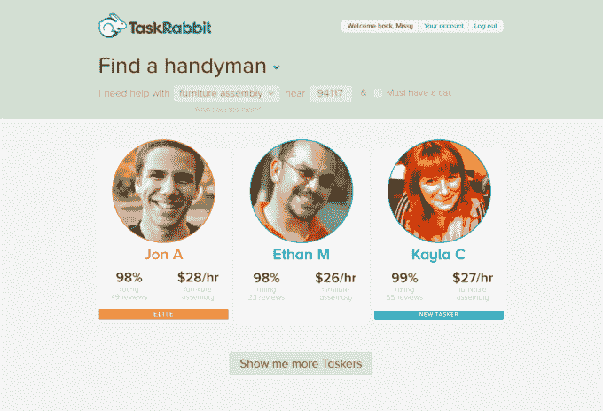
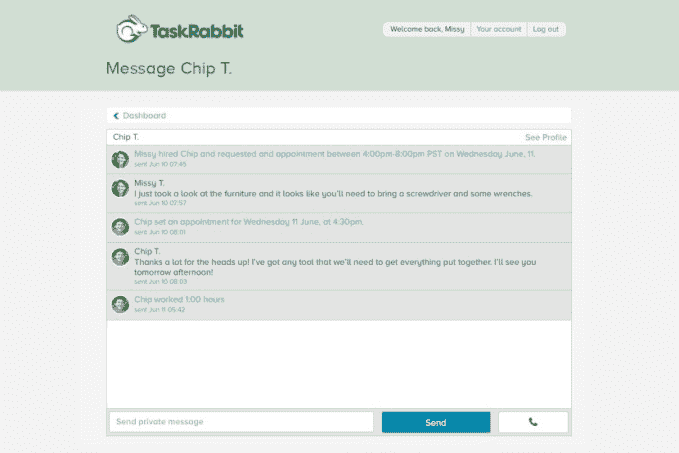

# 随着完成工作数量的下降，差事市场 TaskRabbit 改变了它的商业模式 

> 原文：<https://web.archive.org/web/https://techcrunch.com/2014/06/17/following-a-drop-in-completed-jobs-errands-marketplace-taskrabbit-shakes-up-its-business-model/>

跑腿市场 [TaskRabbit](https://web.archive.org/web/20221206013430/http://www.taskrabbit.com/) 今天正在改变它的商业模式。该公司表示，它正在摆脱承包商对最终用户发布的任务进行投标的拍卖模式，现在将把客户与潜在的“任务者”(又名承包商，该公司以前称为“兔子”)进行匹配。它还将提供透明的定价，并允许客户只需点击一下就可以预订他们选择的任务。

该公司告诉我们，在此之前，该公司发生了一系列其他变化，包括[去年夏天的一轮裁员](https://web.archive.org/web/20221206013430/https://beta.techcrunch.com/2013/07/08/taskrabbit-confirms-layoffs-as-it-realigns-to-focus-on-mobile-and-enterprise/)，从[转向以独立解决方案为目标的商业客户](https://web.archive.org/web/20221206013430/https://beta.techcrunch.com/2014/04/01/taskrabbit-for-business-service-portal-quietly-disappears/)，以及每项任务的投标数量下降。

后一个问题是 TaskRabbit 今天试图通过这个新模型解决的。

去年夏天，TaskRabbit 意识到，虽然它的业务仍在增长，但它的任务完成率却在下降。该公司意识到，问题在于它没有有效地匹配供给和需求。

但据该公司称，并非所有指标都在下降。TaskRabbit 去年增加了超过 125 万用户，预计今年将翻一番。超过 25，000 人通过这项服务获得收入，其中 10%的人将此作为全职工作，每天完成 3-5 项任务，每月收入 5000-8000 美元。今天早上发布的官方公告宣称，自一月份以来，任务发布量增长了 50%。

但是拍卖模式被打破了。或者，也许 TaskRabbit 已经超越了它。

为了应对这个问题，该公司花了几个月时间建立了一个新的匹配算法，该算法根据对任务执行者过去在网站上的行为、技能偏好、可用性和时间表的理解，为该工作建议合适的任务执行者。

结果还将表明任务者是终身的还是新的，允许客户选择他们是否想以可能降低的价格雇用新员工来试水。任务者的评分也显示在价格旁边。

然后，客户只需点击他们想要的任务，就可以知道谁在做他们的工作，工作完成后他们会欠多少钱。

此外，一个新的消息平台将允许任务者和客户之间的私人一对一通信，更新的 iOS 和 Android 应用程序将支持移动中的消息传递。事实上，任务者现在只能从他们的手机上使用这项服务；以前，他们每周花大约两个小时在网站上寻找工作。

另一个 Tasker 请求也正在使用更新的计划工具完成。

目前，越来越多的按需应用，如优步、Lyft 和谷歌或易贝的一日送达服务，已经影响了城市消费者的思维和行为。人们想要按钮式服务，这是 TaskRabbit 现在进入这一领域的尝试。但是随着它的衰落，其他公司也开始参与竞争。

与今天宣布的模式类似的模式最初于 11 月在伦敦进行了测试，TaskRabbit 团队发现，用户数量的增长速度比最初在纽约和旧金山推出服务时更快。但你不能把这仅仅归因于商业模式的改变。TaskRabbit 在当时对伦敦来说也是新鲜事物，这将使它迅速发展，每个城市对新服务的反应和采用方式都是不同的。

但是一旦住在那里，完成的任务开始增加，至少。这鼓励了 TaskRabbit 现在把这个模型带到它的[其他 18 个受支持的美国城市](https://web.archive.org/web/20221206013430/https://www.taskrabbit.com/directory)。

TaskRabbit 表示，由红杉资本和其他投资者提供 3000 万美元支持的新模式[，将在 7 月底前上线。不过，随着该公司几个月前开始测试，按小时计价的变化已经发生了。现在，工作一般在每小时 15-25 美元之间，大多数客户最终支付每项任务 40-60 美元。此外，Taskers 今后不能将工资定在最低工资以下，TaskRabbit 目前的最低价格是 14 美元/小时。](https://web.archive.org/web/20221206013430/https://beta.techcrunch.com/2014/05/20/local-services-marketplace-thumbtack-raises-30-million/)

该公司告诉我们，最终的结果是，任务者拿回家更多的钱，但消费者并没有真正为这项服务支付更多的钱。

随着过渡的进行，TechCrunch 的消息人士告诉我们，TaskRabbit 关闭了新承包商的申请。例如，一位消息人士向我们发送了他本月早些时候收到的一条消息，该消息表明 TaskRabbit 的申请量如此之高，以至于该服务暂停了申请。

然而，事实并非如此。TaskRabbit 只是给自己时间让员工过渡到新的平台，并在此期间关闭了入职流程。

如今，该公司称其全职员工已经超过 50 人，并计划再增加 15 人。该公司拒绝提供有关其增长或收入的更多细节。