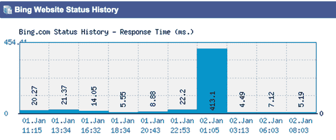
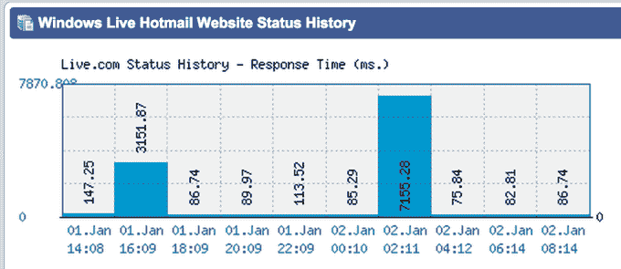

# 微软和雅虎证实搜索服务中断

> 原文：<https://web.archive.org/web/https://techcrunch.com/2015/01/02/following-bing-coms-brief-outage-search-yahoo-com-goes-down-too/>

根据 Twitter 和其他网站监控服务的报道，微软的搜索引擎 Bing.com 和包括 live.com 在内的其他网站今天遭遇了大约 20 分钟的短暂中断。虽然 Bing.com 和其他人已经回来了(事实上，当我们寻求对中断的评论时)，我们也注意到雅虎在 search.yahoo.com 的搜索服务(由 Bing 提供)目前也停止了。我们正在寻找是否有任何关于中断的解释。

当你从 Yahoo.com 进行网络搜索时，你会被重定向到 search.yahoo.com，而这只会返回一个空白页，或者最近会返回一条错误消息，而不是搜索结果。

在 Bing 的例子中，该网站根本无法解析，尽管有些[报告说](https://web.archive.org/web/20230330195350/http://www.isitdownrightnow.com/bing.com.html)看到的是默认的 IIS 主页。网站监控服务 IsItDownRightNow 也证实，该网站今天曾短暂离线:

有些人[报告说](https://web.archive.org/web/20230330195350/https://twitter.com/TheRegister/status/551102022737354752)其他微软域名，包括 portal.office.com、[、outlook.com 和 hotmail](https://web.archive.org/web/20230330195350/http://gizmodo.com/no-its-not-just-you-it-looks-like-some-of-microsofts-1677131235) ，也很难到达，但我们无法直接证实这一点。这些网站现在看起来功能正常，在某些情况下，网站监控服务显示没有中断或没有引用域的数据。然而，似乎 Live.com 确实在 Live.com 宕机的同时经历了短暂的宕机(Hotmail 重定向到 live . com):

雅虎的搜索是由微软支持的，所以看到两个搜索服务同时关闭并不奇怪。然而，在写这篇文章的时候，Bing.com 已经回来了，但是雅虎的搜索还没有回来。

在必应宕机期间，利用必应的手机助手 Siri 和 Cortana 也受到了影响。

我们已经联系了两家公司寻求进一步的解释或官方回应，但公关人员仍在制定假期计划，这意味着答复可能会推迟。

**更新，**2015 年 1 月 2 日，美国东部时间下午 3:30:微软已经通过一份简短声明确认了此次中断:

*“今天早上，微软经历了一次短暂、孤立的服务中断，现在已经解决。对于给您带来的不便，我们深表歉意。”*

**更新 2，**2015 年 1 月 2 日，美国东部时间下午 4 点 20 分:雅虎也确认了其服务中断:

“我们知道用户无法使用雅虎搜索。我们的工程师正在努力尽快恢复服务。”

**更新 3，**2015 年 1 月 2 日，美国东部时间晚上 8:10，雅虎称搜索恢复。它不会对原因发表评论。

**更新 4** ，2015 年 1 月 3 日:有[消息来源](https://web.archive.org/web/20230330195350/http://uk.reuters.com/article/2015/01/03/uk-yahoo-search-idUKKBN0KB1CF20150103)称崩溃是由于“错误的代码更新”

上图:几分钟前的 search.yahoo.com。下图:现在的 search.yahoo.com。

