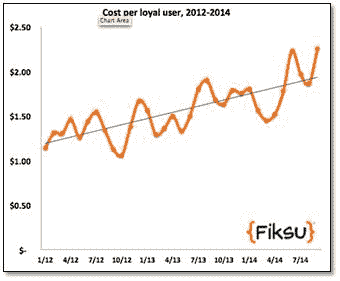

# 继 iPhone 6 和 6+发布后，应用营销成本创下历史新高

> 原文：<https://web.archive.org/web/https://techcrunch.com/2014/10/27/following-iphone-6-and-6-plus-launches-app-marketing-costs-hit-an-all-time-high/>

# 继 iPhone 6 和 6+发布之后，应用营销成本创下历史新高

iPhone 6 和 iPhone 6 Plus 的成功发布，以及苹果新的移动操作系统 iOS 8 的发布，影响了与收集移动应用程序下载和留住常规用户相关的营销成本。根据应用营销技术提供商 [Fiksu](https://web.archive.org/web/20221225202320/https://www.fiksu.com/resources/fiksu-indexes#analysis) 今天早上发布的一份新报告，截至 9 月份，留住一个“忠实用户”(即打开一个应用 3 次或以上的用户)的成本创下历史新高。

这一指标在 9 月份上升了 21%，从 8 月份的 1.86 美元升至 2.25 美元。同比而言，这一数字上升了 34%——请记住，我们甚至还没有进入假期。这通常是一年中销售应用程序最昂贵的时候，因为许多消费者正在购买新设备作为节日礼物，并前往应用商店，在购买新应用程序和游戏的同时，在手机里装满他们最喜欢的应用程序和游戏。

但是苹果 6 和 6 Plus 的发布在假期到来之前，让大量新用户涌入应用商店和其他应用营销渠道，导致价格上涨。

根据 Fiksu 的数据，发布后的前 30 天，苹果 6 的认知度比苹果 5 的认知度高出 116%。随车而来的新用户热衷于下载和使用新的移动应用，加剧了应用营销人员之间的竞争。

Fiksu 还发现，跟踪每次重复应用程序发布成本的每次发布成本指数在 iOS 上上涨至 0.29 美元，同比上涨 36%，同比上涨 48%。与此同时，衡量通过广告在用户设备上安装应用程序相关成本的每次安装成本指数在 9 月份上涨 6%，至 1.23 美元，同比上涨 41%。

同样有趣的是:其中一些成本的增加不仅是因为新 iPhones 和新移动操作系统的发布，还因为安装 iOS 8 需要用户在手机上释放大量空间，以便以无线方式更新操作系统。(也就是说，不与电脑绑定，不通过 iTunes 安装。)因此，用户通过删除应用来释放空间，使得与新手机和新操作系统发布相关的本已热闹的应用营销环境变得更加竞争激烈，因为应用制造商发现他们的用户成群结队地消失，迫使他们加大努力寻找和留住新用户。

9 月份，美国前 200 名免费 iPhone 应用程序的日下载总量比 8 月份增加了 4%，达到 550 万次。然而，这一指标——Fiksu 的竞争指数——同比下降了 4%—该公司也导致用户删除应用程序以释放存储空间，以及苹果将 App Store 中的热门应用程序从 300 个减少到 150 个。这意味着 Fiksu 指数中的一些热门应用不再可以在热门应用列表中滚动。