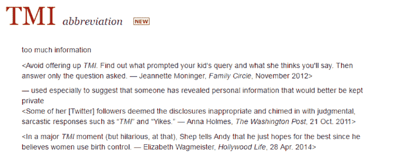

# FOMO、TMI 和基督教青年会被收入韦氏词典词典

> 原文：<https://web.archive.org/web/https://techcrunch.com/2016/04/21/fomo-tmi-and-icymi-added-to-merriam-webster-dictionary/>

# FOMO、TMI 和基督教青年会加入韦氏词典词典

对于整个英语世界的语言部门来说，这是一个重要的日子，因为韦氏词典刚刚向字典中添加了 1400 多个新单词和短语。

一些新定义的词包括“摇摆舞”、“古怪的烟草”和“hella”，这可能会让你认为最新添加的词相当愚蠢。然而，语言是我们自我表达的最主要形式，因此，我们拥有准确表达自己意思的工具至关重要。

比如，尊称 Mx。(夫人或先生的中性形式)被添加到词典中。

其他新词包括 FOMO(害怕错过)、Nomophobia(害怕没有手机)、dox(公开识别或发布关于某人的私人信息，特别是作为一种惩罚或报复)和 ICYMI(以防你错过了)。

比特币、复仇色情和 TMI 也榜上有名。