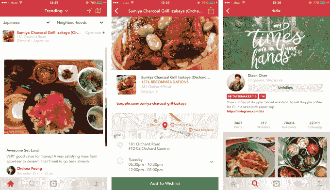

# 美食探索服务 Burpple 斥资 600 万美元在亚洲扩张 

> 原文：<https://web.archive.org/web/http://techcrunch.com/2015/11/30/food-discovery-service-burpple-eats-up-6m-to-expand-in-asia/>

食品探索服务公司 Burpple 今天尝到了现金的滋味，这家总部位于新加坡的公司获得了 Tembusu Partners、新加坡新闻控股公司的媒体基金和 Triumph Capital 的 600 万美元 A 轮投资。

TechCrunch 的老读者可能还记得 2012 年推出的服务，这是一款为美食家提供的照片分享应用，内置了一些发现元素。但 Burpple 在过去三年经历了相当大的转变，迄今已获得 75 万美元投资。如今，这项服务是新加坡和马来西亚吉隆坡的美食发现平台，类似于 Yelp 或 Zomato，但用户被鼓励拍摄并上传他们的菜肴照片。

Burpple 联合创始人兼首席执行官 Dixon Chan 在接受 TechCrunch 采访时表示:“2014 年，我们发展了这一模式，专注于本地发现，并真正深入 F&B 和酒店领域。”“很多很多用户喜欢它，它不仅仅是一本美食杂志。”

在这方面，Chan 表示，今年已有 100 多个国家的 400 万人使用其应用程序、网络和移动服务。Burpple 的发现功能仅在新加坡和马来西亚活跃，但全球任何用户都可以策划当地的名胜古迹，并为各城市制作美食清单。Chan 解释说，这笔新资金的一个用途是确定亚洲用户活动频繁的“美食之都”, Burpple 可以在那里推出更多本地化的推荐指南和编辑程序。

在新加坡和吉隆坡，这些指南已经很活跃，该公司希望增加其在餐馆业主和机构中的存在。该公司今年早些时候推出了一项[“商务”](https://web.archive.org/web/20230128094829/https://business.burpple.com/)服务，允许餐馆老板认领他们的 Burpple 页面，查看流量分析等等。Chan 分享说，虽然基本功能将保持免费，但 Burpple 希望在其商业产品中引入更多服务。他说，虽然不愿意透露未来的计划，但像餐桌预订、餐桌管理和支付等事情都是可能的。

Burpple 面临着大量的竞争，特别是在其本土新加坡，新加坡电信拥有的 HungryGoWhere，以及香港——一个潜在的扩张 OpenRice 在这个领域处于领先地位。Chan 说，他相信 Burpple 以社区为主导的推荐方式——由用户群和内部编辑中精心挑选的“时尚达人”领导——有助于它通过提供真正策划的建议而脱颖而出。他说，同样，该公司正在将其五人数据科学团队增加一倍，以更有效地帮助服务和社区内部的表面趋势和热门推荐。

自从 Burpple 筹集到最初的 50 万美元种子资金已经过去三年了，虽然后来又增加了 25 万美元，但 Chan 说，通过合作协议增加的收入——他声称 2014 年的收入比 2013 年增长了 10 倍，但没有给出具体数字——以及一个只有 15 人的精干团队让这笔相对较小的资金维持了这么久。