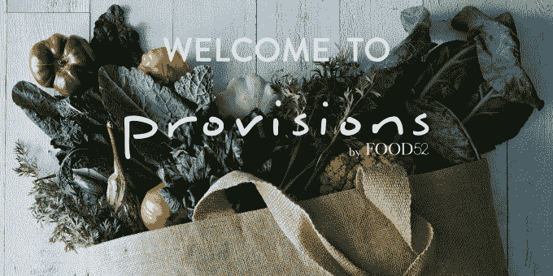

# 烹饪网站和在线商店 Food52 再赚 600 万美元 

> 原文：<https://web.archive.org/web/https://techcrunch.com/2014/09/30/food52-series-a-1/>

众包烹饪和商业网站 [Food52](https://web.archive.org/web/20230128100305/http://food52.com/) 的失控势头有所扩大，在被称为该公司“A-1 系列”的一轮融资中获得了[600 万美元的额外资金](https://web.archive.org/web/20230128100305/https://food52.com/blog/11396-looking-forward-at-food52)这轮投资由投资公司 14W 的 Alex Zubillaga 牵头，他现在加入了 Food52 的董事会。其他投资者包括斯克里普斯网络互动公司(食品网络的母公司)、沃尔登风险投资公司、BDMI、Vocap 投资伙伴、托马斯·莱曼、罗宾·克莱恩、乔安妮·威尔森、加里·维纳查克等人。

迄今为止，该公司已经筹集了 900 万美元。

该网站由前《纽约时报》美食编辑阿曼达·赫塞尔和梅里尔·斯塔布斯于 2009 年共同创建，最初是作为一个厨师平台，鼓励他们与他人分享自己的食谱，以获得每周获奖的机会——当然，通常是一些烹饪相关的产品。通过这种模式，Food52 将其网络发展到近 30，000 种食谱，其中 98%是由社区成员提供的。

2012 年，该公司将其众包贡献扩大到包括文章，并表示现在其 70%的内容来自外部贡献者。那一年，它还获得了詹姆斯·比尔德最佳烹饪网站奖。

[去年夏天](https://web.archive.org/web/20230128100305/https://techcrunch.com/2013/08/06/content-meets-commerce-meets-food-cooking-site-food52-debuts-new-e-commerce-shop-provisions/)，Food52 再次发展壮大，推出了第一家名为 Provisions 的网上商店，厨师可以在这里购买与网站上其他地方的食谱和操作方法相关的产品。

这一部分现在占公司总收入的三分之二，其余收入由广告销售推动。(该公司没有披露营收数据。)

今天，Food52 告诉我们，它每月有大约 380 万独立访客，超过 35 万注册用户。在过去的 12 个月里，电子邮件订户增长了 155%，社交媒体增长了 350%。

有了新的资金，Food52 获得了新董事会成员 Alex Zubillaga 的洞察力，他的投资包括 Tango、Lyst、CrowdSurge 和 Wahanda 的董事会席位，退出包括 Mendeley(到 Reed Elsevier)；社会指南(给尼尔森)；还有，Viki(对乐天)。

该公司向 TechCrunch 解释说，亚历克斯拥有消费和电子商务品牌的专业知识，曾与 Everlane 和 Lyst 等公司合作，创始人阿曼达和梅里尔从他们与他的第一次会面中感觉到，他理解他们对 Food52 品牌的愿景，以及所有不同组件如何协同工作。

该公司表示，它将利用额外的资金增加其现有的 28 人团队，扩大其产品系列，制作更多视频，扩展到更多“家庭相关”内容，并超越其纽约总部。

Food52 目前在其网站的热线部分也有一个移动应用程序，允许你提出烹饪问题并实时获得答案，但它现在将投资开发移动体验，让你与其业务的内容和商业方面进行互动。