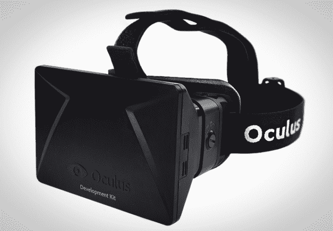

# 对于媒体和游戏来说，虚拟现实是站在门外的狼

> 原文：<https://web.archive.org/web/http://techcrunch.com/2015/09/12/for-media-and-gaming-virtual-reality-is-the-wolf-standing-just-outside-the-door/>

[Roelof Botha](https://web.archive.org/web/20230316062135/http://www.sequoiacap.com/us/roelof-botha/info)

是的合作伙伴

[Sequoia Capital](https://web.archive.org/web/20230316062135/http://www.sequoiacap.com/)

并且之前担任过 PayPal 的 CFO。他是多家公司的董事会成员，包括 Square、Evernote、Eventbrite、Jawbone、MongoDB 和 Unity Technologies。

**五年锻炼**

想象一下五年后的，你的公司取得了巨大的成功。你有一个了不起的产品，你已经取得了市场领先地位，其他人都在努力追赶。哪些决定帮助你实现了这一目标？

现在想象同样的五年过去了，但是这次你的公司在挣扎。你没有实现你最初的设想。你的产品停止了。你被逼到墙角了。是什么选择导致了那个时刻？

这两个问题是拉里·萨默斯(经济学家和前财政部长)最近带领团队在广场进行的战略规划技术的开场练习。这一过程引发了关于选择、风险和远见的重要讨论。

对于一些技术来说，五年技术不仅仅是一种练习，而是将一些公司推上顶峰并让其他公司卷铺盖走人的成败时刻。

虚拟现实正处于成败关头。它已经准备好进入主流，公司今天所做的决定将决定谁能成功，谁能回家。

**平台复杂度**

在最近一次 Unity Technologies 的董事会会议上，我们有机会尝试拉里·萨默斯的技术。Unity 帮助超过 450 万开发人员在 22 个不同的平台上进行开发——从 web 到 Wii U 再到移动设备。我们浏览了 Larry 的五年实践，同时特别关注他们业务的新兴部分:虚拟现实。

Unity 开发工具和系统，这样游戏开发者就可以制作精彩的游戏，而 Unity 则完成所有跨平台编译的残酷工作。

虚拟现实给游戏开发增加了一个全新的复杂层次，有更多的系统、设备和分销渠道。这种碎片化对开发者来说是一件苦差事，因为他们必须创建一个游戏的许多版本来适应所有不同的系统。

Unity 对 Larry Summer 的做法的回答是将相同的跨平台方法应用于 VR，以处理所有的碎片化和不同的系统——允许游戏开发人员重新制作优秀的游戏和其他沉浸式娱乐体验。

如果你在一家游戏或媒体公司，正在考虑虚拟现实，我会鼓励你试试萨默斯的运动，否则就太晚了。

**虚拟现实，为什么是现在？**

要真正理解虚拟现实，就得去尝试。使用传统屏幕，很容易将自己与眼前发生的事情分开。有了 VR，你就融入了这个世界。地板消失在你的脚下。你飞过一座城市。

你不只是在玩游戏——你在另一个世界。但几十年来，我们已经听到了对 VR 的热情呼喊。这次是真的吗？

在过去的 20 年里，虚拟现实已经指日可待，但在主流采用的道路上有三个主要障碍。今天，这三个障碍都被消除了。这不再是谎报军情的情况。狼是真的，就站在门外。

**价格**

第一个障碍一直是价格。我体验过的第一个虚拟现实系统(在斯坦福大学的虚拟人类交互实验室)比今天的 Oculus Rift 贵十倍。尽管如此，大多数消费者还不准备在一个非常专业的硬件上花 300 美元。

每个主要的设备制造商都在探索更便宜、更强大的系统。拥有硬件的竞赛已经开始。最便宜的是[谷歌的 Cardboard](https://web.archive.org/web/20230316062135/https://techcrunch.com/tag/google-cardboard/) ，它实际上是由纸板制成的，可以免费下载，只需拿着你的手机。

谁来为大众制作占主导地位的 VR 系统？我们可以肯定的是，更快、更便宜的 VR 系统即将到来。随着低端的免费系统和高端的 10 倍缩减，价格障碍终于被克服了。

**内容**

一直困扰 VR 的第二个坎是围绕内容的鸡和蛋问题。

没有庞大的客户群，开发者不会创造出顶级的 VR 体验。但是如果没有好的内容，这些客户是不会上船的。这给开发者制造了一个难题:你是专注于让你发挥创造力的高端系统呢？或者，你的目标是数十亿体验有限的智能手机用户(比如谷歌 Cardboard)？

我们看到了各方面的进展——主要广播公司都在探索虚拟现实体验，比如 HBO 的[权力的游戏虚拟现实项目](https://web.archive.org/web/20230316062135/http://thenextweb.com/insider/2014/03/11/hbos-game-thrones-oculus-rift-exhibit-immersive-entertainment-ive-ever-encountered/)在去年的 SXSW 音乐节上亮相。GoPro 和其他公司已经加入了拍摄真人 VR 的 360 摄像机，YouTube 也开始为 [360 视频](https://web.archive.org/web/20230316062135/https://www.youtube.com/channel/UCzuqhhs6NWbgTzMuM09WKDQ)提供实验支持。3a 游戏还会远吗？

在今年的 E3 2015 上，虚拟现实项目的数量同比翻了一番，增加到 30 个新项目或名称。每一个趋势都指向内容获得动力。内容的障碍也已经被跨越了。

**生产和分配的碎片化**

最后一个障碍是生产和销售的分散化。Unity 用他们的虚拟现实平台制作工具正面解决了这个问题。iOS 和 Android 的应用商店解决了低端的分发问题，每个高端制造商都在竞相建立自己作为高端的，类似于阀门的分发渠道。然而，对于雄心勃勃的创始人来说，发行的最终决定仍然是开放的，以成为虚拟现实的 YouTube。如果这位创始人是你，我们很想听听你的意见。

**结论**

随着三个主要障碍的通过，虚拟现实终于准备好进入主流。仍有大量工作要做，但如果虚拟内容市场增长到 250 亿美元移动游戏市场的一小部分，对那些现在钻研的人来说，好处将是巨大的。如果你还觉得我们只是在喊狼来了，戴上你的 VR 耳机四处看看，门的另一边有东西在等着你。