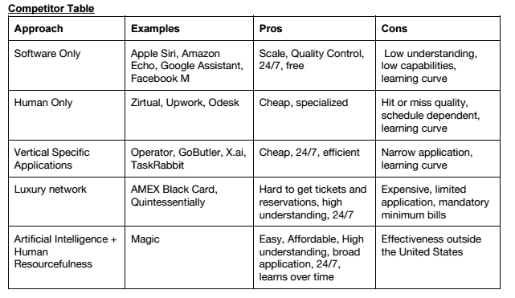

# 松散集成是 Magic 的下一步行动 

> 原文：<https://web.archive.org/web/https://techcrunch.com/2017/04/19/for-my-next-trick/>

还记得那个基于短信的服务点播公司，[魔法助手](https://web.archive.org/web/20230206155707/https://getmagic.com/)吗？

在[推出产品搜索](https://web.archive.org/web/20230206155707/https://techcrunch.com/2015/02/23/magic-is-a-startup-that-promises-to-bring-you-anything-if-youre-willing-to-pay-for-it/)服务后的两个月旋风中，Magic 因其[声称可以交付任何东西](https://web.archive.org/web/20230206155707/https://techcrunch.com/2015/02/27/catch-a-tiger-by-the-toe/)而迅速走红；迅速从红杉资本筹集了传闻中的 1200 万美元(迈克尔·莫里茨爵士加入董事会)；然后当它想出一个实际的商业计划时就藏了起来。

一年后，该公司推出了一个溢价定价计划，并对他们的业务实际上可以做什么有了更多的看法…然后又回到了相对默默无闻和基本的业务建设封锁和处理。

好吧，它又回来了——而且这次是用 Slack！

该公司已经将其基于文本的按需服务集成到 Slack 的企业消息怪兽中。

一个松散的整合并不特别([几乎每个人都在做](https://web.archive.org/web/20230206155707/https://slack.com/apps/category/At0MQP5BEF-bots))，但是它确实给了我们一个机会去了解魔术团队，并且发现事情是如何发展的。

根据他们的说法，答案是“相当好”

对于那些不记得背景故事的人，Magic 在 2015 年推出了产品搜索，作为五名 Oberlin 毕业生(在你的母校大喊一声)的辅助项目，他们当时在 Y Combinator[工作，开发 Bettir](https://web.archive.org/web/20230206155707/https://techcrunch.com/2014/12/08/bettir-wants-to-chat-with-you-about-your-blood-pressure/) ，一款血压监测应用程序。

当魔术起飞时，团队靠边站贝蒂尔，并开始全职研究魔术。它像火箭一样起飞，但最初的业务并不能保证一定会成功。

正如我们自己早已去世但未被遗忘的主编当时写道:

> 据我的 Magic 运营商称，所有 Magic 订单中有 9%到 13%是由 Postmates 交付的(Magic 创始人兼首席执行官 Mike Chen 告诉我，该公司尚未计算这一数据)。因此，Snapguide 的创始人丹尼尔·拉弗尔(Daniel Raffel)比较了邮戳和魔法的送达时间(T3)，这有点违背了初衷。例如，Raffel 的魔法午餐订单也是通过 Postmates 交付的，但 Magic 还使用其他按需播放器，如 GrubHub 和 Eat24。
> 
> 接受订单亏损的模式无法扩展。曾在奥伯林学院(Oberlin College)学习哲学和计算机科学的陈(音)估计，该公司 50%的订单不亏不赚，25%亏损，25%盈利——他说总体上不亏不赚。运营商应该将他们与客户和供应商互动的时间计入神奇费用。

Magic Plus 服务的推出解决了这个问题，当时该公司改变了其商业模式，提供一种基于消息的服务，可以以每小时 100 美元的费用为某人做任何事情。

自从这项服务推出以来，Magic 一直在努力通过人工智能和人类互动的结合来降低成本。该公司目前雇佣了大约 150 名全职员工来处理收到的订单。

“一开始我们以为是送食物，”陈告诉我。"它已经成为个人助理或行政助理的替代品."

自 2016 年 1 月推出这项服务以来，按需提供的行政助理的标价已经下降。现在，一个人只需要每小时支付少得可怜的 35 美元，就可以让一些机械土耳其人或其他杂役来做这项工作，而不是雇佣一个真正的人来全职做这项工作。陈向我保证，魔术在这个价格上仍然是有利可图的。

“我们在这笔交易上获得了正利润，”陈告诉我。

随着客户开始更频繁地使用服务，服务业务开始向集中发展。“当时的情况是，人们会代表他们的企业提出个人要求，”陈说。

随着它进入更多的商业服务角色，该公司可能会发现自己与 Q 管理的[伊甸园](https://web.archive.org/web/20230206155707/https://www.eden.io/)或[等办公室管理服务发生冲突。](https://web.archive.org/web/20230206155707/https://www.managedbyq.com/)

这也是对“服务对服务”已经变得多么拥挤的默认(是的，我没有忘记前面陈述中包含的荒谬的大毒蛇)。脸书有一个信息平台，可以将任何人与任何提供服务的公司联系起来， [Alfred 将为您提供私人服务的礼宾服务](https://web.archive.org/web/20230206155707/https://app.helloalfred.com/?utm_source=Google&utm_medium=CPC&utm_campaign=Branded&referral_code=gadwb&gclid=Cj0KEQjwldzHBRCfg_aImKrf7N4BEiQABJTPKGeGvad2Xf_3TWCr_DSP_XQiJekytCKYr7-dsHcxVaoaAvQs8P8HAQ#/)。

如果你愿意让公司的分机听到你在家里说的每一句话，你可以安装一个谷歌主页或亚马逊回声，让他们送货上门。

魔术自己的竞争力分析截图

硅谷到处都是服务公司，为用户提供他们可以拿起电话为自己订购的服务，但在一个每周工作四小时的世界里，谁有时间做这些呢？